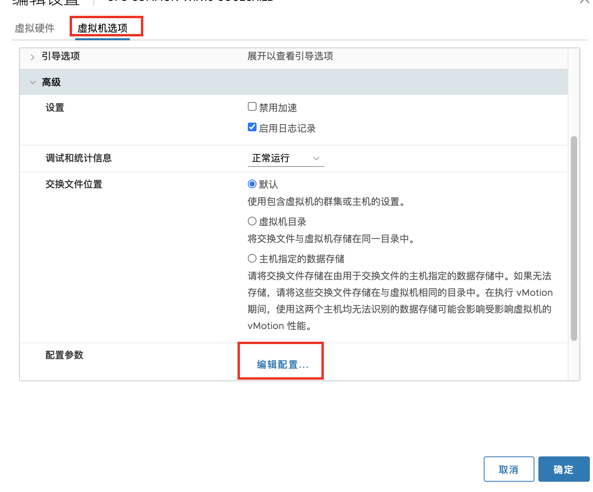

# vSphere 6.5(VMware Remote Console)ESXI开启远程复制粘贴

<!--more-->
### 1.进入虚拟机的虚拟机选项-高级-配置参数-编辑配置


### 2.添加如下两个参数(关机状态下)
```
isolation.tools.copy.disable FALSE
isolation.tools.paste.disable FALSE
```


---

> 作者: [SoulChild](https://www.soulchild.cn)  
> URL: https://www.soulchild.cn/post/2223/  

