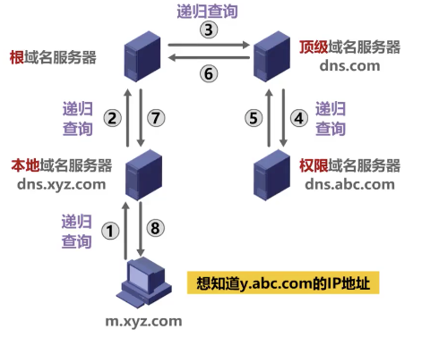

# DNS递归查询和迭代查询

<!--more-->
## 一、四种不同类型的域名服务器：
### 1. 根域名服务器
全世界一共有13台ipv4根服务器(13个集群)，25台ipv6根服务器。根域名服务器一般就返回域名所属顶级域的顶级域服务器的IP地址。
存的记录比较少，记录的是com、cn、net、org这种顶级域服务器的ip地址或其他记录。

### 2. 顶级域服务器
这种域名服务器负责 管理 `在该顶级域名服务器`上`注册的所有二级域名`。当收到DNS查询请求时，就给出相应的回答（可能是最后的结果，也可能是下一级权限域名服务器的地址）。

### 3. 权限(权威)域名服务器
二级(jd.cn)、三级(www.jd.cn)或更多级别的域名可以归为权限服务器。（可能是最后的结果，也可能是下一级权限域名服务器的地址）。

### 4. 本地域名服务器
一般就是本地配置的DNS地址，可能是路由器的地址，也可能是网络运营商提供的DNS地址


## 二、递归查询
一层一层的进去，然后一层一层的回来。
```
客户端-->本地域名服务器-->根域名服务器-->顶级域名服务器-->权限域名服务器
                                                          ↓
               客户端<--本地域名服务器<--根域名服务器<--顶级域名服务器
```


## 三、迭代查询
一来一回的查询。
1. 客户端-->本地域名服务器(这里是递归查询)
2. 本地域名服务器-->根域名服务器(.)-->告诉本地域名服务器找顶级域名服务器(.com)
3. 本地域名服务器-->顶级域名服务器(.com)-->告诉本地域名服务器找权限域名服务器(.abc.com)
4. 本地域名服务器-->权限域名服务器(.abc.com)-->`y.abc.com`归属于`.abc.com`所管。所以直接告诉本地域名服务器最终结果


> 第一步中为何使用递归查询？
> 如果第一步使用迭代查询，那么后面的请求都需要请求主机(客户机)来参与完成，这样会增大请求主机的压力。所以通常情况下请求主机和本地域名服务器是使用递归查询。


---

> 作者: [SoulChild](https://www.soulchild.cn)  
> URL: https://www.soulchild.cn/post/2237/  

