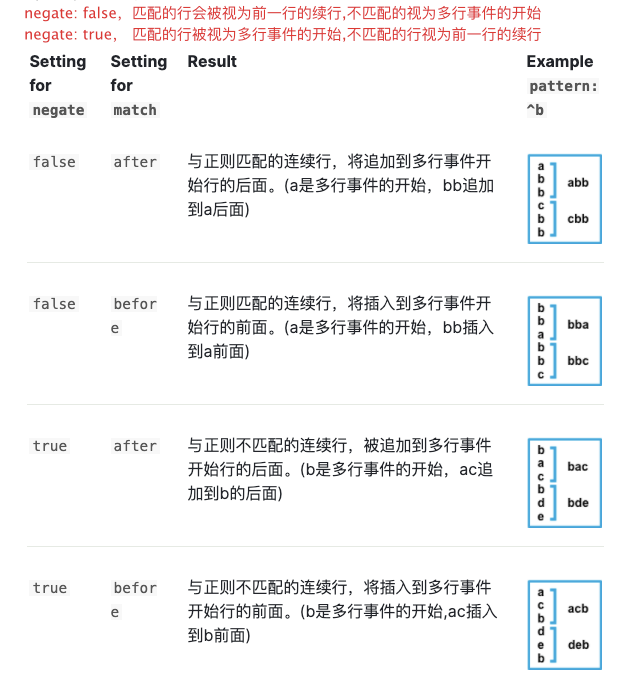

# ELK-filebeat配置多行解析(四)

<!--more-->
Filebeat收集的文件可能包含跨越多行文本的消息。例如，Java堆栈。为了正确处理这些多行消息，需要在filebeat.yml文件中配置多行设置，以指定哪些行是单个消息的一部分.


##一、 简单示例
```
filebeat.inputs:
  - type: log
    paths:
      - /var/log/test.log
    multiline.pattern: '^\d{4}-\d{2}-\d{2}'
    multiline.negate: true
    multiline.match: after
```

##二. 配置项说明
###2.1 multiline.pattern
指定正则表达式。匹配的行被视为前一行的延续，其他行视为起始行。
> 与logstash的正则表达式有所不同。filebeat支持的正则表达式https://www.elastic.co/guide/en/beats/filebeat/6.8/regexp-support.html

###2.2 multiline.negate
定义是否为否定模式。
默认为false，匹配的行会被视为前一行的续行，不匹配的视为多行事件的开始
设置为true 匹配的行被视为多行事件的开始,不匹配的行视为前一行的续行
可以看2.3中的图，有助于理解。

###2.3 multiline.match
设置匹配到的内容附加的位置。插入到前一行还是追加到后一行。before 或 after。

> 上图为个人理解。不一定对。


###2.4 multiline.flush_pattern
指定一个正则表达式，用来结束多行事件。

###2.5 multiline.max_lines
如果多行消息包含的行数超过max_lines，则将删除所有其他行。默认值为500。


###2.6 multiline.timeout
在指定的时间后，指定的正则即使没有启动新事件，Filebeat也会发送多行事件。默认值为5s。

## 三、例子
```
filebeat.inputs:
  - type: log
    paths:
      - /var/log/test.log
    multiline.pattern: '^\d{4}-\d{2}-\d{2}'
    multiline.negate: true
    multiline.match: after

output.elasticsearch:
  hosts: ["es-01:9200", "es-02:9200", "es-03:9200"]
```
解析：将所有以日期(xxxx-xx-xx)开头的行，作为多行事件的开始。直至遇到下一个多行事件时结束,或者等待multiline.timeout时间
例如下面的日志会被解析成4条日志：
```
2021-03-18 17:54:20.848 DEBUG 123521 --- [  XNIO-1 task-2] o.s.s.m.ResBagRelationM
2021-03-18 17:54:20.849  INFO 123521 --- [  XNIO-1 task-3] o.s.core.boot

================  Response Start  ================
===Result===  {"code":200}
<=== GET: /xixxxnfos (6 ms)
================  Response End   ================
2021-03-18 17:54:20.849  INFO 123521 --- [  XNIO-1 task-3] o.s.core.boot
2021-03-18 17:54:20.849  INFO 123521 --- [  XNIO-1 task-3] o.s.core.boot
```
官方给的其他例子
https://www.elastic.co/guide/en/beats/filebeat/6.8/_examples_of_multiline_configuration.html


---

> 作者: [SoulChild](https://www.soulchild.cn)  
> URL: https://www.soulchild.cn/post/2256/  

