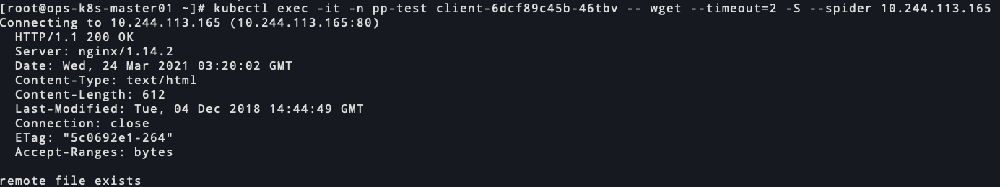

# k8s使用calico实现不同namespace网络隔离

<!--more-->
### 一、准备环境
1. 创建namespace: `pp-dev`、`pp-test`、`kk-dev`、`kk-test`
2. 每个namespace创建两个应用
```
apiVersion: apps/v1
kind: Deployment
metadata:
  name: nginx1
  #namespace: pp-test
spec:
  selector:
    matchLabels:
      app: nginx1
  template:
    metadata:
      labels:
        app: nginx1
        author: soulchild
    spec:
      containers:
      - name: nginx
        image: nginx:1.14.2
        ports:
        - containerPort: 80
---
apiVersion: apps/v1
kind: Deployment
metadata:
  name: client
  #namespace: pp-test
spec:
  selector:
    matchLabels:
      app: client
  template:
    metadata:
      labels:
        app: client
        author: soulchild
    spec:
      containers:
      - name: busybox
        image: busybox:1.33.0
        args: ["sleep", "1000000"]
```
> kubectl apply -n pp-dev -f nginx.yaml
> kubectl apply -n pp-test -f nginx.yaml
> kubectl apply -n kk-dev -f nginx.yaml
> kubectl apply -n kk-test -f nginx.yaml

> 配置完后测试网络正常


### 二、配置globalnetworkpolicy
官方文档: https://docs.projectcalico.org/reference/resources/globalnetworkpolicy#selectors
1.给namespace打标签
```
kubectl label namespaces pp-dev enable-env-isolate-policy="true"
kubectl label namespaces pp-dev env="dev"

kubectl label namespaces pp-test enable-env-isolate-policy="true"
kubectl label namespaces pp-test env="test"

kubectl label namespaces kk-dev enable-env-isolate-policy="true"
kubectl label namespaces kk-dev env="dev"

kubectl label namespaces kk-test enable-env-isolate-policy="true"
kubectl label namespaces kk-test env="test"
```

2.配置拥有env=dev标签的namespace互通
```
apiVersion: crd.projectcalico.org/v1
kind: GlobalNetworkPolicy
metadata:
  name: allow-label-env-dev-namesapce
spec:
  namespaceSelector: enable-env-isolate-policy == "true" # 与标签匹配的namespace，生效下面配置的规则
  order: 101 # 配置优先级，越小越先执行策略
  ingress: # 配置入口规则
  - action: Allow # 允许下面指定的规则访问,其他进来的流量拒绝,不会拒绝公网流量
    source:
      namespaceSelector: env == "dev" # 根据标签选择器,选出namespace,namespace下的所有工作端点定义为源地址
    destination:
      namespaceSelector: env == "dev" # 根据标签选择器,选出namespace,namespace下的所有工作端点定义为目标地址
  egress:
  - action: Allow # 允许所有出去的流量
```
> 工作端点即Workload endpoint，calico默认会为每个容器分配一个workload-endpoint

3.配置拥有env=test标签的namespace互通
```
apiVersion: crd.projectcalico.org/v1
kind: GlobalNetworkPolicy
metadata:
  name: allow-label-env-test-namesapce
spec:
  namespaceSelector: enable-env-isolate-policy == "true"
  order: 100
  ingress:
  - action: Allow
    source:
      namespaceSelector: env == "test"
    destination:
      namespaceSelector: env == "test"
  egress:
  - action: Allow
```
> 这里的入口和出口是相对于策略执行者，而非pod


### 三、测试dev和test的命名空间互通情况
#### ip信息


**kk-dev的服务访问pp-dev的服务**
nginx正常访问


**kk-dev的服务访问kk-test和pp-test的服务**
nginx访问超时


**pp-test访问kk-test的服务**
nginx正常访问


**pp-test访问pp-dev和kk-dev的服务**
nginx访问超时


### 四、总结
含有enable-env-isolate-policy="true"的namespace才会应用我们定义的网络策略。

最终效果是env=test的命名空间下的pod可以互相访问
env=dev的命名空间下的pod可以互相访问


---

2020.4.11

上面的配置当使用nodePort时会发现也不能访问

修改后的策略如下:

1.拒绝env=dev的命名空间中的pod访问test的命名空间中的pod
```
apiVersion: crd.projectcalico.org/v1
kind: GlobalNetworkPolicy
metadata:
  name: deny-dev-namesapce-to-test
spec:
  namespaceSelector: env == "dev"
  ingress:
  - action: Allow
  egress:
  - action: Deny
    destination:
      namespaceSelector: env == "test"
  - action: Allow
```

2.拒绝env=test的命名空间中的pod访问dev的命名空间中的pod
```
apiVersion: crd.projectcalico.org/v1
kind: GlobalNetworkPolicy
metadata:
  name: deny-dev-namesapce-to-test
spec:
  namespaceSelector: env == "test"
  ingress:
  - action: Allow
  egress:
  - action: Deny
    destination:
      namespaceSelector: env == "dev"
  - action: Allow
```


---

> 作者: [SoulChild](https://www.soulchild.cn)  
> URL: https://www.soulchild.cn/post/2273/  

