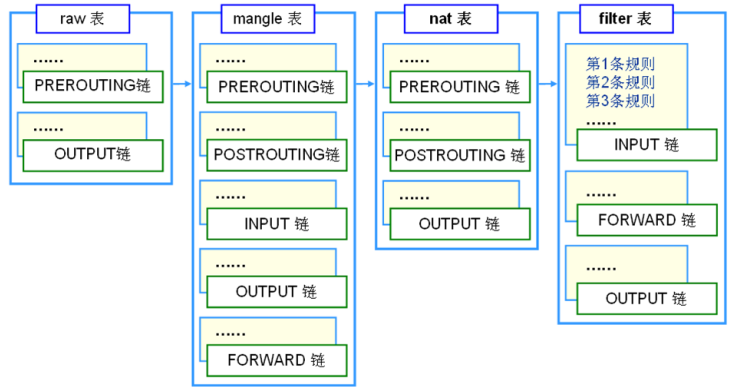
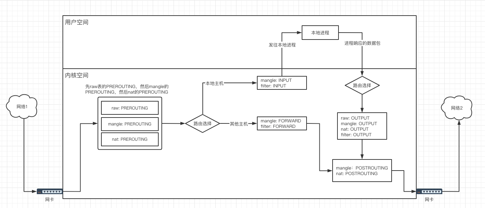

# iptables基本介绍(一)

<!--more-->
参考文章: 
https://www.cnblogs.com/kevingrace/p/6265113.html
https://www.frozentux.net/iptables-tutorial/cn/iptables-tutorial-cn-1.1.19.html

iptables的基本概念
### 一、链:
每个链下都会有很多规则,当一个数据包到达一个链时，iptables就会从链中第一条规则开始检查，看该数据包是否满足规则所定义的条件。如果满足，系统就会根据 该条规则所定义的方法处理该数据包；否则iptables将继续检查下一条规则，如果该数据包不符合链中任一条规则，iptables就会根据该链预先定义的默认策略来处理数据包。

- PREROUTING: 控制刚从网卡到达内核时的数据包，即经过路由表之前(流量进来的第一个环节)
- INPUT: 控制通向本地套接字(本地进程)的数据包
- FORWARD: 控制转发到其他主机的数据包
- OUTPUT: 控制本地套接字(本地进程)发往外部的数据包
- POSTROUTING: 控制所有发到网卡前的数据包，即经过路由表之后(流量出去的最后一个环节)

### 二、表: 
优先级raw>mangle>nat>filter

- filter: iptables工具的默认表,用于过滤数据包。
  - 包含INPUT、FORWARD、OUTPUT链
- nat: 可以修改sip、dip、sport、dport。
  - 包含PREROUTING、INPUT(centos7包含)、OUTPUT、POSTROUTING链
- mangle: 不能过滤数据包也不能修改数据包。允许的操作是修改TOS、TTL、MARK
  - 包含所有链
- raw: 决定数据包是否被状态跟踪机制处理
  - 包含PREROUTING、OUTPUT链
- security: 此表用于强制访问控制(MAC)网络规则，例如由SECMARK和CONNSECMARK目标启用的规则。
  - 包含INPUT、FORWARD、OUTPUT链

### 三、规则:
规则就是如果数据包满足指定条件，执行某些操作。规则是有顺序的，当某一条规则匹配成功后就不会匹配后面的规则

### 四、数据包处理流程

> 注意如果数据包先和某个表中的链的规则匹配成功，则不会和其他表匹配了。

---

> 作者: [SoulChild](https://www.soulchild.cn)  
> URL: https://www.soulchild.cn/post/2324/  

