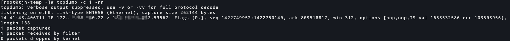
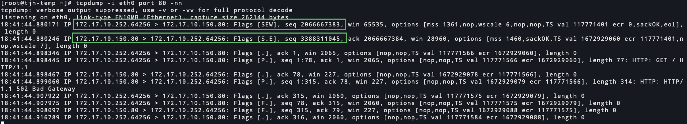

# tcpdump-命令使用

<!--more-->
### 参考地址: 
https://www.tcpdump.org/manpages/tcpdump.1.html
https://danielmiessler.com/study/tcpdump/
https://www.tcpdump.org/manpages/pcap-filter.7.html


### 命令格式: 
tcpdump 参数 过滤器表达式

### 描述:
tcpdump可以捕获系统中的网络数据包。

当tcpdump完成捕获数据包时，会有一个统计返回(结果类似如下，最后三行)：


`captured`: 这是tcpdump已接收和处理的数据包数
`received by filter`: 含义取决于运行tcpdump命令的操作系统
1. 在某些操作系统上，它会对数据包进行计数，而不管它们是否与过滤表达式匹配，也不管tcpdump是否已读取并处理它们。
2. 在某些操作系统上，它只计算被过滤器表达式匹配的数据包，而不管tcpdump是否已经读取和处理了它们
3. 在某些操作系统上，它只计算被过滤器表达式匹配并被tcpdump处理的数据包

`dropped by kernel`: 由于缓冲区空间不足，而被tcpdump丢弃的数据包数量，可以通过-B参数设置缓冲区大小。


### 参数: 
参数较多，解释一部分

`-A`: 以ASCII格式打印每个数据包(减去其链路级报头)。便于抓取http请求。
`-B (--buffer-size=buffer_size)`: 设置捕获缓冲区大小，单位为KiB(1024 bytes).
`-c`: 收到指定数据包后退出。
`-e`: 显示mac地址
`-w`: 将捕获到的数据包输出到文件中。文件名支持使用strftime格式(例如: -w test-%H%M%S.pcap)
`-r`: 从文件中读取数据包（使用-w选项保存的pcap文件）。如果文件为`-`，则使用标准输入。
`-G`: 每隔多长时间输出一个文件(文件名不能一样，否则会覆盖)，单位秒(s)
`-C`: 当使用`-w`将数据包保存到文件时,单个文件保存的最大大小。1代表将近1M(1000000 bytes)

`-D`: 显示操作系统中可以使用的网络接口
`-E`: 通过提供加密密钥来解密IPSEC通信。
`-F`: 指定一个文件，过滤器表达式将从这个文件中获取。
`-i (--interface=interface)`: 指定捕获哪个网络接口的数据包,默认是`tcpdump -D`显示的第一个接口。
`-l`: 使stdout按照行缓冲。比如将结果重定向输出到文件的同时，可以看到接近实时的行输出.`tcpdump -l | tee dat` or `tcpdump -l > dat & tail -f dat`
`-n`: 不将ip解析成名称
`-nn`: 不将ip解析成域名，不将端口解析成名称
`-#`: 打印数据包编号
`--print`: 当使用`-w`时，stdout不会有数据包信息输出，加此参数可以同时输出.老版本不支持此参数
`-Q`: 数据包方向(`in`,`out`,`inout`),不是在所有平台都可以用
`-q`: 打印更少的协议信息
`-S`: 显示绝对的seq编号。默认单方向第一个条目显示绝对seq编号，后面的数据包显示的是相对的seq编号。(不知这么解释对不对)看下图吧


`-s`: 指定从每个数据包中获取数据的字节数，而不是默认的262144字节。`-s0`和默认值一样
`-t`: 不显示时间
`-tt`: 显示时间戳
`-ttt`: 与上一条的时间增量,详细请看man手册
`-tttt`: 可读性强的时间

`-v`: 打印IP数据包中的ttl，flags，总长度和选项等信息
`-vv`: 更详细的输出。
`-vvv`: 更详细的输出。

`-X`: 数据包内容以16进制和ascii格式显示
`-XX`: 同上，信息可能更多


### 过滤器表达式
过滤表达式由一个或多个原语组成。原语的编写主要分为三个层面:

类型: 根据主机、网络、端口等信息过滤。如: `host`、`net`、`port`、`portrange`等。
- 例如: `host xxx.com(也可以写ip)`,`net 192.168.1.0/24`,`port 20(这里仅代表tcp和udp)`,`portrange 6000-6008`

传输方向: 根据源和目的进行过滤。如: `src`, `dst`, `src or dst`,`src and dst`等。
- 例如: 
  - `src 192.168.1.10`,`dst 192.168.1.20`
  - `src or dst 192.168.1.1`,`src and dst 192.168.1.1`,`src or dst port 20`
  - `dst net 128.3.0.0`

协议: 基于协议进行过滤。如: `tcp`、`udp`、`icmp`、`ip`、`ip6`、`arp`、`rarp`、`wlan`等。
- 例如: `arp net 128.3`, `tcp port 21`, `udp portrange 7000-7009`

#### 常用原语
tcpdump捕获的数据包和表达式匹配结果为true，才是我们也要的结果，表达式中可以使用`and(&&)`,`or(||)`,`not(!)`,

`dst`: 目标主机。`dst host 1.1.1.1`也可以写成`dst 1.1.1.1`.因为默认是host，host可以被省略
`src`: 源主机。
`ether dst`: ether的目标地址(mac地址)
`ether src`: ether的源地址(mac地址)
`net`: 网络(网段)
`dst net`: 目标网络
`src net`: 源网络
`port`: 端口
`dst port`: 目标端口 
`src port`: 源端口
`portrange`: 端口范围
`dst portrange`: 目标端口范围
`src portrange`: 源端口范围
`less`: 数据包的长度小于或等于指定长度。`less 32`等同于`len <= 32`
`greater`: 数据包的长度大于或等于指定长度。`less 32`等同于`len >= 32`


### 例子:
#### 1.捕获源和目的是soulchild.cn相关的流量
`tcpdump host soulchild.cn`

#### 2.捕获eth0网卡的流量
`tcpdump -i eth0`

#### 3.根据源地址和目的地址捕获流量
```bash
tcpdump src 1.1.1.1
tcpdump dst 1.0.0.1
```

#### 4.捕获源和目的是1.2.3.0/24网段的流量
`tcpdump net 1.2.3.0/24`

#### 5.捕获与指定端口相关的流量
```bash
tcpdump port 3389
tcpdump src port 1025
tcpdump dst port 80
```

#### 6.捕获指定协议的流量
```bash
tcpdump tcp
tcpdump ip6
tcpdump icmp
```

#### 7.捕获指定端口范围的流量
`tcpdump portrange 20-21`

#### 8.根据数据包大小捕获流量
```bash
tcpdump less 32 
tcpdump greater 64 
tcpdump 'len <= 128'
```

#### 9.将捕获的数据包保存至文件和从文件读取
```bash
# 保存至文件中
tcpdump -w soulchild.cn.pcap 'host soulchild.cn and port 80'
# 从文件读取
tcpdump -r soulchild.cn.pcap
# 保存到文件中并同时在stdout输出
tcpdump --print -w soulchild.cn.pcap 'host soulchild.cn and port 80'
```

#### 10.可读性较高的一种参数组合
`tcpdump -ttnnvvS`

#### 11.源地址是10.5.2.3发送到任意主机的3389端口的数据包
`tcpdump -nnvvS src 10.5.2.3 and dst port 3389`

#### 12.捕获从一个网络到另一个网络的数据包
`tcpdump -nvX src net 192.168.0.0/16 and dst net 10.0.0.0/8 or 172.16.0.0/16`

#### 13.捕获目的地址是192.168.0.2并且不是icmp的数据包
```bash
tcpdump 'dst 192.168.0.2 and not icmp'
# 指定协议的另一种写法
tcpdump 'dst 192.168.0.2 and not proto \icmp'
```

#### 14.捕获192.168.0.2进来的流量，并且不是22目的端口的流量
`tcpdump -vv src 192.168.0.2 and not dst port 22`

---
#### *根据tcp状态进行选择
tcp标志可用字段`tcp-fin`, `tcp-syn`, `tcp-rst`, `tcp-push`, `tcp-ack`, `tcp-urg`, `tcp-ece`, `tcp-cwr`.

#### 15.捕获包含rst标志位的tcp数据包
```bash
tcpdump 'tcp[13] & 4!=0'
tcpdump 'tcp[tcpflags] == tcp-rst'
```

#### 15.1.捕获包含syn标志位的tcp数据包
```bash
tcpdump 'tcp[13] & 2!=0'
tcpdump 'tcp[tcpflags] == tcp-syn'
```

#### 15.2.捕获包含syn和ack的tcp数据包
```bash
tcpdump 'tcp[13]=18'
tcpdump 'tcp[tcpflags] & (tcp-syn|tcp-ack) == (tcp-syn|tcp-ack)'
```

#### 16.查找http user-agent
`tcpdump -vvAls0 | grep 'User-Agent:'`

#### 19.获取GET请求
`tcpdump -vvAls0 | grep 'GET'`

#### 20.捕获DNS流量
`tcpdump -vvAs0 port 53`

#### 21.捕获NTP流量
`tcpdump -vvAs0 port 123`

#### 22.查找明文密码
`tcpdump -lA port http or port ftp or port smtp or port imap or port pop3 or port telnet | egrep -i -B5 'pass=|pwd=|log=|login=|user=|username=|pw=|passw=|passwd= |password=|pass:|user:|username:|password:|login:|pass |user '`

#### 23.捕获指定状态的icmp包
icmp可用字段`icmp-echoreply`, `icmp-unreach`, `icmp-sourcequench`, `icmp-redirect`, `icmp-echo`, `icmp-routeradvert`, `icmp-routersolicit`, `icmp-timxceed`, `icmp-paramprob`, `icmp-tstamp`, `icmp-tstampreply`, `icmp-ireq`, `icmp-ireqreply`, `icmp-maskreq`, `icmp-maskreply`.
```bash
#捕获icmp-echo(请求包)
tcpdump icmp[icmptype] = icmp-echo

#捕获icmp-echoreply(响应包)
tcpdump icmp[icmptype] = icmp-echoreply

#捕获不是icmp-echo、icmp-echoreply的状态
tcpdump icmp[icmptype] != icmp-echo and icmp[icmptype] != icmp-echoreply
```

#### 24.查找带有"Evil Bit"的流量
IP报头中有一位永远不会被合法应用程序设置，我们称之为"Evil Bit"。
`tcpdump 'ip[6] & 128 != 0'`


这里有一个tcpdump高级用法的解释: https://blog.csdn.net/zhaojie0708/article/details/103496004


---

> 作者: [SoulChild](https://www.soulchild.cn)  
> URL: https://www.soulchild.cn/post/2354/  

