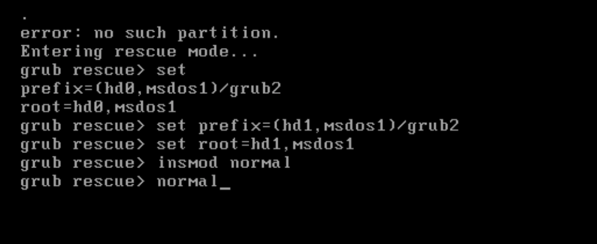

# 更改boot分区为新磁盘

<!--more-->
```bash
# 查看新硬盘
fdisk -l

# 新硬盘分区
fdisk /dev/sdb

# 格式化文件系统
mkfs.xfs /dev/sdb1

# 卸载旧分区
umount /boot

# 挂载新分区
mount /dev/sdb1 /boot

# 挂载旧boot分区
mkdir /boot.old
mount /dev/sda1 /boot.old

# 复制旧boot分区内容到新boot分区
cp -arT /boot.old /boot

# 修改/etc/fstab中boot分区的挂载
/dev/sdb1               /boot                   xfs     defaults        0 0

# 将旧磁盘的grub引导boot改为当前的boot
grub2-install --boot-directory=/boot /dev/sda

# 在新磁盘中安装grub
grub2-install --boot-directory=/boot /dev/sdb

# 重启
reboot
```


中间遇到grub rescue问题，通过如下方式进入系统



---

> 作者: [SoulChild](https://www.soulchild.cn)  
> URL: https://www.soulchild.cn/post/2382/  

