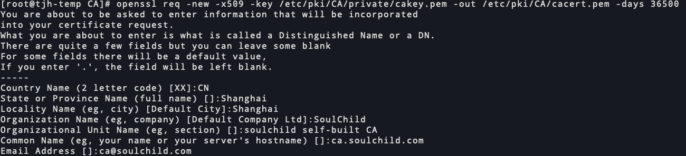

# openssl-创建CA、生成密钥、颁发、吊销证书等

<!--more-->
### 一、常用子命令
`genrsa`: 生成私钥
`req`: 用于生成证书和生成证书签名请求
`x509`: 查询证书信息
`ca`: 签发证书。管理维护已颁发的证书及其状态。

### 二、使用rsa算法生成密钥对:
1.生成私钥，三种方式
```bash
# 生成私钥
openssl genrsa -out my.key
# 生成私钥长度为4096 bit
openssl genrsa -out my.key 4096
# 对私钥进行对称加密
openssl genrsa -out my.key -des3 2048
```
2.从私钥中提取公钥(一般不需要，因为申请的证书中包含公钥)
```bash
openssl rsa -in my.key -pubout -out my.pub 
```
> 非对称加密是不能公钥私钥相互推导的，但是上面的命令是从私钥文件中获取的公钥,这点我比较困惑。

> 下面是查了一些资料，了解的一部分内容，但还是不清晰
> genrsa生成的私钥，不仅仅是私钥。可以通过`openssl rsa -in my.key -text`查看到。可能他是根据这里面额外的信息计算出的rsa公钥。
> 相关连接:
> https://stackoverflow.com/questions/5244129/use-rsa-private-key-to-generate-public-key
> https://security.stackexchange.com/questions/172274/can-i-get-a-public-key-from-an-rsa-private-key

### 三、自签CA:
默认配置文件: /etc/pki/tls/openssl.cnf

#### 1.生成CA私钥
```bash
openssl genrsa -out /etc/pki/CA/private/cakey.pem
chmod 600 /etc/pki/CA/private/cakey.pem
```
#### 2.自签证书(自己给自己颁发证书)
**交互式**
```bash
openssl req -new -x509 -key /etc/pki/CA/private/cakey.pem -out /etc/pki/CA/cacert.pem -days 36500
```
> -new: 生成一个新的证书签名请求
> -x509: 输出自签名证书，而不是证书签名请求。
> -key: 指定私钥
> -out: 文件输出位置,默认stdout输出
> -days: 申请的有效期
> 更多信息可以通过`man req`查询



**非交互式**
```bash
openssl req -new -x509 -key /etc/pki/CA/private/cakey.pem -out /etc/pki/CA/cacert.pem -subj "/C=CN/ST=Shanghai/L=Shanghai/O=SoulChild/OU=soulchild self-built CA/CN=ca.soulchild.com/emailAddress=ca@soulchild.com" -days 36500
```

#### 3.CA配置初始化
```bash
# 生成索引数据库文件
touch /etc/pki/CA/index.txt

# 配置当前应该颁发的证书的序列号
echo 00 > /etc/pki/CA/serial

# 创建证书吊销列表(crl)序列号文件
echo 00 > /etc/pki/CA/crlnumber
```

### 四、客户端向CA申请证书
#### 3.1 生成客户端私钥
```bash
openssl genrsa -out soulchild.com.key
```

#### 3.2 生成客户端证书签名请求文件(csr)
```bash
openssl req -new -key soulchild.com.key -days 3650 -out soulchild.com.csr -subj "/C=CN/ST=Shanghai/L=Shanghai/O=SoulChild/OU=it/CN=it.soulchild.com/emailAddress=it@soulchild.com"
```

#### 3.3 向CA提交请求
```bash
# 复制给CA服务器
scp soulchild.com.csr root@172.17.10.150:
```

### 五、CA签名请求颁发证书
```bash
# 这里-out指定的路径一定要确定是不存在文件，下面的命令执行后首先会清空这个文件。
openssl ca -in soulchild.com.csr -out /etc/pki/CA/certs/soulchild.com.crt -days 365
# 这里指定的-days会覆盖请求文件中的days，以CA签发的有效期为准
```
> 默认会使用配置文件: /etc/pki/tls/openssl.cnf里设置的默认CA路径，我们上面创建的CA相关文件和配置文件是对应的，所以可以不用指定，否则需要指定CA的私钥和证书，需要使用`-cert`和`-keyfile`这两个参数
检查无误后同意签名


### 六、吊销证书
```bash
#1.吊销证书
openssl ca -revoke /etc/pki/CA/certs/xxx.crt

#2.更新吊销证书列表
openssl ca -gencrl -out /etc/pki/CA/crl.pem
```

### 七、查看证书和吊销列表信息
#### 1.查看证书信息
```bash
# 以文本可读的方式查看
openssl x509 -in certs/soulchild.com.crt -noout -text

# 只查看有效期部分
openssl x509 -in certs/soulchild.com.crt -noout -dates

# 只查看subject部分
openssl x509 -in certs/soulchild.com.crt -noout -subject
```
#### 2.查看吊销列表信息
```bash
openssl crl -in crl.pem -noout -text
```

#### 3.查看csr请求信息
```bash
openssl req -in soulchild.com.csr -noout -text
```


### 八、扩展
我们上面签发的证书是没有扩展项的,通过https使用证书时,chrome会报错`Subject Alternative Name missing`.
下面演示一个简单的方法添加subjectAltName扩展项,注意通过下面的方法会丢失一些默认的扩展项,如果需要可以自己加上来。
1.编写扩展信息配置文件
```bash
echo 'subjectAltName=DNS.1:it.soulchild.com,IP.1:127.0.0.1' > soulchild.com_ext.cnf
```
2.签发证书
```bash
openssl ca -in ~/soulchild.com.csr -out certs/soulchild.com.crt -days 30 -extfile soulchild.com_ext.cnf
```

3.验证结果
```bash
openssl x509 -in certs/soulchild.com.crt -text -noout | grep -A 2 extensions
```


浏览器证书查看


---

> 作者: [SoulChild](https://www.soulchild.cn)  
> URL: https://www.soulchild.cn/post/2391/  

