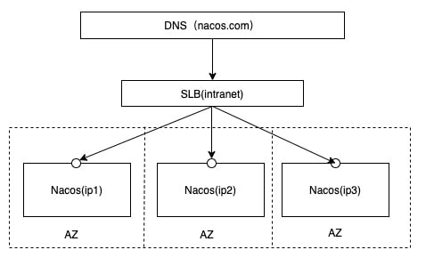

# nacos 2.0.1集群部署

<!--more-->
### 1.部署架构
官方文档: https://nacos.io/zh-cn/docs/cluster-mode-quick-start.html


### 2.主机规划
nacos01: 172.17.10.240
nacos02: 172.17.10.241
nacos03: 172.17.10.242
mysql: 172.17.10.150
nginx: 172.17.10.150

### 3.nacos下载:
```bash
# 三台机器分别下载或复制
wget https://github.91chifun.workers.dev/https://github.com//alibaba/nacos/releases/download/2.0.1/nacos-server-2.0.1.tar.gz
```

### 4.解压安装
```bash
# 三台机器执行
tar xf nacos-server-2.0.1.tar.gz
mv nacos /usr/local/
```

### 5.初始化nacos数据库
copy初始sql
```bash
scp /usr/local/nacos/conf/nacos-mysql.sql 172.17.10.150:
```

创建数据库,初始化数据
```bash
mysql -uroot -p -h 172.17.10.150
create database nacos default character set utf8mb4 collate utf8mb4_unicode_ci;
grant all on nacos.* to nacos@'172.17.10.%' identified by 'nacos';
use nacos
source /root/nacos-mysql.sql
```

### 6.修改配置
修改集群配置
```bash
cd /usr/local/nacos/conf

# 配置集群节点
cat > cluster.conf<<EOF
172.17.10.240:8848
172.17.10.241:8848
172.17.10.242:8848
EOF
```

修改数据源和日志配置
```bash
vim application.properties

# 如果本地有多个地址，可以手动指定一个地址
# nacos.inetutils.ip-address=

# 使用mysql数据源
spring.datasource.platform=mysql
# db的数量
db.num=1
db.url.0=jdbc:mysql://172.17.10.150:3306/nacos?characterEncoding=utf8&connectTimeout=1000&socketTimeout=3000&autoReconnect=true&useUnicode=true&useSSL=false&serverTimezone=UTC
db.user.0=nacos
db.password.0=nacos

server.tomcat.accesslog.enabled=false
```

复制配置给其他机器
```bash
# 复制给其他机器
scp application.properties cluster.conf 172.17.10.241:/usr/local/nacos/conf/
scp application.properties cluster.conf 172.17.10.242:/usr/local/nacos/conf/
```


### 7. 启动服务
```bash
# 三台机器都启动
/usr/local/nacos/bin/startup.sh
```

### 8. 使用nginx负载
nginx配置
```nginx
upstream nacos-cluster{
    server 172.17.10.240:8848;
    server 172.17.10.241:8848;
    server 172.17.10.242:8848;
}

server {
    listen       80 ;
    server_name  my.nacos.cn;
    location / {
        proxy_pass http://nacos-cluster;
    }
}
```

### 9. 测试
```bash
# 注册服务
curl -X POST 'http://my.nacos.cn/nacos/v1/ns/instance?port=8848&healthy=true&ip=11.11.11.11&weight=1.0&serviceName=soulchild&namespaceId=public'

# 服务发现
curl -X GET 'http://my.nacos.cn/nacos/v1/ns/instance/list?serviceName=soulchild'

# 发布配置
curl -X POST "http://my.nacos.cn/nacos/v1/cs/configs?dataId=nacos.cfg.dataId&group=test&content=helloWorld"

# 获取配置
curl -X GET "http://my.nacos.cn/nacos/v1/cs/configs?dataId=nacos.cfg.dataId&group=test"

# 查看集群状态
curl -s -X GET 'http://my.nacos.cn/nacos/v1/ns/operator/servers' | jq .servers
```


---

> 作者: [SoulChild](https://www.soulchild.cn)  
> URL: https://www.soulchild.cn/post/2433/  

