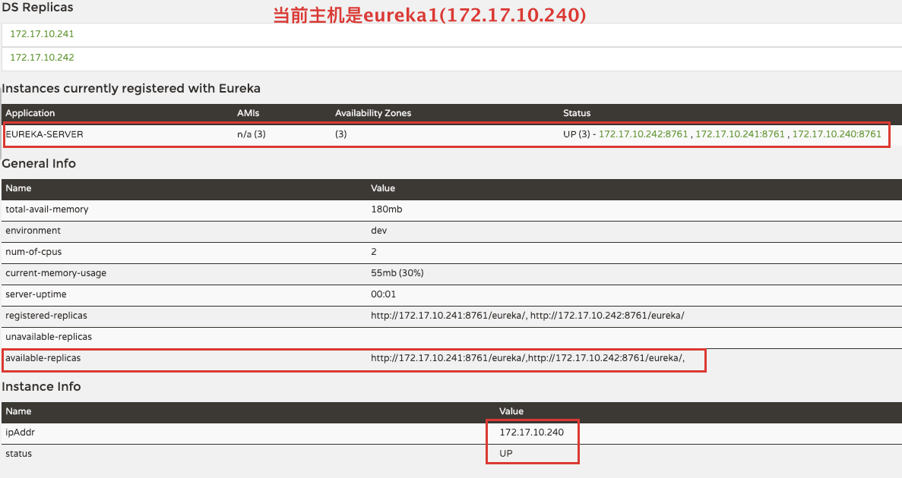
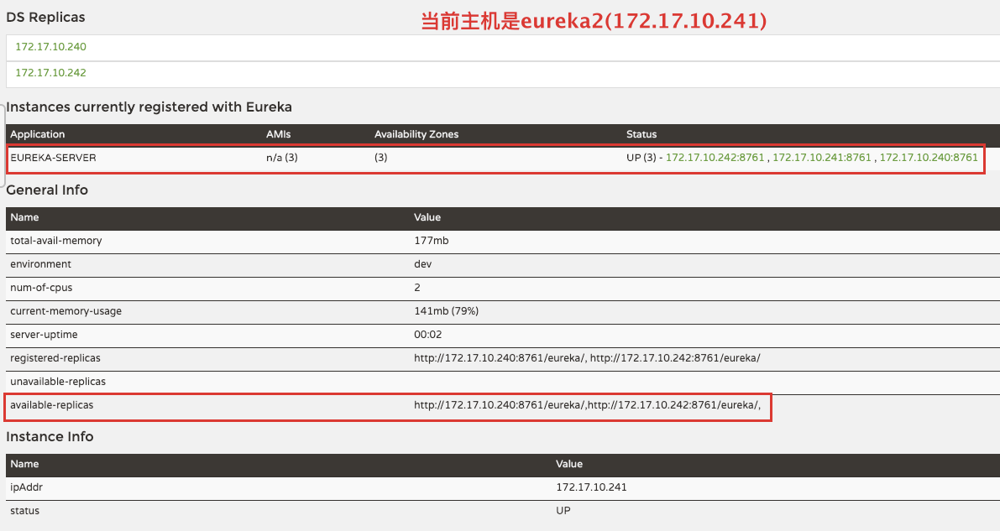
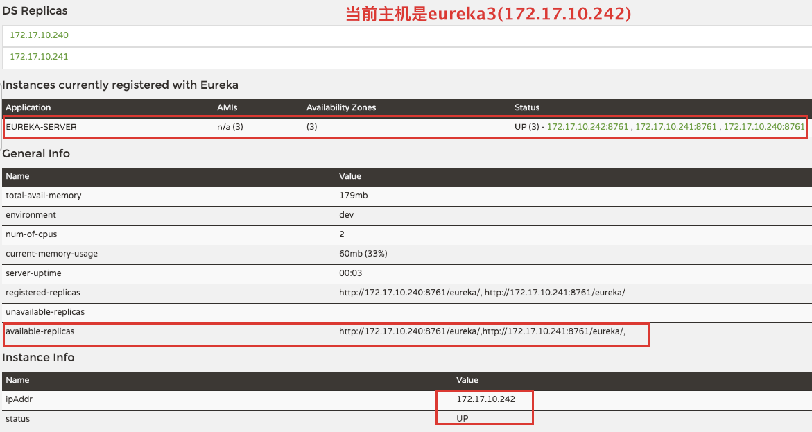
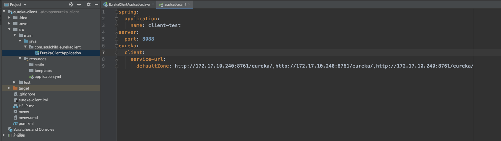
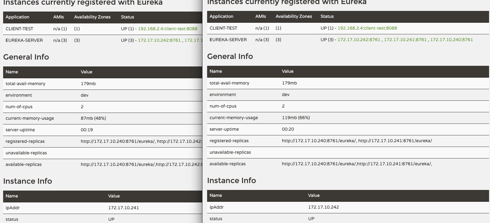
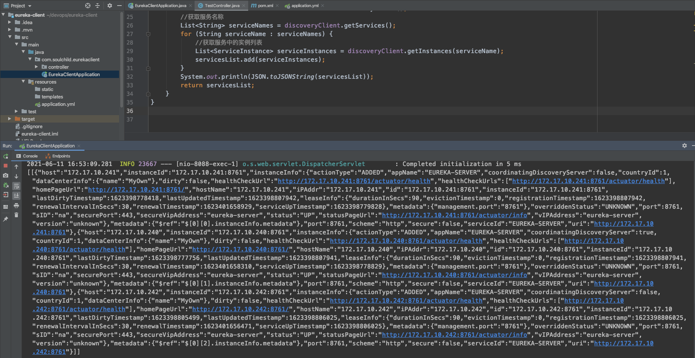

# eureka-server集群部署

<!--more-->
### 机器分配
eureka1: 172.17.10.240
eureka2: 172.17.10.241
eureka3: 172.17.10.242

### 1.[源码下载](https://start.spring.io/#!type=maven-project&language=java&platformVersion=2.3.12.RELEASE&packaging=jar&jvmVersion=1.8&groupId=cn.soulchild&artifactId=eureka-server&name=eureka-server&description=eureka%20server%20test&packageName=cn.soulchild.eureka-server&dependencies=cloud-eureka-server)


### 2.添加eureka注解
```bash
cd /server/packages/
unzip eureka-server.zip
cd eureka-server/src/main/java/cn/soulchild/eurekaserver/

sed -i '4iimport org.springframework.cloud.netflix.eureka.server.EnableEurekaServer;' EurekaServerApplication.java

sed -i '6i@EnableEurekaServer' EurekaServerApplication.java
```

### 3.修改配置文件
添加三个eureka的配置文件
```bash
cd /server/packages/eureka-server


cat > src/main/resources/application-eureka1.yml <<EOF
spring:
  application:
   name: eureka-server
server:
  port: 8761
eureka:
  instance:
    # 指定instance-id为ip:port的形式，在页面中显示的就是ip+port，不指定此选项显示主机名
    instance-id: ${spring.cloud.client.ip-address}:${server.port}
    # 这里使用ip的方式注册,使用hostname需要支持解析才行
    prefer-ip-address: true
  # 客户端配置
  client:
    # 是否将自己注册到注册中心
    register-with-eureka: true
    # 是否从注册中心获取信息
    fetch-registry: true
    serviceUrl:
      defaultZone: http://172.17.10.241:8761/eureka/,http://172.17.10.242:8761/eureka/
  # 控制eureka页面显示内容
  environment: "dev"
  datacenter: "bj-yz"
EOF

####################################################
cat > src/main/resources/application-eureka2.yml <<EOF
spring:
  application:
   name: eureka-server
server:
  port: 8761
eureka:
  instance:
    # 指定instance-id为ip:port的形式，在页面中显示的就是ip+port，不指定此选项显示主机名
    instance-id: ${spring.cloud.client.ip-address}:${server.port}
    # 这里使用ip的方式注册,使用hostname需要支持解析才行
    prefer-ip-address: true
  # 客户端配置
  client:
    # 是否将自己注册到注册中心
    register-with-eureka: false
    # 是否从注册中心获取信息
    fetch-registry: false
    serviceUrl:
      defaultZone: http://172.17.10.240:8761/eureka/,http://172.17.10.242:8761/eureka/
  # 控制eureka页面显示内容
  environment: "dev"
  datacenter: "bj-yz"
EOF

####################################################
cat > src/main/resources/application-eureka3.yml <<EOF
spring:
  application:
   name: eureka-server
server:
  port: 8761
eureka:
  instance:
    # 指定instance-id为ip:port的形式，在页面中显示的就是ip+port，不指定此选项显示主机名
    instance-id: ${spring.cloud.client.ip-address}:${server.port}
    # 这里使用ip的方式注册,使用hostname需要支持解析才行
    prefer-ip-address: true
  # 客户端配置
  client:
    # 是否将自己注册到注册中心
    register-with-eureka: false
    # 是否从注册中心获取信息
    fetch-registry: false
    serviceUrl:
      defaultZone: http://172.17.10.240:8761/eureka/,http://172.17.10.241:8761/eureka/
  # 控制eureka页面显示内容
  environment: "dev"
  datacenter: "bj-yz"
EOF
```
> 也可以将上面的三个文件合并成一个文件
```bash
vim src/main/resources/application.yml


spring:
  application:
   name: eureka-server
server:
  port: 8761
eureka:
  instance:
    # 指定instance-id为ip:port的形式，在页面中显示的就是ip+port，不指定此选项显示主机名
    instance-id: ${spring.cloud.client.ip-address}:${server.port}
    # 这里使用ip的方式注册,使用hostname需要支持解析才行
    prefer-ip-address: true
  # 客户端配置
  client:
    # 是否将自己注册到注册中心
    register-with-eureka: true
    # 是否从注册中心获取信息
    fetch-registry: true
---
spring:
  profiles: eureka1
eureka:
  client:
    serviceUrl:
      defaultZone: http://172.17.10.241:8761/eureka/,http://172.17.10.242:8761/eureka/
---
spring:
  profiles: eureka2
eureka:
  client:
   service-url:
     defaultZone: http://172.17.10.240:8761/eureka/,http://172.17.10.242:8761/eureka/
---
spring:
  profiles: eureka3
eureka:
  client:
   service-url:
     defaultZone: http://172.17.10.240:8761/eureka/,http://172.17.10.241:8761/eureka/
```


### 4.打包
```bash
./mvnw clean package
```

### 5.运行
三台机器运行各自的配置
```bash
# eureka1
java -Dspring.profiles.active=eureka1 -jar target/eureka-server-0.0.1-SNAPSHOT.jar
# eureka2
java -Dspring.profiles.active=eureka2 -jar target/eureka-server-0.0.1-SNAPSHOT.jar
# eureka3
java -Dspring.profiles.active=eureka3 -jar target/eureka-server-0.0.1-SNAPSHOT.jar
```


### 6.运行结果









### 7.注册服务测试




### 8.服务发现测试



---

> 作者: [SoulChild](https://www.soulchild.cn)  
> URL: https://www.soulchild.cn/post/2444/  

