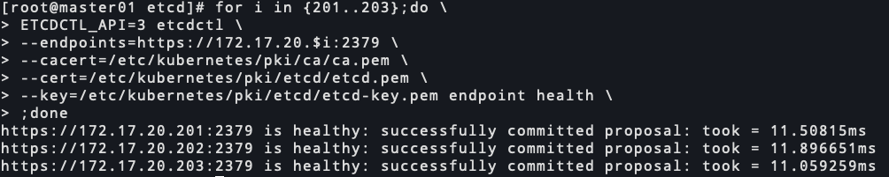
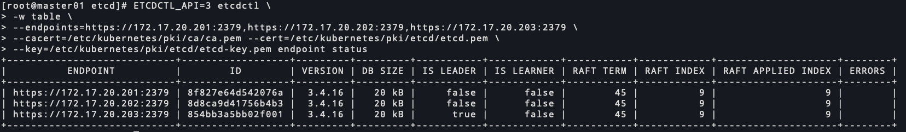

# kubernetes 1.20.7 二进制安装-etcd高可用部署(四)

<!--more-->
### 一、下载二进制包

```bash
mkdir /server/packages/ -p
cd /server/packages/

# 下载
wget https://github.91chifun.workers.dev/https://github.com//etcd-io/etcd/releases/download/v3.4.16/etcd-v3.4.16-linux-amd64.tar.gz

# 分发到其他机器
for i in {202..203};do scp etcd-v3.4.16-linux-amd64.tar.gz 172.17.20.$i:`pwd` ;done
```

### 二、安装etcd

```bash
# 三台执行
cd /server/packages/
tar xf etcd-v3.4.16-linux-amd64.tar.gz
mv etcd-v3.4.16-linux-amd64/etcd* /usr/local/bin/

# 创建相关目录
mkdir /data/etcd/{data,wal} -p
```

### 三、分发证书

```bash
for i in {202..203};do scp -r /etc/kubernetes/  172.17.20.$i:/etc/kubernetes/ ;done
```

### 四、创建systemd启动脚本

```bash
cat > /etc/systemd/system/etcd.service <<EOF
[Unit]
Description=Etcd Server
After=network.target
After=network-online.target
Wants=network-online.target
Documentation=https://github.com/coreos

[Service]
Type=notify
WorkingDirectory=/data/etcd/data/
ExecStart=/usr/local/bin/etcd \\
  --name=etcd01 \\
  --data-dir=/data/etcd/data/ \\
  --wal-dir=/data/etcd/wal \\
  --heartbeat-interval=200 \\
  --election-timeout=1500 \\
  --listen-peer-urls=https://172.17.20.201:2380 \\
  --listen-client-urls=https://172.17.20.201:2379 \\
  --initial-advertise-peer-urls=https://172.17.20.201:2380 \\
  --advertise-client-urls=https://172.17.20.201:2379 \\
  --initial-cluster=etcd01=https://172.17.20.201:2380,etcd02=https://172.17.20.202:2380,etcd03=https://172.17.20.203:2380 \\
  --initial-cluster-state=new \\
  --initial-cluster-token=k8s-etcd-cluster \\
  --cert-file=/etc/kubernetes/pki/etcd/etcd.pem \\
  --key-file=/etc/kubernetes/pki/etcd/etcd-key.pem \\
  --client-cert-auth \\
  --trusted-ca-file=/etc/kubernetes/pki/ca/ca.pem \\
  --peer-cert-file=/etc/kubernetes/pki/etcd/etcd.pem \\
  --peer-key-file=/etc/kubernetes/pki/etcd/etcd-key.pem \\
  --peer-client-cert-auth \\
  --peer-trusted-ca-file=/etc/kubernetes/pki/ca/ca.pem \\
  --enable-v2=true \\
  --logger=zap \\
  --log-level=info

Restart=on-failure
RestartSec=5
LimitNOFILE=65536

[Install]
WantedBy=multi-user.target
EOF
```

> 如果你看懂了下面的参数介绍，相信你可以写出其他两台etcd节点的参数配置

#### 参数简介

`--name`: 节点名称

`--data-dir`: 数据存储目录

`--wal-dir`: wal预写日志，所有的修改在提交之前都要先写入log文件中。默认路径在--data-dir目录下

`--heartbeat-interval`: 心跳间隔时间(毫秒)。leader通知所有的followers，他还是Leader的时间间隔。默认100ms

`--election-timeout`: 选举超时的时间(毫秒)。表示follower在多久后还没有收到leader的心跳，他就申请选举自己为Leader。默认1000ms。关于raft动画介绍: http://thesecretlivesofdata.com/raft

`--listen-peer-urls`: 监听地址，与集群其它成员通信的地址。

`--listen-client-urls`: 监听地址，与客户端通信的地址。

`--initial-advertise-peer-urls`: 向集群中其他成员通告自己的地址，对应`--listen-peer-urls`

`--advertise-client-urls`: 向客户端通告自己的地址，对应`--listen-client-urls`。这里有一个助于理解的文档：https://www.jianshu.com/p/7bbef1ca9733

`--initial-cluster`: 指定与集群中其他成员的通信地址(所有节点的地址)。形式为:`name=http://xxxx:2380`,name代表`--name`指定的值

`--initial-cluster-state`: 指定`new`或`existing`.前者为初始化新的集群，后者代表加入现有集群

`--initial-cluster-token`: 引导期间etcd集群的初始集群令牌,同一个集群令牌一致。

`--cert-file`: 服务端证书

`--key-file`: 服务端证书私钥

`--client-cert-auth`: 启用客户端证书认证

`--trusted-ca-file`: 指定信任的CA(校验客户端证书)

`--peer-cert-file`: 集群间通信的证书

`--peer-key-file`: 集群间通信的证书私钥

`--peer-client-cert-auth`: 启用集群间通信证书认证

`--peer-trusted-ca-file`: 指定信任的CA(校验集群间通信证书)

`--enable-v2`: 启用v2版本api

`--logger`: 指定日志器，默认capnslog,在3.5版本中已弃用。可选项zap是结构化日志。

`--log-level`: 日志级别，可选项debug, info, warn, error, panic, fatal。默认info


#### 其他etcd节点配置

**etcd02**

```bash
cat > /etc/systemd/system/etcd.service <<EOF
[Unit]
Description=Etcd Server
After=network.target
After=network-online.target
Wants=network-online.target
Documentation=https://github.com/coreos

[Service]
Type=notify
WorkingDirectory=/data/etcd/data/
ExecStart=/usr/local/bin/etcd \\
  --name=etcd02 \\
  --data-dir=/data/etcd/data/ \\
  --wal-dir=/data/etcd/wal \\
  --heartbeat-interval=200 \\
  --election-timeout=1500 \\
  --listen-peer-urls=https://172.17.20.202:2380 \\
  --listen-client-urls=https://172.17.20.202:2379 \\
  --initial-advertise-peer-urls=https://172.17.20.202:2380 \\
  --advertise-client-urls=https://172.17.20.202:2379 \\
  --initial-cluster=etcd01=https://172.17.20.201:2380,etcd02=https://172.17.20.202:2380,etcd03=https://172.17.20.203:2380 \\
  --initial-cluster-state=new \\
  --initial-cluster-token=k8s-etcd-cluster \\
  --cert-file=/etc/kubernetes/pki/etcd/etcd.pem \\
  --key-file=/etc/kubernetes/pki/etcd/etcd-key.pem \\
  --client-cert-auth \\
  --trusted-ca-file=/etc/kubernetes/pki/ca/ca.pem \\
  --peer-cert-file=/etc/kubernetes/pki/etcd/etcd.pem \\
  --peer-key-file=/etc/kubernetes/pki/etcd/etcd-key.pem \\
  --peer-client-cert-auth \\
  --peer-trusted-ca-file=/etc/kubernetes/pki/ca/ca.pem \\
  --enable-v2=true \\
  --logger=zap \\
  --log-level=info

Restart=on-failure
RestartSec=5
LimitNOFILE=65536

[Install]
WantedBy=multi-user.target
EOF
```

**etcd03**

```bash
cat > /etc/systemd/system/etcd.service <<EOF
[Unit]
Description=Etcd Server
After=network.target
After=network-online.target
Wants=network-online.target
Documentation=https://github.com/coreos

[Service]
Type=notify
WorkingDirectory=/data/etcd/data/
ExecStart=/usr/local/bin/etcd \\
  --name=etcd03 \\
  --data-dir=/data/etcd/data/ \\
  --wal-dir=/data/etcd/wal \\
  --heartbeat-interval=200 \\
  --election-timeout=1500 \\
  --listen-peer-urls=https://172.17.20.203:2380 \\
  --listen-client-urls=https://172.17.20.203:2379 \\
  --initial-advertise-peer-urls=https://172.17.20.203:2380 \\
  --advertise-client-urls=https://172.17.20.203:2379 \\
  --initial-cluster=etcd01=https://172.17.20.201:2380,etcd02=https://172.17.20.202:2380,etcd03=https://172.17.20.203:2380 \\
  --initial-cluster-state=new \\
  --initial-cluster-token=k8s-etcd-cluster \\
  --cert-file=/etc/kubernetes/pki/etcd/etcd.pem \\
  --key-file=/etc/kubernetes/pki/etcd/etcd-key.pem \\
  --client-cert-auth \\
  --trusted-ca-file=/etc/kubernetes/pki/ca/ca.pem \\
  --peer-cert-file=/etc/kubernetes/pki/etcd/etcd.pem \\
  --peer-key-file=/etc/kubernetes/pki/etcd/etcd-key.pem \\
  --peer-client-cert-auth \\
  --peer-trusted-ca-file=/etc/kubernetes/pki/ca/ca.pem \\
  --enable-v2=true \\
  --logger=zap \\
  --log-level=info

Restart=on-failure
RestartSec=5
LimitNOFILE=65536

[Install]
WantedBy=multi-user.target
EOF
```

### 四、启动服务

```bash
systemctl start etcd
systemctl enable etcd
```

### 五、查看节点状态

```bash
for i in {201..203};do \
ETCDCTL_API=3 etcdctl \
--endpoints=https://172.17.20.$i:2379 \
--cacert=/etc/kubernetes/pki/ca/ca.pem \
--cert=/etc/kubernetes/pki/etcd/etcd.pem \
--key=/etc/kubernetes/pki/etcd/etcd-key.pem endpoint health \
;done
```



### 六、查看集群状态

```bash
ETCDCTL_API=3 etcdctl \
-w table \
--endpoints=https://172.17.20.201:2379,https://172.17.20.202:2379,https://172.17.20.203:2379 \
--cacert=/etc/kubernetes/pki/ca/ca.pem --cert=/etc/kubernetes/pki/etcd/etcd.pem \
--key=/etc/kubernetes/pki/etcd/etcd-key.pem endpoint status
```




---

> 作者: [SoulChild](https://www.soulchild.cn)  
> URL: https://www.soulchild.cn/post/2467/  

