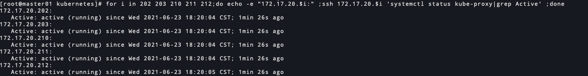

# kubernetes 1.20.7 二进制安装-kube-proxy安装(十一)

<!--more-->
### 一、安装kubelet

```bash
# 安装kubelet
for i in {201..203};do scp /server/packages/kubernetes/server/bin/kube-proxy root@172.17.20.$i:/usr/local/bin/ ;done
for i in {210..212};do scp /server/packages/kubernetes/server/bin/kube-proxy root@172.17.20.$i:/usr/local/bin/ ;done
```

### 二、配置kube-config

#### master节点执行

```bash
cd /etc/kubernetes/
# 设置集群信息
kubectl config set-cluster kubernetes --kubeconfig=kube-proxy.conf --server=https://172.17.20.200:6443 --certificate-authority=/etc/kubernetes/pki/ca/ca.pem --embed-certs=true

# 设置用户信息
kubectl config set-credentials kube-proxy --kubeconfig=kube-proxy.conf --client-certificate=/etc/kubernetes/pki/kube-proxy.pem --client-key=/etc/kubernetes/pki/kube-proxy-key.pem --embed-certs=true

# 设置上下文
kubectl config set-context kube-proxy --kubeconfig=kube-proxy.conf --cluster=kubernetes --user=kube-proxy

# 设置默认上下文
kubectl config use-context kube-proxy --kubeconfig=kube-proxy.conf

# 分发到其他节点
for i in 202 203 210 211 212;do scp /etc/kubernetes/kube-proxy.conf 172.17.20.$i:/etc/kubernetes/ ;done
```

### 三、kube-proxy配置文件

```bash
cat > /etc/kubernetes/kube-proxy.yaml <<EOF
apiVersion: kubeproxy.config.k8s.io/v1alpha1
kind: KubeProxyConfiguration
bindAddress: 0.0.0.0
healthzBindAddress: 0.0.0.0:10256
metricsBindAddress: 0.0.0.0:10249
bindAddressHardFail: true
enableProfiling: false
clusterCIDR: 10.244.0.0/16
hostnameOverride: 172.17.20.201
clientConnection: 
  kubeconfig: /etc/kubernetes/kube-proxy.conf
  qps: 100
  burst: 200
mode: "ipvs"
EOF


# 分发到其他机器
for i in 202 203 210 211 212;do scp /etc/kubernetes/kube-proxy.yaml 172.17.20.$i:/etc/kubernetes/ ;done

# 修改hostnameOverride信息
for i in 202 203 210 211 212;do ssh 172.17.20.$i 'sed -i "s#hostnameOverride.*#hostnameOverride: $(ip a s eth0 | grep -o 172\.17\.20.*/ | tr -d /)#" /etc/kubernetes/kube-proxy.yaml' ;done
```

参数说明:
`bindAddress`: 监听地址

`healthzBindAddress`: 健康检查服务的监听地址和端口，默认0.0.0.0:10256

`metricsBindAddress`: metrics指标服务的监听地址和端口，默认127.0.0.1:10249

`bindAddressHardFail`: 端口绑定失败视为严重错误，直接退出程序

`enableProfiling`: 启用性能分析

`clusterCIDR`: pod的ip范围

`hostnameOverride`: 参数值必须与 kubelet 的值一致，否则 kube-proxy 启动后会找不到该 Node，从而不会创建任何 ipvs 规则

`clientConnection`: kube-proxy客户端的配置
  - `kubeconfig`: kubeconfig文件路径
  - `qps`: 每秒允许的查询数
  - `burst`: 与apiserver通信时的并发数

`mode`: 使用的网络代理模式，可选项userspace、iptables、ipvs

### 四、配置systemd启动脚本

```bash
cat > /etc/systemd/system/kube-proxy.service <<EOF
[Unit]
Description=Kubernetes Kube-Proxy Server
Documentation=https://github.com/GoogleCloudPlatform/kubernetes
After=network.target

[Service]
ExecStart=/usr/local/bin/kube-proxy \\
  --config=/etc/kubernetes/kube-proxy.yaml \\
  --logtostderr=false \\
  --log-file=/var/log/kube-proxy.log \\
  --v=2

Restart=on-failure
RestartSec=5
LimitNOFILE=65536

[Install]
WantedBy=multi-user.target
EOF

# 分发到其他机器
for i in 202 203 210 211 212;do scp /etc/systemd/system/kube-proxy.service 172.17.20.$i:/etc/systemd/system/ ;done
```

### 五、启动服务

```bash
systemctl start kube-proxy
systemctl enable kube-proxy
```

### 六、查看状态

```bash
for i in 201 202 203 210 211 212;do echo -e "172.17.20.$i:" ;ssh 172.17.20.$i 'systemctl status kube-proxy|grep Active' ;done
```




---

> 作者: [SoulChild](https://www.soulchild.cn)  
> URL: https://www.soulchild.cn/post/2505/  

