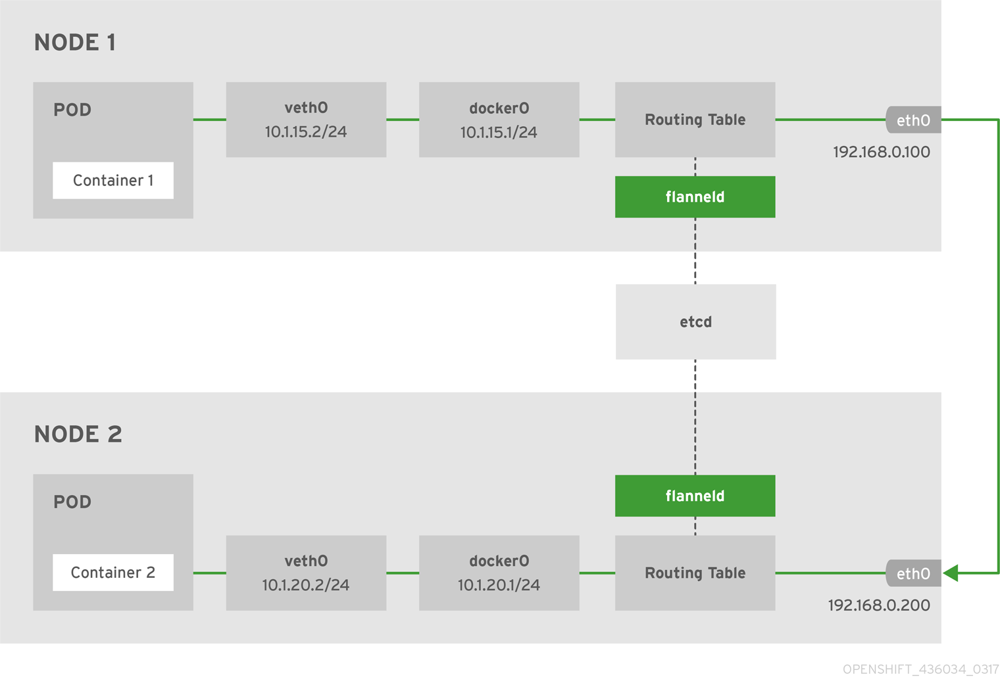
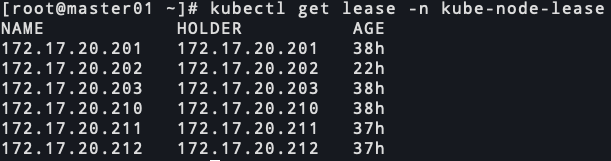
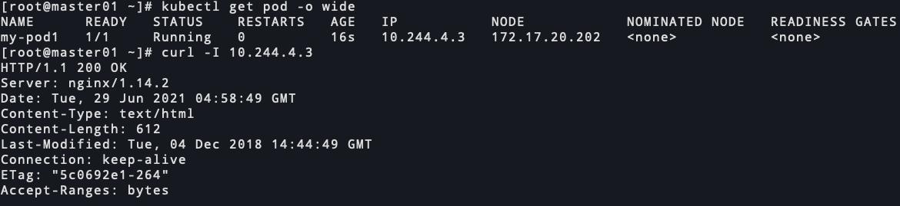

# kubernetes 1.20.7 二进制安装-flannel安装(十二) 

<!--more-->

## 概述

下图说明了使用flannel插件进行跨宿主机进行容器网络流量的转发。


1. pod(容器)通过veth0将流量发送到docker0
2. docker0经过路由表会将docker0的流量转发到flanneld中,flanneld获取数据包目标地址，根据etcd的信息找出目标地址所属的宿主机地址，然后将数据包封装转发到0.200主机的flanneld中
3. 0.200的宿主机收到流量后，需要解封装，获取原始数据包,在经过路由表发送至docker0网卡，最后到达容器

> 上面是基于UDP的一个大概解释

## 第一种方式安装(推荐)

flannel通过k8s api来分配子网，本文参考: https://zhangguanzhang.github.io/2019/03/15/flannel-bin/

### 一、下载安装flannel

```bash
cd /server/packages/
wget https://github.com/flannel-io/flannel/releases/download/v0.14.0/flannel-v0.14.0-linux-amd64.tar.gz
tar xf flannel-v0.14.0-linux-amd64.tar.gz flanneld
mv flanneld /usr/local/bin/
for i in 202 203 210 211 212;do scp /usr/local/bin/flanneld 172.17.20.$i:/usr/local/bin/ ;done
```

### 二、添加flannel配置文件

```bash
mkdir /etc/kube-flannel/
cat > /etc/kube-flannel/net-conf.json <<EOF
{
    "Network": "10.244.0.0/16",
    "Backend": {
        "Type": "vxlan",
        "DirectRouting": true
    }
}
EOF
```

分发到所有安装flannel的节点

```bash
for i in 202 203 210 211 212;do scp -r /etc/kube-flannel/ 172.17.20.$i:/etc/kube-flannel/ ;done
```

### 三、配置cni

#### 1.下载cni二进制文件

```bash
# master节点执行
cd /server/packages/
wget https://github.com//containernetworking/plugins/releases/download/v0.8.6/cni-plugins-linux-amd64-v0.8.6.tgz
mkdir /opt/cni/bin -p
tar xf cni-plugins-linux-amd64-v0.8.6.tgz -C /opt/cni/bin/

# 分发到所有要安装flannel的节点
for i in 202 203 210 211 212;do scp -r /opt/cni 172.17.20.$i:/opt/ ;done
```

#### 2.添加cni配置文件

```bash
cat > /etc/cni/net.d/10-flannel.conflist <<EOF
{
  "name": "cbr0",
  "cniVersion": "0.3.1",
  "plugins": [
    {
      "type": "flannel",
      "delegate": {
        "hairpinMode": true,
        "isDefaultGateway": true
      }
    },
    {
      "type": "portmap",
      "capabilities": {
        "portMappings": true
      }
    }
  ]
}
EOF
```

分发到所有要安装flannel的节点

```bash
for i in 202 203 210 211 212;do scp -r /etc/cni 172.17.20.$i:/etc/ ;done
```

### 四、配置flannel kubeconfig

#### 1. 创建权限、sa生成token

```bash
cat <<EOF | kubectl apply -f -
kind: ClusterRole
apiVersion: rbac.authorization.k8s.io/v1
metadata:
  name: flannel
rules:
- apiGroups: ['extensions']
  resources: ['podsecuritypolicies']
  verbs: ['use']
  resourceNames: ['psp.flannel.unprivileged']
- apiGroups:
  - ""
  resources:
  - pods
  verbs:
  - get
- apiGroups:
  - ""
  resources:
  - nodes
  verbs:
  - list
  - watch
- apiGroups:
  - ""
  resources:
  - nodes/status
  verbs:
  - patch
---
kind: ClusterRoleBinding
apiVersion: rbac.authorization.k8s.io/v1
metadata:
  name: flannel
roleRef:
  apiGroup: rbac.authorization.k8s.io
  kind: ClusterRole
  name: flannel
subjects:
- kind: ServiceAccount
  name: flannel
  namespace: kube-system
---
apiVersion: v1
kind: ServiceAccount
metadata:
  name: flannel
  namespace: kube-system
EOF
```

#### 2. 创建kubeconfig

```bash
cd /etc/kubernetes/
kubectl config set-cluster kubernetes --kubeconfig=flannel.conf --embed-certs --server=https://172.17.20.200:6443 --certificate-authority=/etc/kubernetes/pki/ca/ca.pem

kubectl config set-credentials flannel --kubeconfig=flannel.conf --token=$(kubectl get sa -n kube-system flannel -o jsonpath={.secrets[0].name} | xargs kubectl get secret -n kube-system  -o jsonpath={.data.token} | base64 -d)

kubectl config set-context kubernetes --kubeconfig=flannel.conf --user=flannel --cluster=kubernetes

kubectl config use-context kubernetes --kubeconfig=flannel.conf

# 分发到所有安装flannel的节点
for i in 202 203 210 211 212;do scp /etc/kubernetes/flannel.conf 172.17.20.$i:/etc/kubernetes/ ;done
```

### 五、配置systemd启动脚本

```bash
cat > /etc/systemd/system/flanneld.service <<EOF
[Unit]
Description=Flanneld
After=network.target
After=network-online.target
Wants=network-online.target
After=etcd.service

[Service]
Type=notify
Environment=NODE_NAME=172.17.20.201
ExecStart=/usr/local/bin/flanneld \\
  --iface=eth0 \\
  --ip-masq \\
  --kube-subnet-mgr=true \\
  --kubeconfig-file=/etc/kubernetes/flannel.conf

Restart=always
RestartSec=5
StartLimitInterval=0

[Install]
WantedBy=multi-user.target
EOF
```

`--iface`: 主机间通信的网卡接口

`--ip-masq`: 为发往flannel网络外部的流量设置ip伪装

分发到所有要安装flannel的节点

```bash
for i in 202 203 210 211 212;do scp /etc/systemd/system/flanneld.service 172.17.20.$i:/etc/systemd/system/ ;done

# 修改配置文件中的NODE_NAME变量
for i in 202 203 210 211 212;do ssh 172.17.20.$i 'sed -i "s#172.17.20.201#$(ip a s eth0 | grep -o 172\.17\.20.*/ | tr -d /)#" /etc/systemd/system/flanneld.service' ;done
```

### 六、启动服务

```bash
所有安装flannel的节点启动服务
systemctl start flanneld
systemctl enable flanneld
```

### 八、查看node lease



## 第二种方式安装(不推荐)

flannel通过etcd来分配子网

### 一、下载安装flannel

```bash
cd /server/packages/
wget https://github.com/flannel-io/flannel/releases/download/v0.14.0/flannel-v0.14.0-linux-amd64.tar.gz
tar xf flannel-v0.14.0-linux-amd64.tar.gz flanneld mk-docker-opts.sh
mv flanneld mk-docker-opts.sh /usr/local/bin/
for i in 202 203 210 211 212;do scp /usr/local/bin/flanneld /usr/local/bin/mk-docker-opts.sh 172.17.20.$i:/usr/local/bin/ ;done
```

### 二、添加flannel网络配置到etcd

注意flannel只支持etcd v2版本api

```bash
ETCDCTL_API=2 etcdctl \
--endpoints=https://172.17.20.201:2379,https://172.17.20.202:2379,https://172.17.20.203:2379 \
--ca-file=/etc/kubernetes/pki/ca/ca.pem --cert-file=/etc/kubernetes/pki/flannel.pem \
--key-file=/etc/kubernetes/pki/flannel-key.pem \
mk /coreos.com/network/config '{ "Network": "10.244.0.0/16", "Backend": {"Type": "vxlan", "DirectRouting": true }}'
```

`Network`: 指定给pod或者容器分配的ip范围

`Backend.Type`: 使用的后端实现为vxlan

`Backend.DirectRouting`: 当node节点位于同一子网上时启用直接路由。仅node节点上的子网不同时,才会使用VXLAN将数据包封装

### 三、配置cni

#### 1.下载cni二进制文件

```bash
# master节点执行
cd /server/packages/
wget https://github.com//containernetworking/plugins/releases/download/v0.8.6/cni-plugins-linux-amd64-v0.8.6.tgz
mkdir /opt/cni/bin -p
tar xf cni-plugins-linux-amd64-v0.8.6.tgz -C /opt/cni/bin/

# 分发到所有要安装flannel的节点
for i in 202 203 210 211 212;do scp -r /opt/cni 172.17.20.$i:/opt/ ;done
```

#### 2.添加cni配置文件

```bash
cat > /etc/cni/net.d/10-flannel.conflist <<EOF
{
  "name": "cbr0",
  "cniVersion": "0.3.1",
  "plugins": [
    {
      "type": "flannel",
      "delegate": {
        "hairpinMode": true,
        "isDefaultGateway": true
      }
    },
    {
      "type": "portmap",
      "capabilities": {
        "portMappings": true
      }
    }
  ]
}
EOF
```

分发到所有要安装flannel的节点

```bash
for i in 202 203 210 211 212;do scp -r /etc/cni 172.17.20.$i:/etc/ ;done
```

### 四、配置systemd启动脚本

```bash
cat > /etc/systemd/system/flanneld.service << EOF
[Unit]
Description=Flanneld overlay address etcd agent
After=network.target
After=network-online.target
Wants=network-online.target
After=etcd.service

[Service]
Type=notify
ExecStart=/usr/local/bin/flanneld \\
  --iface=eth0 \\
  --ip-masq \\
  --etcd-endpoints=https://172.17.20.201:2379,https://172.17.20.202:2379,https://172.17.20.203:2379 \\
  --etcd-prefix=/coreos.com/network \\
  --etcd-keyfile=/etc/kubernetes/pki/flannel-key.pem \\
  --etcd-certfile=/etc/kubernetes/pki/flannel.pem \\
  --etcd-cafile=/etc/kubernetes/pki/ca/ca.pem

Restart=always
RestartSec=5
StartLimitInterval=0
[Install]
WantedBy=multi-user.target
EOF
```

`--iface`: 主机间通信的网卡接口

`--ip-masq`: 为发往flannel网络外部的流量设置ip伪装

分发到所有要安装flannel的节点

```bash
for i in 202 203 210 211 212;do scp /etc/systemd/system/flanneld.service 172.17.20.$i:/etc/systemd/system/ ;done
```

### 五、启动服务

```bash
所有安装flannel的节点启动服务
systemctl start flanneld
systemctl enable flanneld
```

### 六、查看flannel给节点分配的网络信息

```bash
ETCDCTL_API=2 etcdctl --endpoints=https://172.17.20.201:2379,https://172.17.20.202:2379,https://172.17.20.203:2379 --ca-file=/etc/kubernetes/pki/ca/ca.pem --cert-file=/etc/kubernetes/pki/etcd/etcd.pem --key-file=/etc/kubernetes/pki/etcd/etcd-key.pem ls /coreos.com/network/subnets
```

## 测试

创建pod和service

```bash
cat <<EOF | kubectl apply -f -
apiVersion: v1
kind: Pod
metadata:
  name: my-pod1
  labels:
    app: nginx
spec:
  nodeName: "172.17.20.202"
  containers:
    - name: nginx
      image: nginx:1.14.2
      ports:
        - name: web
          containerPort: 80
---
apiVersion: v1
kind: Service
metadata:
  name: my-pod1
spec:
  type: ClusterIP
  selector:
    app: nginx
  ports:
    - name: web
      port: 80
      targetPort: 80
EOF
```




---

> 作者: [SoulChild](https://www.soulchild.cn)  
> URL: https://www.soulchild.cn/post/2509/  

