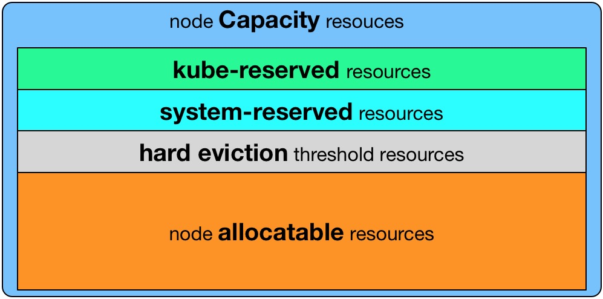
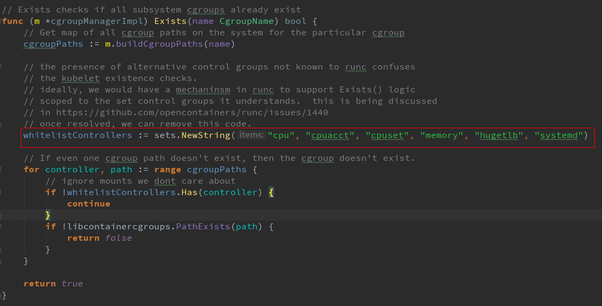
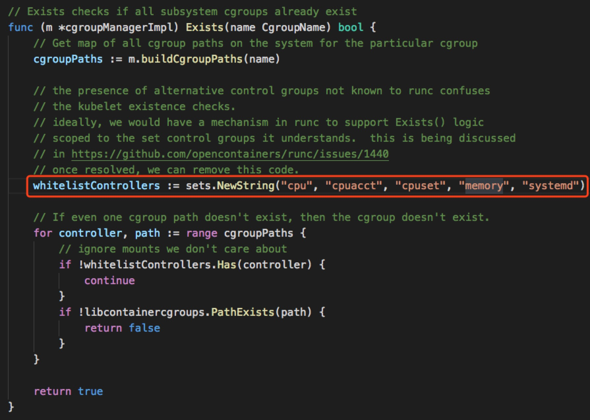
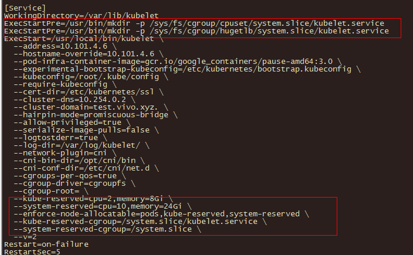

# k8s-node节点资源预留相关配置

<!--more-->
原文链接: 
从一次集群雪崩看Kubelet资源预留的正确姿势
https://my.oschina.net/jxcdwangtao/blog/1629059


### Kubelet Node Allocatable
- Kubelet Node Allocatable用来为Kube组件和System进程预留资源，从而保证当节点出现满负荷时也能保证Kube和System进程有足够的资源。

- 目前支持cpu, memory, ephemeral-storage三种资源预留。

- `node Capacity resources`是Node的所有硬件资源，`kube-reserved resources`是给kube组件预留的资源，`system-reserved resources`是给系统进程预留的资源，`hard eviction threshold resources`是kubelet eviction的阈值设定，`node allocatable resources`才是真正scheduler调度Pod时的参考值（保证Node上所有Pods的request resource不超过Allocatable）。

- (node可用资源计算) Node Allocatable Resource = Node Capacity - Kube-reserved - system-reserved - eviction-threshold




### 如何配置

- --enforce-node-allocatable，默认为pods，要为kube组件和System进程预留资源，则需要设置为pods,kube-reserved,system-reserve。
- --cgroups-per-qos，Enabling QoS and Pod level cgroups，默认开启。开启后，kubelet会将管理所有workload Pods的cgroups。
- --cgroup-driver，默认为cgroupfs，另一可选项为systemd。取决于容器运行时使用的cgroup driver，kubelet与其保持一致。比如你配置docker使用systemd cgroup driver，那么kubelet也需要配置--cgroup-driver=systemd。
- --kube-reserved,用于配置为kube组件（kubelet,kube-proxy,dockerd等）预留的资源量，比如—kube-reserved=cpu=1000m,memory=8Gi，ephemeral-storage=16Gi。
- --kube-reserved-cgroup，如果你设置了--kube-reserved，那么请一定要设置对应的cgroup，并且该cgroup目录要事先创建好，否则kubelet将不会自动创建导致kubelet启动失败。比如设置为kube-reserved-cgroup=/kubelet.service 。
- --system-reserved，用于配置为System进程预留的资源量，比如—system-reserved=cpu=500m,memory=4Gi,ephemeral-storage=4Gi。
- --system-reserved-cgroup，如果你设置了--system-reserved，那么请一定要设置对应的cgroup，并且该cgroup目录要事先创建好，否则kubelet将不会自动创建导致kubelet启动失败。比如设置为system-reserved-cgroup=/system.slice。
- --eviction-hard，用来配置kubelet的hard eviction条件，只支持memory和ephemeral-storage两种不可压缩资源。当出现MemoryPressure时，Scheduler不会调度新的Best-Effort QoS Pods到此节点。当出现DiskPressure时，Scheduler不会调度任何新Pods到此节点。关于Kubelet Eviction的更多解读，请参考我的相关博文。
- Kubelet Node Allocatable的代码很简单，主要在pkg/kubelet/cm/node_container_manager.go，感兴趣的同学自己去走读一遍。

> 关于如何规划Node的Cgroup结构，请参考官方建议: recommended-cgroups-setup


### 简单示例
以如下的kubelet资源预留为例，Node Capacity为memory=32Gi, cpu=16, ephemeral-storage=100Gi，我们对kubelet进行如下配置：

```bash
--enforce-node-allocatable=pods,kube-reserved,system-reserved
--kube-reserved-cgroup=/kubelet.service
--system-reserved-cgroup=/system.slice
--kube-reserved=cpu=1,memory=2Gi,ephemeral-storage=1Gi
--system-reserved=cpu=500m,memory=1Gi,ephemeral-storage=1Gi
--eviction-hard=memory.available<500Mi,nodefs.available<10%
```

最终计算结果: 
NodeAllocatable = NodeCapacity - Kube-reserved - system-reserved - eviction-threshold = cpu=14.5,memory=28.5Gi,ephemeral-storage=98Gi.

Scheduler会确保Node上所有的Pod Resource Request不超过NodeAllocatable。Pods所使用的memory和storage之和超过NodeAllocatable后就会触发kubelet Evict Pods。

### 我踩的坑
#### kube-reserved-cgroup及system-reserved-cgroup配置
最开始，我只对kubelet做了如下配置--kube-reserved, --system-reserved,我就以为kubelet会自动给kube和system创建对应的Cgroup，并设置对应的cpu share, memory limit等，然后高枕无忧了。

然而实际上并非如此，直到在线上有一次某个TensorFlow worker的问题，无限制的使用节点的cpu，导致节点上cpu usage持续100%运行，并且压榨到了kubelet组件的cpu使用，导致kubelet与APIServer的心跳断了，这个节点便Not Ready了。

接着，Kubernetes会在其他某个最优的Ready Node上启动这个贪婪的worker，进而把这个节点的cpu也跑满了，节点Not Ready了。

如此就出现了集群雪崩，集群内的Nodes逐个的Not Ready了,后果非常严重。

把kublet加上如下配置后，即可保证在Node高负荷时，也能保证当kubelet需要cpu时至少能有--kube-reserved设置的cpu cores可用。

```bash
--enforce-node-allocatable=pods,kube-reserved,system-reserved
--kube-reserved-cgroup=/kubelet.service
--system-reserved-cgroup=/system.slice
```

> 注意,因为kube-reserved设置的cpu其实最终是写到kube-reserved-cgroup下面的cpu shares。了解cpu shares的同学知道，只有当集群的cpu跑满需要抢占时才会起作用，因此你会看到Node的cpu usage还是有可能跑到100%的，但是不要紧，kubelet等组件并没有收到影响，如果kubelet此时需要更多的cpu，那么它就能抢到更多的时间片，最多可以抢到kube-reserved设置的cpu nums。


### Kubernetes会检查的cgroup subsystem
- 在Kubernetes 1.7版本，Kubelet启动会检查以下cgroup subsystem的存在：



- 在Kubernetes 1.8及1.9版本，Kubelet启动会检查以下cgroup subsystem的存在：


对于Centos系统，cpuset和hugetlb subsystem是默认没有初始化system.slice，因此需要手动创建，否则会报Failed to start ContainerManager Failed to enforce System Reserved Cgroup Limits on "/system.slice": "/system.slice" cgroup does not exist的错误日志。

我们可以通过在kubelet service中配置ExecStartPre来实现。




---

> 作者: [SoulChild](https://www.soulchild.cn)  
> URL: https://www.soulchild.cn/post/2539/  

