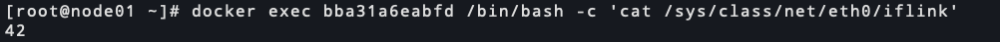
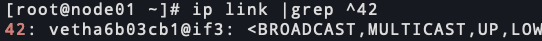
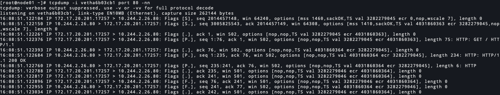

# k8s 对pod抓包

<!--more-->
1.查找pod所属的node节点和容器ID
```bash
kubectl get pod POD_NAME -o yaml | egrep 'containerID|nodeName'
```

2.查看容器网卡的链接索引值：
```bash
kubectl exec -it POD_NAME -- 'cat /sys/class/net/eth0/iflink'

# 如果容器没有命令可以使用其他镜像进行查看
docker run -it --rm --network container:bba31a6eabfd busybox:1.23 'cat /sys/class/net/eth0/iflink'
```

> 链接到索引是42的网卡上


3.根据索引值找到宿主机网卡
```bash
ip link |grep ^42
```



4.抓包
```bash
tcpdump -i vetha6b03cb1 port 80 -nn 
```



---

> 作者: [SoulChild](https://www.soulchild.cn)  
> URL: https://www.soulchild.cn/post/2556/  

