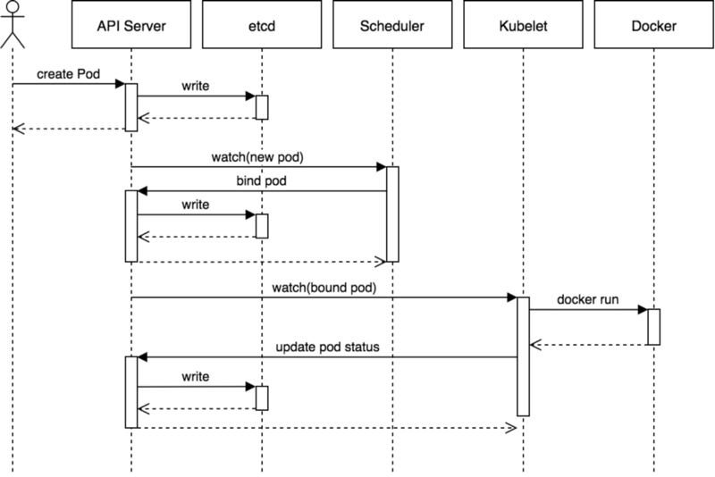

# k8s 创建pod和deployment的流程

<!--more-->
### 1、创建Pod流程

图片来源: heptio.com

1. 客户端将创建Pod的请求发送给Apiserver
2. Apiserver将Pod信息写入etcd,etcd将写入结果响应给Apiserver,Apiserver将创建结果响应给客户端(此时Pod处于Pending状态)
3. Scheduler通过Apiserver的watch接口,获取到未调度的Pod的通知,根据调度算法选择一个node节点,告诉Apiserver这个Pod应该运行在哪个节点
4. Apiserver将这个Pod和node的绑定信息更新到etcd,etcd将写入结果响应给Apiserver
5. Kubelet通过Apiserver的watch接口,获取到当前节点有创建Pod的通知,Kubelet调用docker创建容器,Kubelet将Pod运行状态发送给Apiserver
6. Apiserver将Pod状态信息更新到etcd

### 2、创建Deployment流程

图片来源书籍: kubernetes in action

1. 客户端将创建Deployment的请求发送给Apiserver
2. Apiserver将Deployment信息写入etcd,etcd将写入结果响应给Apiserver,Apiserver将创建结果响应给客户端(此时未经过ControllerManager,deployment的READY状态为0)
3. ControllerManager通过Apiserver的watch接口,获取到新增的Deployment资源,Deployment controller向Apiserver发送创建RS的请求,Apiserver将RS信息写入etcd。。。
4. ControllerManager通过Apiserver的watch接口,获取到新增的ReplicaSet资源,ReplicaSet controller向Apiserver发送创建Pod的请求,Apiserver将Pod信息写入etcd。。。
5. Scheduler通过Apiserver的watch接口,获取到未调度的Pod的通知,根据调度算法选择一个node节点,告诉Apiserver这个Pod应该运行在哪个节点
6. Apiserver将这个Pod和node的绑定信息更新到etcd,etcd将写入结果响应给Apiserver
7. Kubelet通过Apiserver的watch接口,获取到当前节点有创建Pod的通知,Kubelet调用docker创建容器,Kubelet将Pod运行状态发送给Apiserver
8. Apiserver将Pod状态信息更新到etcd

> 通过Apiserver的watch接口获取的信息，都是由Apiserver主动通知的

---

> 作者: [SoulChild](https://www.soulchild.cn)  
> URL: https://www.soulchild.cn/post/2579/  

