# k8s 部署jenkins实现动态slave

<!--more-->
### 一、创建namespace
```bash
k create namespace devops
```

### 二、创建PVC
我的k8s集群已经配置过nfs-storageclass了,所以下面只创建了pvc，pv是自动创建的
```bash
apiVersion: v1
kind: PersistentVolumeClaim
metadata:
  name: jenkins-pvc
  namespace: devops
spec:
  storageClassName: nfs-storage
  accessModes:
  - ReadWriteOnce
  resources:
    requests:
      storage: 20Gi
```

### 三、创建ServiceAccount
```bash
---
apiVersion: v1
kind: ServiceAccount
metadata:
  name: jenkins
  namespace: devops
---
apiVersion: rbac.authorization.k8s.io/v1
kind: Role
metadata:
  annotations:
    rbac.authorization.kubernetes.io/autoupdate: "true"
  labels:
    kubernetes.io/bootstrapping: rbac-defaults
  name: jenkins
  namespace: devops
rules:
- apiGroups:
  - ""
  resources:
  - pods
  - pods/log
  - pods/exec
  verbs:
  - create
  - get
  - watch
  - delete
  - list
  - patch
  - update
- apiGroups:
  - ""
  resources:
  - secrets
  verbs:
  - get
---
apiVersion: rbac.authorization.k8s.io/v1
kind: RoleBinding
metadata:
  annotations:
    rbac.authorization.kubernetes.io/autoupdate: "true"
  labels:
    kubernetes.io/bootstrapping: rbac-defaults
  name: jenkins
  namespace: devops
roleRef:
  apiGroup: rbac.authorization.k8s.io
  kind: Role
  name: jenkins
subjects:
- apiGroup: rbac.authorization.k8s.io
  kind: User
  # system:serviceaccounts:<namespace名称>表示devops命名空间的所有ServiceAccount，这里用到了k8s中以用户组的概念，如果要使用这种方法，需要将kind的值改为Group
  #name: system:serviceaccounts:devops
  # 下面表达的意思是devops命名空间下的jenkins serviceaccount
  name: system:serviceaccount:devops:jenkins
```

### 四、创建Deployment
关于jenkins镜像说明: https://github.com/jenkinsci/docker/blob/master/README.md

注意点:
1. jenkins存储目录在/var/jenkins_home，所以需要持久化这个目录
2. 端口有两个，一个是8080(web页面),另一个是50000(agent端口)
3. JVM参数通过`JAVA_OPTS`环境变量修改

```bash
apiVersion: apps/v1
kind: Deployment
metadata:
  name: jenkins
  namespace: devops
spec:
  replicas: 1
  selector:
    matchLabels:
      app: jenkins
  template:
    metadata:
      labels:
        app: jenkins
    spec:
      containers:
      - name: jenkins
        image: jenkins/jenkins:lts-jdk11
        imagePullPolicy: IfNotPresent
        ports:
        - name: web
          containerPort: 8080
        - name: tcp
          containerPort: 50000
        volumeMounts:
        - name: jenkins-home
          mountPath: /var/jenkins_home
        startupProbe:
          httpGet:
            path: /login
            port: web
          initialDelaySeconds: 60
          periodSeconds: 10
          successThreshold: 1
          failureThreshold: 10
          timeoutSeconds: 5
        readinessProbe:
          httpGet:
            path: /login
            port: web
          initialDelaySeconds: 60
          periodSeconds: 2
          successThreshold: 1
          failureThreshold: 2
          timeoutSeconds: 5
        livenessProbe:
          httpGet:
            path: /login
            port: web
          initialDelaySeconds: 60
          periodSeconds: 2
          successThreshold: 1
          failureThreshold: 2
          timeoutSeconds: 5
      volumes:
      - name: jenkins-home
        persistentVolumeClaim:
          claimName: jenkins-pvc
```

### 五、创建Service
我在测试的时候jnlp容器报错:java.nio.channels.UnresolvedAddressException，查询资料发现jenkins-web的地址要和jenkins-agent的地址一样,所以web和agent要使用同一个service，但是我不想把jenkins-agent的端口暴露在集群外，所以下面我创建了两个service，一个是提供jenkins-web的外部访问(只包含web)，一个用于集群内部访问(包含web和agent)
```bash
apiVersion: v1
kind: Service
metadata:
  name: jenkins-web
  namespace: devops
spec:
  type: NodePort
  ports:
  - name: web
    port: 8080
    targetPort: 8080
  selector:
    app: jenkins
---
apiVersion: v1
kind: Service
metadata:
  name: jenkins
  namespace: devops
spec:
  type: ClusterIP
  ports:
  - name: web
    port: 8080
    targetPort: 8080
  - name: agent
    port: 50000
    targetPort: 50000
  selector:
    app: jenkins
```


### 六、访问测试
查看nodeport端口
```bash
k get svc -n devops jenkins-web -o jsonpath={.spec.ports[*].nodePort}
```
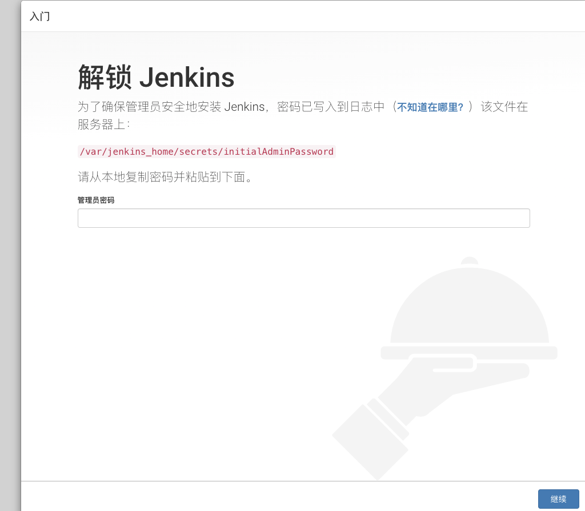

查看初始密码
```bash
k logs -n devops --selector=app=jenkins --tail=100 |egrep '^([0-9]|[a-zA-Z]){32}'
```

### 7、配置动态slave(请自行安装kubernetes插件)

** 1.查看jenkins serviceaccount token **
```bash
k get secret -n devops $(k get sa -n devops jenkins -o jsonpath={.secrets[0].name}) -o jsonpath={.data.token} |base64 -d ;echo
```

** 2.创建jenkins凭据 **

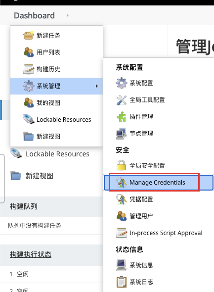

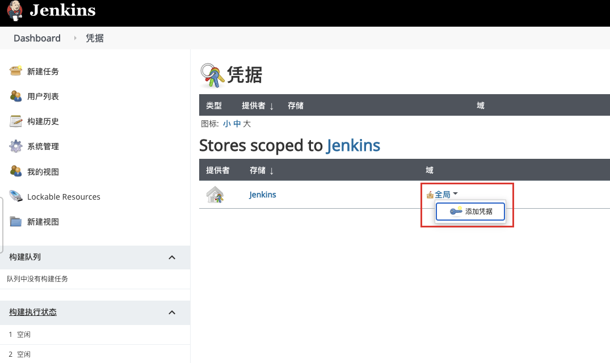

** 将第一步的token填入到secret即可 **

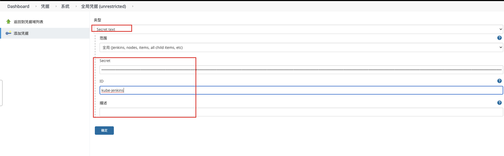

** 3.配置kubernetes插件 **

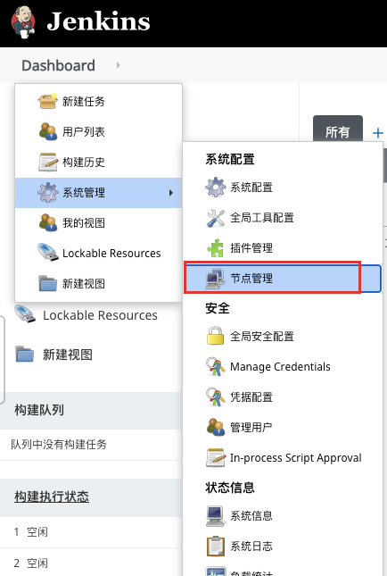

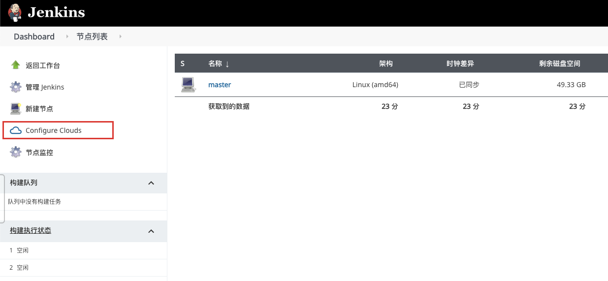

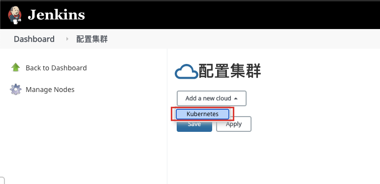

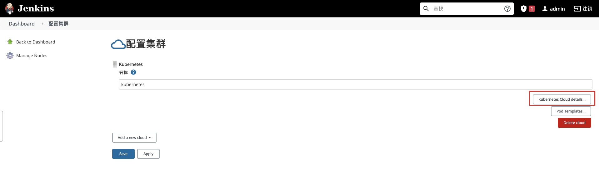

** 连接测试后，显示Connected to kubernetes v1.xx.x即正常 **

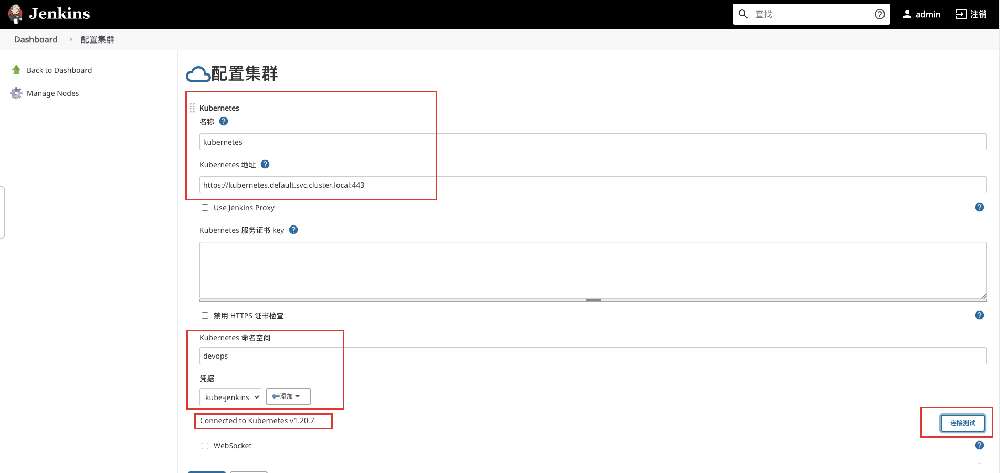

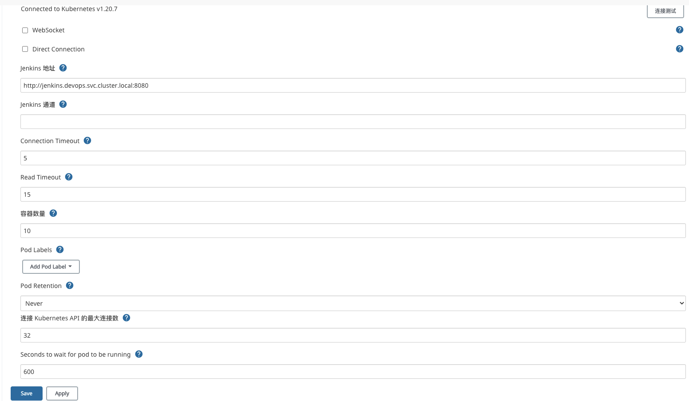

最后保存即可。


** 4.配置Pod模板 **
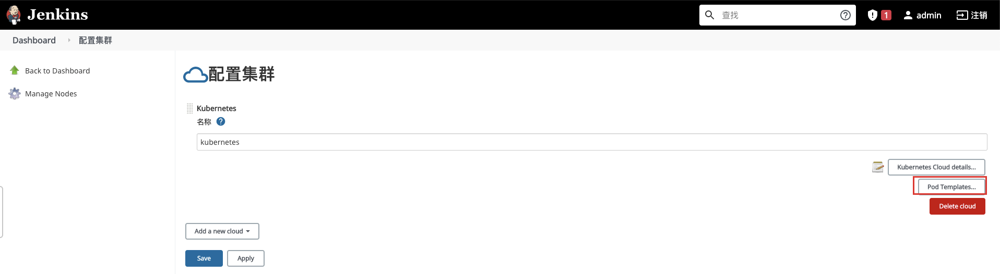

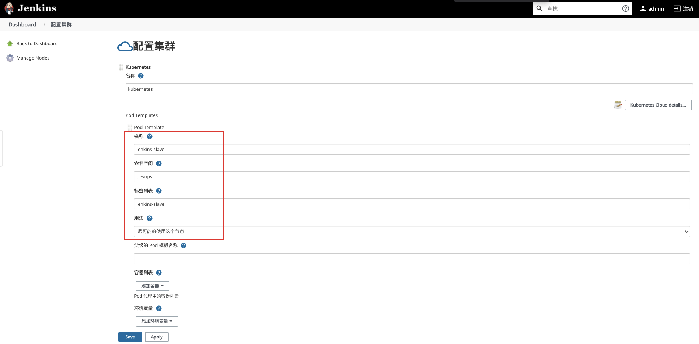

这里只配置了最基本的内容,默认情况下kubernetes插件会包含一个jnlp的容器,用于连接到jenkins master,保存后进行一个简单的测试

** 5.测试 **
创建一个job
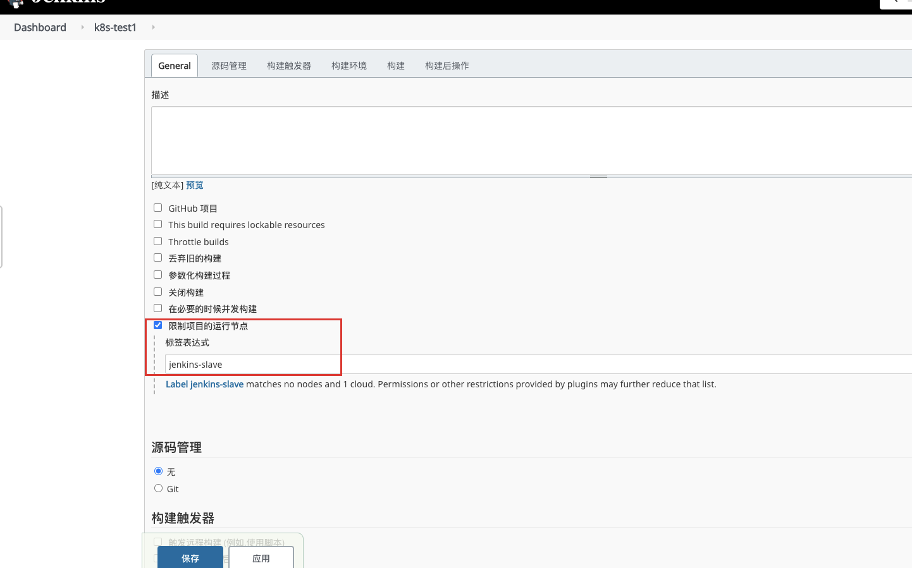

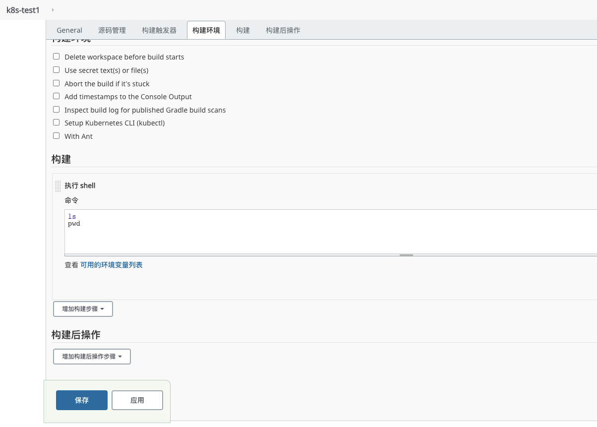

构建过程中jenkins会在k8s中创建jenkins-slave-xx pod作为节点,并在这个节点中运行我们指定的命令
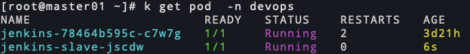

构建结果
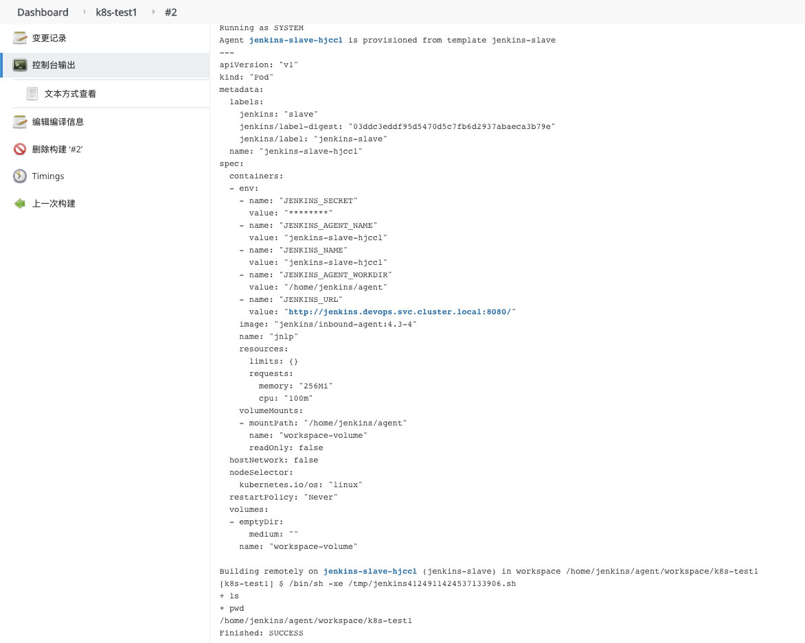


---

> 作者: [SoulChild](https://www.soulchild.cn)  
> URL: https://www.soulchild.cn/post/2591/  

