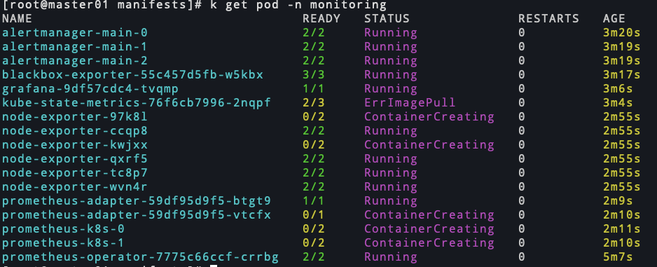

# kube-prometheus安装部署(一)

<!--more-->
### 一、下载编排文件
```bash
git clone https://github.com.cnpmjs.org/prometheus-operator/kube-prometheus.git
cd kube-prometheus/manifests/
```

### 二、部署operator crd
```bash
k apply -f setup/
```

### 三、部署prometheus
```bash
k apply -f .
```
> 如果需要数据持久化,可以配置pvc,前提是集群有storage-class,修改prometheus-prometheus.yaml,在最后追加如下内容
> ```
>  storage:
>    volumeClaimTemplate:
>      spec:
>        storageClassName: nfs-storage
>        resources:
>          requests:
>            storage: 50Gi
> ```

### 四、解决报错



kube-state-metrics镜像拉取错误，`k describe pod -n monitoring kube-state-metrics-76f6cb7996-2nqpf`查看详细信息


需要访问google，em。。。我从本地拉了一个传到阿里云镜像仓库了,镜像地址: registry.cn-shanghai.aliyuncs.com/soulchild/kube-state-metrics:v2.0.0

修改镜像: `k set image -n monitoring deployment kube-state-metrics kube-state-metrics=registry.cn-shanghai.aliyuncs.com/soulchild/kube-state-metrics:v2.0.0`

部署完成


### 五、配置ingress提供外部访问
```yaml
apiVersion: networking.k8s.io/v1
kind: Ingress
metadata:
  name: prometheus
  namespace: monitoring
spec:
  rules:
  - host: prom.ops.cn
    http:
      paths:
      - pathType: Prefix
        path: "/"
        backend:
          service:
            name: prometheus-k8s
            port:
              name: web
  - host: alert.ops.cn
    http:
      paths:
      - pathType: Prefix
        path: "/"
        backend:
          service:
            name: alertmanager-main
            port:
              name: web
  - host: grafana.ops.cn
    http:
      paths:
      - pathType: Prefix
        path: "/"
        backend:
          service:
            name: grafana
            port:
              name: http
```

### 六、解决controllerManager和scheduler不能自动发现
kube-prometheus默认会在kube-system命名空间下查找controllerManager和scheduler的service对应的endpoint作为target地址,由于我本地是二进制部署的集群,并没有这两个service和ep,所以需要手动创建一下

controller-manager: 
```bash
apiVersion: v1
kind: Service
metadata:
  name: kube-controller-manager
  namespace: kube-system
  labels:
    app.kubernetes.io/name: kube-controller-manager
spec:
  type: ClusterIP
  clusterIP: None
  ports:
  - name: https-metrics
    port: 10257
---
apiVersion: v1
kind: Endpoints
metadata:
  name: kube-controller-manager
  namespace: kube-system
  labels:
    app.kubernetes.io/name: kube-controller-manager
subsets:
- addresses:
  - ip: 172.17.20.201
  - ip: 172.17.20.202
  - ip: 172.17.20.203
  ports:
  - name: https-metrics
    port: 10257
    protocol: TCP
```

scheduler:
```bash
apiVersion: v1
kind: Service
metadata:
  name: kube-scheduler
  namespace: kube-system
  labels:
    app.kubernetes.io/name: kube-scheduler
spec:
  type: ClusterIP
  clusterIP: None
  ports:
  - name: https-metrics
    port: 10259
---
apiVersion: v1
kind: Endpoints
metadata:
  name: kube-scheduler
  namespace: kube-system
  labels:
    app.kubernetes.io/name: kube-scheduler
subsets:
- addresses:
  - ip: 172.17.20.201
  - ip: 172.17.20.202
  - ip: 172.17.20.203
  ports:
  - name: https-metrics
    port: 10259
    protocol: TCP
```

### 七、解决CoreDns不能自动发现
kube-prometheus同样通过service查找coredns的ep作为target,kube-prometheus在选择service的时候使用的是app.kubernetes.io/name: kube-dns这样的标签,但是我部署的core-dns没有这个标签，所以需要添加这个标签

`k label service -n kube-system kube-dns app.kubernetes.io/name=kube-dns`


可以看到刚才的几个组件都可以正常显示了


### 八、访问测试
grafana的默认账号密码是admin


---

> 作者: [SoulChild](https://www.soulchild.cn)  
> URL: https://www.soulchild.cn/post/2613/  

