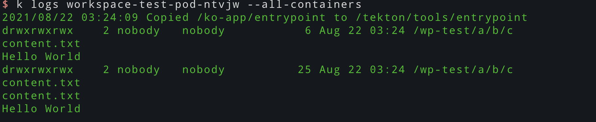
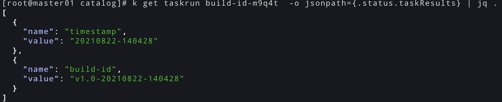

# tekton学习-task资源对象(二)

<!--more-->
## 概述
Task包含一系列step，每个step就是一个容器，这些step会按照定义的顺序执行,当一个step执行失败后，后续的容器不会执行。Task在Kubernetes集群上作为Pod执行。Task在特定的命名空间中可用，而ClusterTask在整个集群中可用。


## 一、task对象支持的属性
https://tekton.dev/vault/pipelines-v0.18.1/tasks/#configuring-a-task

- 必须:
  - apiVersion - api版本,例如: tekton.dev/v1beta1.
  - kind - 定义的资源类型,这里是Task
  - metadata - 元数据,包括name、lables、annotations等
  - spec - 定义Task资源对象的详细配置信息。
    - steps - 定义执行具体操作的容器信息

- 可选:
  - description - task的描述信息
  - params - 定义task的执行参数，例如编译参数或制品名称。参数可以在task中设置默认值也可以通过TaskRun传递，通过$(params.xxx)可以使用参数值
  - resources - 定义task需要的资源(PipelineResources)
    - inputs - 定义需要的输入资源，例如源代码。需要taskrun提供
    - outputs - 定义需要的输出资源，例如容器镜像。需要taskrun提供
  - workspaces - 定义一个workspace卷,在运行task时必须要提供一个workspace卷,我们可以用这个卷进行持久化,这个卷是针对task中的所有容器的。如果不指定mountPath,则默认挂载到/workspace/<name> 中
  - results - 这个可以用于step运行结果的传递。具体请看下面的results测试
  - volumes - 定义卷，我理解它和Pod的volumes一样。volumes和workspaces不同的是可以选择不同的容器进行挂载。可以通过steps[0].volumeMount.xx来配置。
  - stepTemplate - 定义task中所有step(容器)共有的属性,这样每个step可以直接继承属性，而不用在每个容器中都写一遍
  - sidecars - sidecars可以定义容器，这些容器会在step定义的容器之前运行,有Probe的情况下，会阻塞step容器的启动

## 二、小技巧

### 1.script
step中有个script字段,内容作为脚本运行，并且可以通过args传参。例如：
```yaml
...
spec:
  steps:
    - name: one
      image: curlimages/curl:7.77.0
      script: |
        #!/bin/sh
        echo "Hello $1!"
      args:
      - "soulchild"
```

### 2.api文档
我在写yaml的时候喜欢对照api文档来写，但是tekton的官网没找到api文档。最后找到一个折中的办法。在tekton的git仓库发现了swagger.json，然后利用swagger-ui读取，也可以呈现出api文档。

首先打开swagger-demo: https://petstore.swagger.io/ 然后将后面这个地址放进去读取就可以了https://raw.githubusercontent.com/tektoncd/pipeline/main/pkg/apis/pipeline/v1beta1/swagger.json

## 三、一些属性测试
### 3.1 workspace
```yaml
apiVersion: tekton.dev/v1beta1
kind: Task
metadata:
  name: workspace-test
spec:
  steps:
  - name: wsp-test1
    image: busybox:stable
    script: |
      #!/bin/sh
      ls -ld $(workspaces.wsp-test.path)
      ls $(workspaces.wsp-test.path)
      echo 'Hello World' > $(workspaces.wsp-test.path)/content.txt
      ls $(workspaces.wsp-test.path)
      cat $(workspaces.wsp-test.path)/content.txt
  - name: wsp-test2
    image: busybox:stable
    script: |
      #!/bin/sh
      ls -ld $(workspaces.wsp-test.path)
      ls $(workspaces.wsp-test.path)
      echo 'Hello World' > $(workspaces.wsp-test.path)/content.txt
      ls $(workspaces.wsp-test.path)
      cat $(workspaces.wsp-test.path)/content.txt
  workspaces:
  - name: wsp-test
    description: "测试workspace"
    mountPath: /wp-test/a/b/c
```
> 使用workspaces定义了一个工作空间,表示要运行这个task必须要提供一个workspace，下面定义一个taskrun

```yaml
apiVersion: tekton.dev/v1beta1
kind: TaskRun
metadata:
  name: workspace-test
spec:
  taskRef:
    name: workspace-test
  workspaces:
  - name: wsp-test
    volumeClaimTemplate:
      spec:
        storageClassName: managed-nfs-storage
        accessModes:
          - ReadWriteOnce 
        resources:
          requests:
            storage: 1Gi
```
> 在这里提供了workspace是一个pvc模板,也支持其他的类型,如: persistentVolumeClaim、emptyDir、configMap、secret、

上面的例子中的执行结果,可以看到两个step的/wp-test/a/b/c是同一个目录,需要注意的是使用volumeClaimTemplate每次都会重新创建pvc,pv也会相应的被重新创建。


### 3.2 stepTemplate
```yaml
apiVersion: tekton.dev/v1beta1
kind: Task
metadata:
  name: hello
  namespace: default
spec:
  steps:
  - args:
    - soulchild
    image: curlimages/curl:7.77.0
    name: one
    script: |
      #!/bin/sh
      date +%s
      echo "Hello $1! $myname"
  - command:
    - /bin/sh
    - -c
    - "echo Hello World! $myname && date +%s"
    image: curlimages/curl:7.77.0
    name: hello
  - command:
    - /bin/sh
    - -c
    - "echo my name is $myname && date +%s"
    image: curlimages/curl:7.77.0
    name: soulchild
  stepTemplate:
    env:
    - name: myname
      value: soulchild
```
> 这个task中所有的step都会包含myname这个变量


### 3.3 resutls
这里参考catalog hub中的一个例子
```yaml
apiVersion: tekton.dev/v1beta1
kind: Task
metadata:
  name: generate-build-id
spec:
  params:
    - name: base-version
      description: Base product version
      type: string
      default: "1.0"
  results:
    - name: timestamp
      description: Current timestamp
    - name: build-id
      description: ID of the current build
  steps:
    - name: get-timestamp
      image: docker.io/library/bash:5.0.18@sha256:8ef3f8518f47caf1ddcbdf49e983a9a119f9faeb41c2468dd20ff39cd242d69d #tag: 5.0.18
      script: |
        #!/usr/bin/env bash
        ts=`date "+%Y%m%d-%H%M%S"`
        echo "Current Timestamp: ${ts}"
        echo ${ts} | tr -d "\n" | tee $(results.timestamp.path)
    - name: get-buildid
      image: docker.io/library/bash:5.0.18@sha256:8ef3f8518f47caf1ddcbdf49e983a9a119f9faeb41c2468dd20ff39cd242d69d #tag: 5.0.18
      script: |
        #!/usr/bin/env bash
        ts=`cat $(results.timestamp.path)`
        buildId=$(inputs.params.base-version)-${ts}
        echo ${buildId} | tr -d "\n" | tee $(results.build-id.path)

```
> 这个task会运行两个step,首先运行get-timestamp，并将结果写入到文件中，路径是`$(results.timestamp.path)`,这个变量的最终结果其实就是一个文件路径`/tekton/results/timestamp`,第二个步骤也可以通过相同的路径访问这个文件,这样就实现了结果的传递。在pipeline中可以通过`tasks.<taskName>.results.<resultName>`来调用不同task的结果,这就是它的作用了。我们也可以通过查看TaskRun的状态来获取运行结果。下面创建TaskRun试试看。

TaskRun
```yaml
apiVersion: tekton.dev/v1beta1
kind: TaskRun
metadata:
  generateName: build-id-
spec:
  taskRef:
    name: generate-build-id
  params:
  - name: base-version
    value: v1.0
```

运行后通过如下命令查看结果
`k get taskrun build-id-m9q4t  -o jsonpath={.status.taskResults} | jq .`



## 四、示例
https://hub.tekton.dev 这里可以看到很多可以复用的tekton资源

### 1.dood方式构建镜像
```yaml
apiVersion: tekton.dev/v1beta1
kind: Task
metadata:
  name: docker-build-push
spec:
  params:
    - name: dockerfileName
      type: string
      description: dockerfile文件名,作为docker build -f的参数
      default: Dockerfile
  # 指定需要一个git输入资源、一个image输出资源,在这个task运行时必要要提供
  resources:
    inputs:
      - name: code
        type: git
    outputs:
      - name: builtImage
        type: image
  steps:
    - name: docker-build
      image: docker:stable
      workingDir: "/workspace/$(resources.inputs.code.name)"
      args:
        [
          "build",
          "--no-cache",
          "--tag",
          "$(resources.outputs.builtImage.url)",
          "--file",
          "$(params.dockerfileName)",
          ".",
        ]
      volumeMounts:
        - name: docker-socket
          mountPath: /var/run/docker.sock

    - name: docker-push
      image: docker:stable
      args: ["push", "$(resources.outputs.builtImage.url)"]
      volumeMounts:
        - name: docker-socket
          mountPath: /var/run/docker.sock

  # 定义一个卷，用于挂载主机的docker socket文件
  volumes:
    - name: docker-socket
      hostPath:
        path: /var/run/docker.sock
        type: Socket
```
> 上面可以根据从git仓库的内容进行构建镜像和推送镜像,但如果是私有镜像仓库,该如何进行认证操作呢。tekton提供了两种方式,在taskrun或者pipelinerun的时候可以配置serviceAccountName。[具体方式可以参考这里](https://tekton.dev/vault/pipelines-v0.18.1/auth/#configuring-authentication-for-docker)

附带taskrun示例:
```yaml
apiVersion: tekton.dev/v1beta1
kind: TaskRun
metadata:
  generateName: website-build-
spec:
  serviceAccountName: aliyun-cr
  resources:
    inputs:
    - name: code
      resourceSpec:
        type: git
        params:
          - name: url
            value: https://github.com/soulchildwm/tekton-demo.git
          - name: revision
            value: python-website
    outputs:
    - name: builtImage
      resourceSpec:
        type: image
        params:
          - name: url
            value: registry.cn-shanghai.aliyuncs.com/soulchild/zero
  params:
  - name: dockerfileName
    value: ./Dockerfile
  taskRef:
    name: docker-build-push
```
> 这里为了方便直接把pipelineresource也写到了taskrun里


---

> 作者: [SoulChild](https://www.soulchild.cn)  
> URL: https://www.soulchild.cn/post/2627/  

