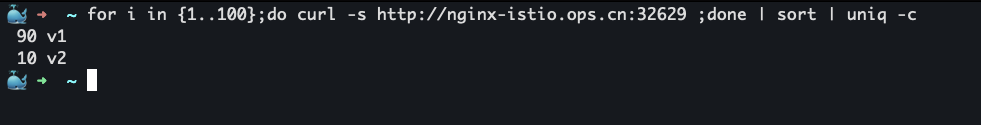

# Istio实现简单的灰度发布流程

<!--more-->
### 一、配置namespace
```yaml
# 创建ns
k create ns istio-demo
# 开启自动注入
k label ns istio-demo istio-injection=enabled
```

### 二、部署nginx-v1应用
```yaml
apiVersion: apps/v1
kind: Deployment
metadata:
  name: nginx-v1
  namespace: istio-demo
spec:
  replicas: 1
  selector:
    matchLabels:
      app: nginx
      version: v1
  template:
    metadata:
      labels:
        app: nginx
        version: v1
    spec:
      initContainers:
      - name: busybox
        image: busybox
        volumeMounts:
        - name: www
          mountPath: /tmp
        command: ["sh", "-c", "echo 'v1' > /tmp/index.html"]
      containers:
      - name: nginx
        image: nginx:1.14-alpine
        imagePullPolicy: IfNotPresent
        ports:
        - name: http
          containerPort: 80
        volumeMounts:
        - name: www
          mountPath: /usr/share/nginx/html/
      volumes:
      - name: www
        emptyDir: {}
```
> 注意这里的标签使用了`app=nginx`，`version=v1`


### 三、创建Service
```yaml
apiVersion: v1
kind: Service
metadata:
  name: nginx-svc
  namespace: istio-demo
spec:
  type: ClusterIP
  ports:
  - name: http
    port: 80
    targetPort: 80
  selector:
    app: nginx
```
> 这里选择所有`app=nginx`的pod


### 四、创建Gateway
允许访问nginx-istio.ops.cn的外部流量
```yaml
apiVersion: networking.istio.io/v1alpha3
kind: Gateway
metadata:
  name: nginx-gw
  namespace: istio-demo
spec:
  selector:
    # 这里使用的是istio的默认网关,后面会介绍使用nginx-controller作为网关
    istio: ingressgateway 
  servers:
  - port:
      number: 80
      name: http
      protocol: HTTP
    hosts:
    - "nginx-istio.ops.cn"
```

### 五、创建VirtualService
将nginx服务的流量都走向v1版本
```yaml
apiVersion: networking.istio.io/v1alpha3
kind: VirtualService
metadata:
  name: nginx-vs
  namespace: istio-demo
spec:
  exportTo:
  - "*"
  gateways:
  - nginx-gw
  hosts:
  - 'nginx-svc.istio-demo.svc.cluster.local'
  - 'nginx-istio.ops.cn'
  http:
  - route:
    - destination:
        host: nginx-svc
        subset: v1
      weight: 100
    - destination:
        host: nginx-svc
        subset: v2
```

### 六、配置DestinationRule
为nginx-svc定义两个子集
```yaml
apiVersion: networking.istio.io/v1alpha3
kind: DestinationRule
metadata:
  name: nginx-dr
  namespace: istio-demo
spec:
  host: nginx-svc
  subsets:
  - name: v1
    labels:
      version: v1
  - name: v2
    labels:
      version: v2
```

### 七、访问测试

```yaml
获取nodeport端口
k get svc -n istio-system istio-ingressgateway -o jsonpath='{.spec.ports[?(@.name=="http2")].nodePort}'
```
http://nginx-istio.ops.cn:32629/

### 八、部署nginx-v2灰度版本
```yaml
apiVersion: apps/v1
kind: Deployment
metadata:
  name: nginx-v2
  namespace: istio-demo
spec:
  replicas: 1
  selector:
    matchLabels:
      app: nginx
      version: v2
  template:
    metadata:
      labels:
        app: nginx
        version: v2
    spec:
      initContainers:
      - name: busybox
        image: busybox
        volumeMounts:
        - name: www
          mountPath: /tmp
        command: ["sh", "-c", "echo 'v2' > /tmp/index.html"]
      containers:
      - name: nginx
        image: nginx:1.14-alpine
        imagePullPolicy: IfNotPresent
        ports:
        - name: http
          containerPort: 80
        volumeMounts:
        - name: www
          mountPath: /usr/share/nginx/html/
      volumes:
      - name: www
        emptyDir: {}
```
> 目前为止流量还都在v1上

### 九、切10%的流量到v2版本

```yaml
apiVersion: networking.istio.io/v1alpha3
kind: VirtualService
metadata:
  name: nginx-vs
  namespace: istio-demo
spec:
  exportTo:
  - "*"
  gateways:
  - nginx-gw
  hosts:
  - 'nginx-svc.istio-demo.svc.cluster.local'
  - 'nginx-istio.ops.cn'
  http:
  - route:
    - destination:
        host: nginx-svc
        subset: v1
      weight: 90
    - destination:
        host: nginx-svc
        subset: v2
      weight: 10
```

### 十、访问测试
访问100次进行测试
```bash
for i in {1..100};do curl -s http://nginx-istio.ops.cn:32629 ;done | sort | uniq -c
```




---

> 作者: [SoulChild](https://www.soulchild.cn)  
> URL: https://www.soulchild.cn/post/2654/  

