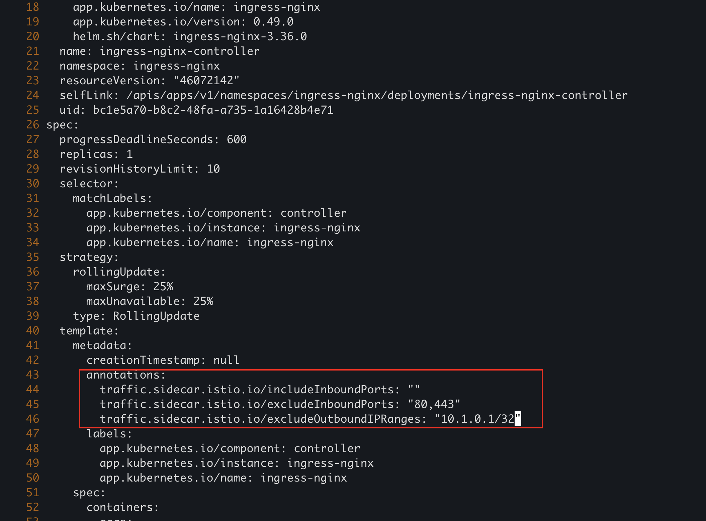
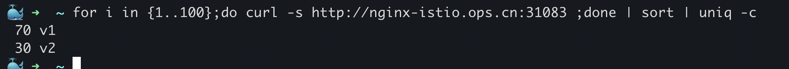

# Istio使用nginx-controller作为网关

<!--more-->
参考链接: https://www.tetrate.io/blog/using-istio-with-other-ingress-proxies/
annotation解释: https://istio.io/v1.9/zh/docs/reference/config/annotations/

### Ready
操作前备份
```bash
k get deployments -n ingress-nginx ingress-nginx-controller -o yaml > ingress-nginx-controller.yaml
```

### 一、修改nginx-controller pod注解
这一步的目的主要是将入口流量完全交给nginx,出口流量交给envoy(排除10.1.0.1,nginx与apiserver通信的地址)
```yaml
k edit deployment -n ingress-nginx ingress-nginx-controller

traffic.sidecar.istio.io/includeInboundPorts: ""   # 将指定端口的流量重定向到envoy sidecar
traffic.sidecar.istio.io/excludeInboundPorts: "80,443"   # 将指定端口的流量不重定向到envoy sidecar
traffic.sidecar.istio.io/excludeOutboundIPRanges: "10.1.0.1/32"   # 将指定ip范围的流出流量不重定向到envoy sidecar。`k get svc kubernetes -o jsonpath='{.spec.clusterIP}'`
```


### 二、将envoy注入nginx-controller
```bash
k get deployments -n ingress-nginx ingress-nginx-controller -o yaml| istioctl kube-inject -f - | k apply -f -
```
> 可以将修改后的保存为yaml
> k get deployments -n ingress-nginx ingress-nginx-controller -o yaml > ingress-nginx-controller-istio.yaml

> 这里我踩了个坑，一定要先有注解再进行注入。如果先注入在写注解，initContainer会先生成，这时没有注解，所以不会生效注解的配置。

### 三、VirtualService配置
使用nginx-controller作为网关后，Gateway资源应该就没有作用了。因为nginx-controller是ingress-controller的实现，pilot在watch到gateway资源后不会下发配置到nginx-controller。

所以之后在virtualService中要么不写gateways，写了的话就得加上一个mesh，才能生效vs的规则
```bash
spec:
  gateways:
  - xxx
  - mesh
  hosts:
  - nginx-svc.istio-demo.svc.cluster.local
  - nginx-istio.ops.cn
```

### 四、配置Ingress测试
`nginx.ingress.kubernetes.io/service-upstream: "true"`    # 默认nginx是将流量直接打到pod ip中的,而不是通过service ip。这个配置用来禁用它，使他的流量发往service ip

`nginx.ingress.kubernetes.io/upstream-vhost: "xxx.default.svc.cluster.local"`    # 这里写的是后端Service的完整fqdn。目的是修改Host请求头的值

经过上面的配置,请求的流量就能和vs对象中配置的hosts匹配上了。

下面是测试例子:
```yaml
apiVersion: extensions/v1beta1
kind: Ingress
metadata:
  name: nginx-istio.ops.cn
  namespace: istio-demo
  annotations:
    kubernetes.io/ingress.class: "nginx"
    nginx.ingress.kubernetes.io/service-upstream: "true"
    nginx.ingress.kubernetes.io/upstream-vhost: "nginx-svc.istio-demo.svc.cluster.local"
spec:
  rules:
  - host: nginx-istio.ops.cn
    http:
      paths:
      - path: /
        backend:
          serviceName: nginx-svc
          servicePort: http
        pathType: Prefix
```
### 五、测试流量
通过访问nginx-controller查看virtualservice规则是否生效



---

> 作者: [SoulChild](https://www.soulchild.cn)  
> URL: https://www.soulchild.cn/post/2660/  

