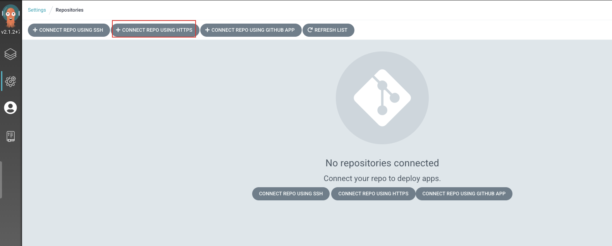

# argocd安装及入门使用

<!--more-->
## 一、安装
### 1.安装argocd
```bash
kubectl create namespace argocd
kubectl apply -n argocd -f https://raw.githubusercontent.com/argoproj/argo-cd/stable/manifests/install.yaml
```
> 如果使用其他命名空间,需要手动修改ClusterRoleBinding引用的ServiceAccount所在的namespace

### 2.暴露argocd ui
```
# NodePort方式
kubectl patch service -n argocd argocd-server -p '{"spec": {"type": "NodePort"}}'

```

### 3.登陆argocd
```bash
# 获取admin登陆密码
kubectl -n argocd get secret argocd-initial-admin-secret -o jsonpath="{.data.password}" | base64 -d
```

### 4.安装cli
```bash
# linux
wget -O /usr/local/bin/argocd https://github.91chifun.workers.dev/https://github.com//argoproj/argo-cd/releases/download/v2.1.2/argocd-linux-amd64 && chmod +x /usr/local/bin/argocd 

# mac
sudo wget -O /usr/local/bin/argocd https://github.91chifun.workers.dev/https://github.com//argoproj/argo-cd/releases/download/v2.1.2/argocd-darwin-amd64 && sudo chmod +x /usr/local/bin/argocd 
```

## 二、简单使用
### 1.准备git仓库

目录结构
```bash
$ tree .
.
├── README.md
└── web-server-headers
    ├── deploy.yaml
    ├── ingress.yaml
    └── svc.yaml

```
> deploy.yaml是部署文件

### 2.配置argocd仓库



### 3.创建应用


### 4.查看结果


## 三、cli使用
### 3.1 快速入门操作
1.登陆
```bash
argocd login ArgoCD_Address:Port
```


2.修改密码
```bash
argocd account update-password
```

3.从git仓库创建一个Application
```bash
argocd app create guestbook --repo https://github.com/argoproj/argocd-example-apps.git --path guestbook --dest-server https://kubernetes.default.svc --dest-namespace default
```
> 创建一个guestbook app,指定仓库地址、应用路径、目标apiserver地址、目标namespace

4.列出所有app和指定app
```bash
argocd app list
argocd app get guestbook
```

5.手动从git仓库同步指定app
```bash
argocd app sync guestbook
```


### 3.2 管理项目
- 创建项目
```bash
argocd proj create myproject -d https://kubernetes.default.svc,mynamespace -s https://github.com/argoproj/argocd-example-apps.git
```
> `-d`: 该项目允许使用的apiserver和namespace
> `-s`: 允许使用的git仓库

- 查看项目列表: `argocd proj list`

- 添加项目可使用的git仓库: `argocd proj add-source <PROJECT> <REPO>`

- 删除项目可使用的git仓库: `argocd proj remove-source <PROJECT> <REPO>`

- 限制项目可使用的k8s资源(cluster级别资源默认拒绝,namespace级别默认允许):
```bash
# 允许使用什么样的资源
argocd proj allow-cluster-resource <PROJECT> <GROUP> <KIND>
argocd proj allow-namespace-resource <PROJECT> <GROUP> <KIND>
# 拒绝使用什么样的资源
argocd proj deny-cluster-resource <PROJECT> <GROUP> <KIND>
argocd proj deny-namespace-resource <PROJECT> <GROUP> <KIND>
```

- Application分配给项目: `argocd app set guestbook-default --project myproject`

- 获取项目信息: `argocd proj get myproject`

- 编辑项目yaml: `argocd proj edit myproject`

### 3.3 管理APP
查看APP列表: `argocd app list|get|delete|create`
  - `-p`: 根据项目过滤
  - `-l`: 根据标签过滤
  - `-r`: 根据仓库过滤
  - `-o`: 输出格式。wide|name|json|yaml

手动同步: `argocd app sync <APPNAME>`

### 3.4 自动同步相关

开启自动同步: `argocd app set <APPNAME> --sync-policy auto`

关闭自动同步: `argocd app set <APPNAME> --sync-policy none`

自动同步时,自动删除git中不存在的资源: `argocd app set <APPNAME> --auto-prune=true`

是否允许一个application有0个资源: `argocd app set <APPNAME> --allow-empty=true`

时刻保证与git中定义的状态同步: `argocd app set <APPNAME> --self-heal=true`

自动同步会将所有对象都同步,对apiserver可能会造成更大的压力,可以只同步`out-of-sync状态`的资源: `argocd app set <APPNAME> --sync-option ApplyOutOfSyncOnly=true`

** 执行自动同步的要求 **
> 仅当Application为 `OutOfSync` 时才会执行自动同步。
> 同一个`commit id`只会同步一次，不管成功还是失败

> argocd每三分钟会检测git仓库一次,用于判断app与git中描述的状态是否一致，如果不一致状态为`OutOfSync`。(注意这里并不会触发更新，除非配置了自动同步)


---

> 作者: [SoulChild](https://www.soulchild.cn)  
> URL: https://www.soulchild.cn/post/2682/  

