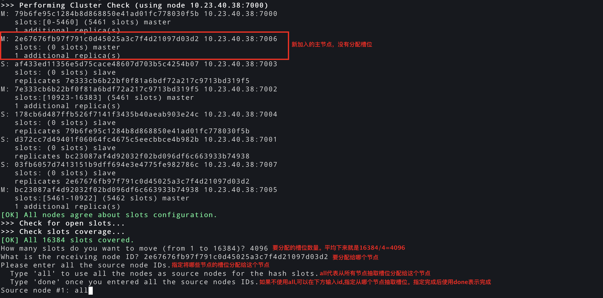

# redis-cluster部署

<!--more-->
### 1.安装redis
```bash
yum install -y gcc-c++
wget http://download.redis.io/releases/redis-5.0.5.tar.gz
tar xf redis-5.0.5.tar.gz -C /server
cd /server/redis-5.0.5
make
mkdir /usr/local/redis/{etc,log} -p
make install PREFIX=/usr/local/redis
cp redis.conf sentinel.conf /usr/local/redis/etc/
```

修改环境变量
```bash
vim /etc/profile
export PATH=$PATH:/usr/local/redis/bin

source /etc/profile
```

### 2.redis模板配置文件
```bash
cat redis.conf.tpl >EOF
daemonize yes
port 7000
dir /usr/local/redis
dbfilename "7000.rdb"
cluster-enabled yes
cluster-config-file "/usr/local/redis/etc/redis-cluster-7000.conf"
cluster-node-timeout 50000
# 这个参数为no 表示当集群中一个节点故障时,集群整体可用,只有存在故障节点的数据不能查询写入
cluster-require-full-coverage no
client-output-buffer-limit normal 0 0 0
client-output-buffer-limit slave 256mb 64mb 60
client-output-buffer-limit pubsub 32mb 8mb 60
bind 0.0.0.0
protected-mode no
save ""
appendonly no
logfile "/usr/local/redis/log/7000.log"
EOF
```
> client-output-buffer-limit 参数含义: 
> Redis为了解决输出缓冲区消息大量堆积的隐患，设置了一些保护机制，主要采用两种限制措施：
> 大小限制，当某一客户端缓冲区超过设定值后直接关闭连接；
> 持续性限制，当某一客户端缓冲区持续一段时间占用过大空间时关闭连接。
> 后面三个参数分别表示 最大限制 最小限制 最小限制的持续时间
> 不同客户端有不同策略，策略如下：
> - 对于普通客户端来说，限制为0，也就是不限制。因为普通客户端通常采用阻塞式的消息应答模式，何谓阻塞式呢？如：发送请求，等待返回，再发送请求，再等待返回。这种模式下，通常不会导致Redis服务器输出缓冲区的堆积膨胀；
> - 对于Pub/Sub客户端（也就是发布/订阅模式），大小限制是32M，当输出缓冲区超过32M时，会关闭连接。持续性限制是，当客户端缓冲区大小持续60秒超过8M，则关闭客户端连接；
> - 对于slave客户端来说，大小限制是256M，持续性限制是当客户端缓冲区大小持续60秒超过64M，则关闭客户端连接。


修改其他实例配置
```bash
for i in {7000..7005};do cp redis.conf.tpl redis-$i.conf;done
for i in {7001..7005};do sed -i s#7000#$i# redis-$i.conf; done
```

### 3.启动所有实例
```bash
for i in {7000..7005};do redis-server redis-$i.conf; done
```

### 4.初始化集群
```bash
# 指定所有节点的地址，并且声明需要一个副本。最终结果是3主3从，每个主带一个从。
redis-cli --cluster create --cluster-replicas 1 10.23.40.38:7000 10.23.40.38:7001 10.23.40.38:7002 10.23.40.38:7003 10.23.40.38:7004 10.23.40.38:7005
```

### 5.测试
```bash
[root@localhost etc]# redis-cli -c -p 7000
127.0.0.1:7000> set name soulchild
-> Redirected to slot [5798] located at 10.23.40.38:7001
OK
10.23.40.38:7000> get name
-> Redirected to slot [5798] located at 10.23.40.38:7001
"soulchild"

# 停止7001主节点
redis-cli -p 7001 shutdown

# 查看key，可以看到已经到7005节点了
[root@10-23-40-38 ~]# redis-cli -c -p 7000
127.0.0.1:7000> get name
-> Redirected to slot [5798] located at 10.23.40.38:7005
"soulchild"
```

### 6.扩容节点
配置好后启动redis，添加到集群的方法如下
```bash
# 主节点身份加入
# 第一个地址是新节点地址。第二个地址是集群中已存在的节点，可以是集群中的任意一个节点
redis-cli --cluster add-node 10.23.40.38:7006 10.23.40.38:7001

# 从节点身份加入
# --cluster-slave表示从节点身份加入
# --cluster-master-id指定跟随哪个主节点，id可以通过cluster nodes获取
redis-cli --cluster add-node 10.23.40.38:7007 10.23.40.38:7001 --cluster-slave --cluster-master-id d67d00c2741f89ddee5a17f8c0715f29690b12c2
```

分配槽位
后加入集群的节点是没有分配槽位的，不会有数据写到新的节点，所以需要为新节点分配槽位


### 7.删除节点
瓜分要删除节点的槽位
```bash
# 连接地址是集群中任意节点
# --cluster-from要瓜分哪个节点的槽位
# --cluster-to 要瓜分给谁
# --cluster-slots 要瓜分多少个
redis-cli --cluster reshard 10.23.40.38:7000 --cluster-from d67d00c2741f89ddee5a17f8c0715f29690b12c2  --cluster-to 79b6fe95c1284b8d868850e41ad01fc778030f5b --cluster-slots 1365 

redis-cli --cluster reshard 10.23.40.38:7000 --cluster-from d67d00c2741f89ddee5a17f8c0715f29690b12c2  --cluster-to bc23087af4d92032f02bd096df6c663933b74938 --cluster-slots 1366

redis-cli --cluster reshard 10.23.40.38:7000 --cluster-from d67d00c2741f89ddee5a17f8c0715f29690b12c2  --cluster-to 7e333cb6b22bf0f81a6bdf72a217c9713bd319f5 --cluster-slots 1365
```

删除节点
```bash
# id通过cluster nodes获取
redis-cli --cluster del-node 10.23.40.38:7000 d67d00c2741f89ddee5a17f8c0715f29690b12c2
```


### 8.常用命令
cluster相关命令: https://redis.io/commands/#cluster

集群节点状态
```bash
cluster nodes
```
> 显示格式： <id> <ip:port@cport> <flags> <master> <ping-sent> <pong-recv> <config-epoch> <link-state> <slot> <slot> ... <slot>

集群状态
```bash
cluster info
```


---

> 作者: [SoulChild](https://www.soulchild.cn)  
> URL: https://www.soulchild.cn/post/2761/  

