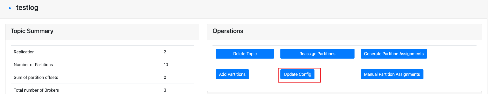
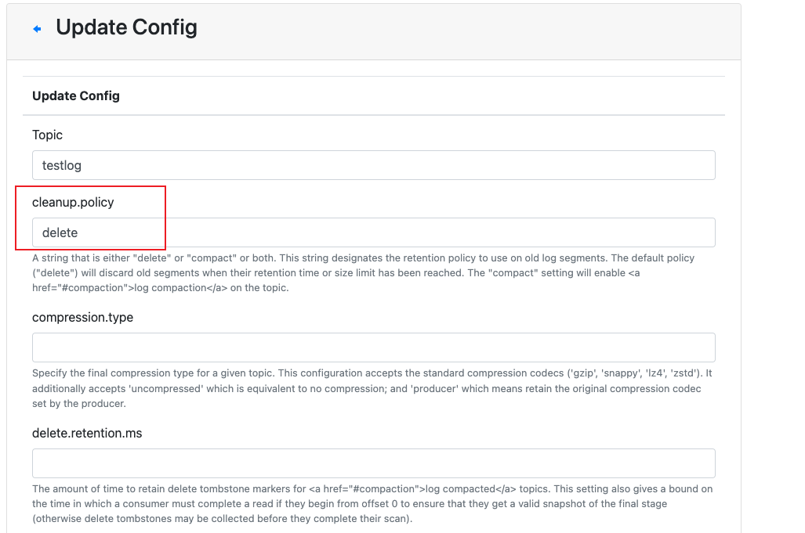
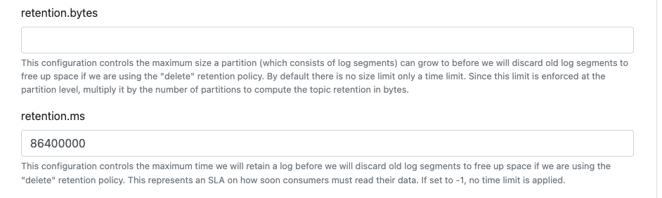

# kafka修改topic中的消息保留时间

<!--more-->
### 方法一
修改kafka配置文件
```bash
log.retention.hours=24
log.cleanup.policy=delete
```

### 方法二
使用kafka脚本
```bash
./kafka-configs.sh --zookeeper localhost:2181 --alter --entity-name testlog --entity-type topics --add-config retention.ms=86400000
```


### 方法三
使用kafka-manager








---

> 作者: [SoulChild](https://www.soulchild.cn)  
> URL: https://www.soulchild.cn/post/2767/  

