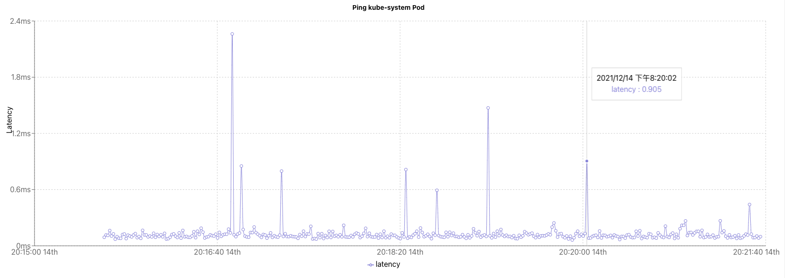
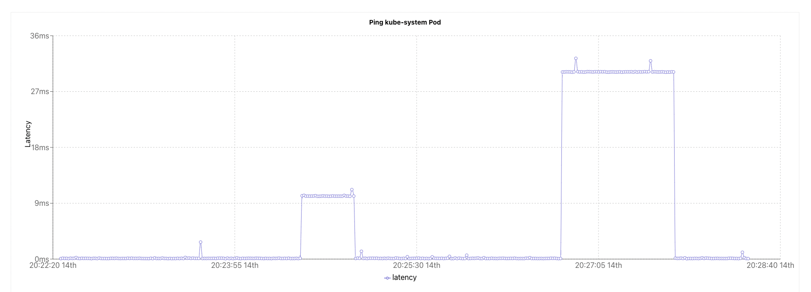

# ChaosMesh-延迟注入测试

<!--more-->
### 1. 部署被注入故障的服务
```bash
apiVersion: apps/v1
kind: Deployment
metadata:
  name: web-show
  labels:
    app: web-show
spec:
  replicas: 1
  selector:
    matchLabels:
      app: web-show
  template:
    metadata:
      labels:
        app: web-show
    spec:
      containers:
        - name: web-show
          image: pingcap/web-show
          imagePullPolicy: Always
          command:
            - /usr/local/bin/web-show
            - --target-ip=$(targetIP)
          env:
          - name: targetIP
            valueFrom:
              fieldRef:
                apiVersion: v1
                fieldPath: status.hostIP
          ports:
            - name: web-port
              containerPort: 8081
              hostPort: 8081
---
apiVersion: v1
kind: Service
metadata:
  name: web-show
  labels:
    app: web-show
spec:
  type: NodePort
  ports:
  - name: web
    targetPort: web-port
    port: 8081
  selector:
    app: web-show
```

### 2.查看web-show服务


### 3. 准备故障注入清单文件
给web-show pod注入1分钟的30ms网络延迟
```bash
apiVersion: chaos-mesh.org/v1alpha1
kind: NetworkChaos
metadata:
  name: web-show-network-delay
spec:
  # 指定的动作,延迟
  action: delay
  # 指定生效的范围,即对哪些pod进行故障注入
  selector:
    namespaces:
    - default
    labelSelectors:
      app: web-show
  # 对selector选出的pod进行更细粒度的控制
  mode: one
  # 增加30ms延迟
  delay:
    latency: 30ms
  # 故障持续时间
  duration: 1m
```
> one（表示随机选出一个符合条件的 Pod）
> all（表示选出所有符合条件的 Pod）
> fixed（表示选出指定数量且符合条件的 Pod）
> fixed-percent（表示选出占符合条件的 Pod 中指定百分比的 Pod）
> random-max-percent（表示选出占符合条件的 Pod 中不超过指定百分比的 Pod）

### 4.最终效果



---

> 作者: [SoulChild](https://www.soulchild.cn)  
> URL: https://www.soulchild.cn/post/2777/  

