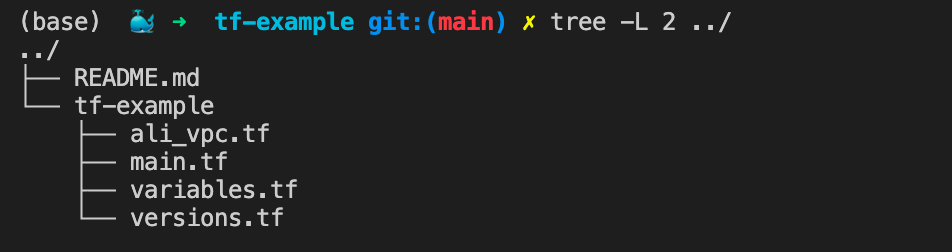
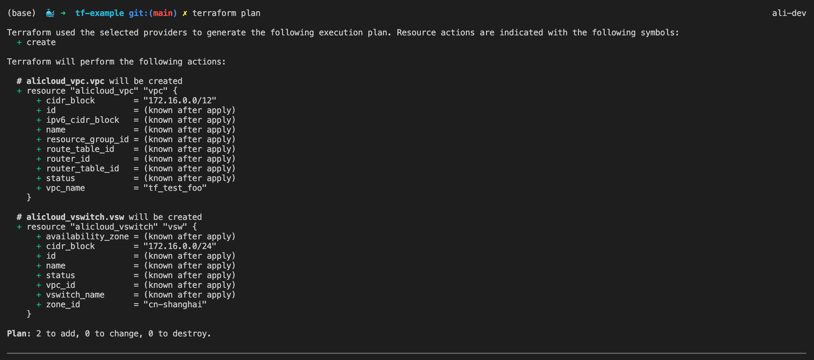
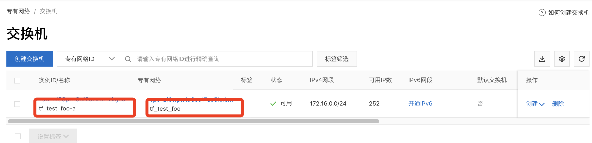

# terraform学习(一)

<!--more-->
Providers: 提供与不同云厂商的交互
支持的Providers: https://registry.terraform.io/browse/providers


## 初体验
目录结构如下



### 一、声明Provider
这里以阿里云为例
```bash
# file: versions.tf
terraform {
  # 指定terraform的版本号
  required_version = "1.1.9"
  # 声明我们要用的peovider列表,这里的内容可以通过官方文档获取
  required_providers {
    alicloud = {
      source = "aliyun/alicloud"
      version = "1.164.0"
    }
  }
}
```
> required_version可以通过`terraform version`查看,注意版本号不带`v`

### 二、配置Provider
上面我们声明了我们要使用阿里云,下面需要配置阿里云认证的相关参数
```bash
# file: main.tf
provider "alicloud" {
  access_key = "${var.ali_access_key}"
  secret_key = "${var.ali_secret_key}"
  region     = "${var.ali_region}"
}
```
> 我们通过环境变量来读取所需要的信息,环境变量需要以`TF_VAR_`开头
> 例如: TF_VAR_ali_access_key=xxx、TF_VAR_ali_secret_key=xxx、TF_VAR_ali_region=xxx

声明变量类型
```bash
# variables.tf
variable "ali_access_key" {
    type = string
}

variable "ali_secret_key" {
    type = string
}

variable "ali_region" {
    type = string
}
```

### 三、声明资源
这里指定我们要创建一个VPC网络,并且还会创建一个交换机
```bash
# file: ali_vpc.tf
# 定义一个资源
# 格式 resource "资源类型" "资源名称"
resource "alicloud_vpc" "vpc" {
  vpc_name   = "tf_test_foo"
  cidr_block = "172.16.0.0/12"
}

# 交换机属于vpc,所以可以顺带创建了
resource "alicloud_vswitch" "vsw" {
  # 引用上面的vpc资源,通过`资源类型.资源名称.id`获取
  vpc_id     = alicloud_vpc.vpc.id
  vswitch_name = "tf_test_foo-a"
  cidr_block = "172.16.0.0/24"
  zone_id    = "cn-shanghai-a"
}
```

### 四、初始化terraform
```bash
cd tf-example
terraform init 
```
> init含义: Terraform 使用`tf-example`作为工作目录，并且还会创建`.terraform`目录来存储设置信息、缓存插件和模块，状态数据。


### 五、检查计划
检查计划用来检查我们的配置,并不会真正的创建资源
```bash
terraform plan
```
可以看到提示我们有两个新增



### 六、创建资源
```bash
terraform apply
```
可以看到vpc和交换机都成功创建了




---

> 作者: [SoulChild](https://www.soulchild.cn)  
> URL: https://www.soulchild.cn/post/2818/  

