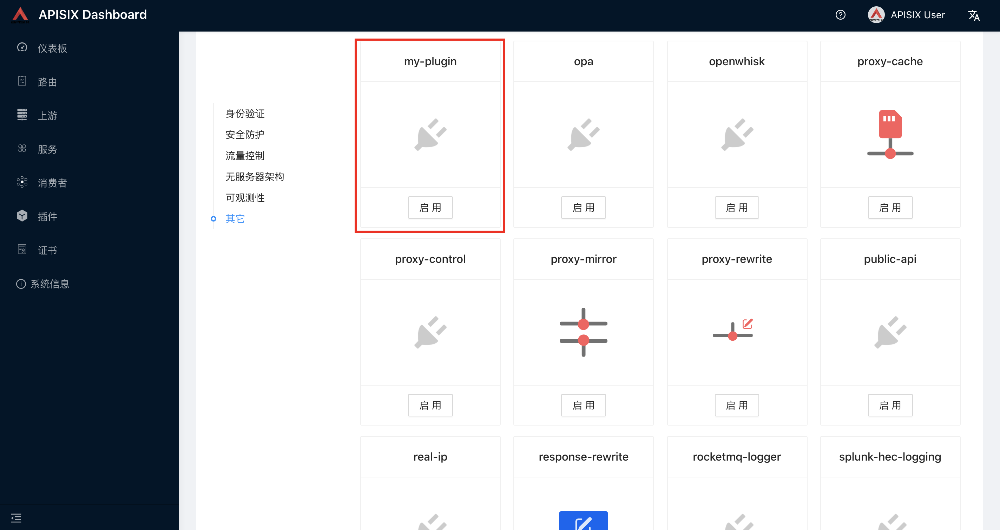

# Apisix lua插件开发流程(docker-compose部署)

<!--more-->
### 准备
```bash
git clone https://github.com/apache/apisix-docker.git
cd apisix-docker/example
```

### 一、开启control api
vim apisix_conf/config.yaml
```yaml
  enable_control: true
  control:
    ip: "127.0.0.1"
    port: 9090
```

### 二、启动apisix
docker-compose -p docker-apisix up -d


### 三、新增插件脚本
```bash
# 进入容器编辑文件
docker exec -it docker-apisix_apisix_1
vim /usr/local/apisix/apisix/plugins/my-plugin.lua
```

脚本内容
```lua
local plugin_name = "my-plugin"

local schema = {
    type = "object",
    properties = {
        content = {
            type = "string"
        }
    }
}

local _M = {
    version = 0.2,
    priority = 5001,
    name = plugin_name,
    schema = schema,
}

return _M
```

将自定义的插件放到配置文件中。
vim /usr/local/apisix/conf/config-default.yaml
```yaml
plugins:
  - my-plugin
```

### 四、配置dashboard可见
自定义插件后，需更新apisix dashboard的schema.json
```bash
# 重启apisix(不重启不知道行不行,待测试)
docker restart docker-apisix_apisix_1
# 导出schema.json
docker exec -it docker-apisix_apisix_1 curl 127.0.0.1:9090/v1/schema > schema.json
# 将schema.json复制到dashboard容器中
docker cp schema.json docker-apisix_apisix-dashboard_1:/usr/local/apisix-dashboard/conf/
# 重启dashboard
docker restart docker-apisix_apisix-dashboard_1 
```

效果:



---

> 作者: [SoulChild](https://www.soulchild.cn)  
> URL: https://www.soulchild.cn/post/2840/  

