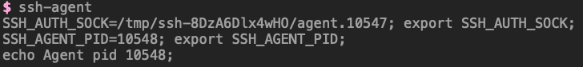
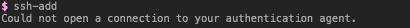
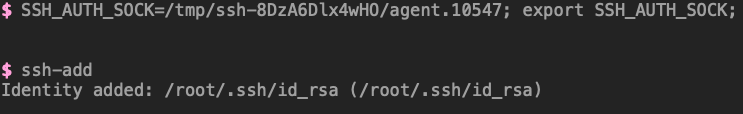
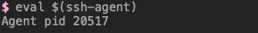

# 关于为什么ssh-agent需要使用eval来运行

<!--more-->
### 执行测试
1.首先我们直接运行`ssh-agent`,可以看到如下效果



2.当我们执行`ssh-add`时，提示如下




ssh-add会通过`SSH_AUTH_SOCK`环境变量，获取与ssh-agent通信的unix套接字,所以我们下面需要设置最开始提示的环境变量。
> https://www.ssh.com/academy/ssh/agent#starting-ssh-agent

3.配置环境变量测试
```bash
SSH_AUTH_SOCK=/tmp/ssh-8DzA6Dlx4wHO/agent.10547; export SSH_AUTH_SOCK;
ssh-add
```


可以看到已经可以使用了，在第一次执行命令的结果中，还有一个`SSH_AGENT_PID`环境变量，这个是`ssh-agent`的进程ID,使用`ssh-agent -k`可以用来退出代理程序。


通过上面的测试发现，只要我们的环境变量配置好正确的unix套接字，就可以使用ssh-agent了，但是每次都这样配置太麻烦了。

### 为什么ssh-agent不帮我们设置环境变量呢? 
这其实和linux操作系统有关，因为ssh-agent是作为当前shell的一个子进程运行的。在linux中，进程只能修改自己的环境变量，并将它们传递给子进程。但它不能修改其父进程的环境变量，因为系统不允许。

> https://unix.stackexchange.com/questions/351725/why-eval-the-output-of-ssh-agent


### 使用eval解决
eval可以将字符串作为命令来执行，在我们直接执行`ssh-agent`时，屏幕会输出三行内容，这三行内容就是三条命令，所以我们可以将`ssh-agent`的执行结果在当前Shell作为命令执行，那么你可以看下下面这个命令，是不是很合理
```bash
eval $(ssh-agent)
```

> 首先执行`ssh-agent`，输出的结果是三行命令，通过eval来执行这三行命令，就达到了自动添加环境变量的目的.因为第三行是一个echo命令，所以将pid输出了出来。


---

> 作者: [SoulChild](https://www.soulchild.cn)  
> URL: https://www.soulchild.cn/post/2893/  

