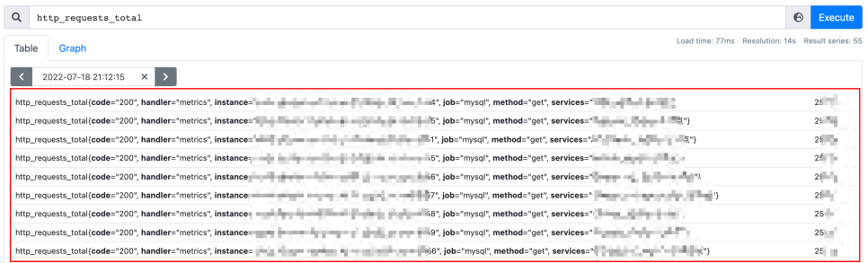
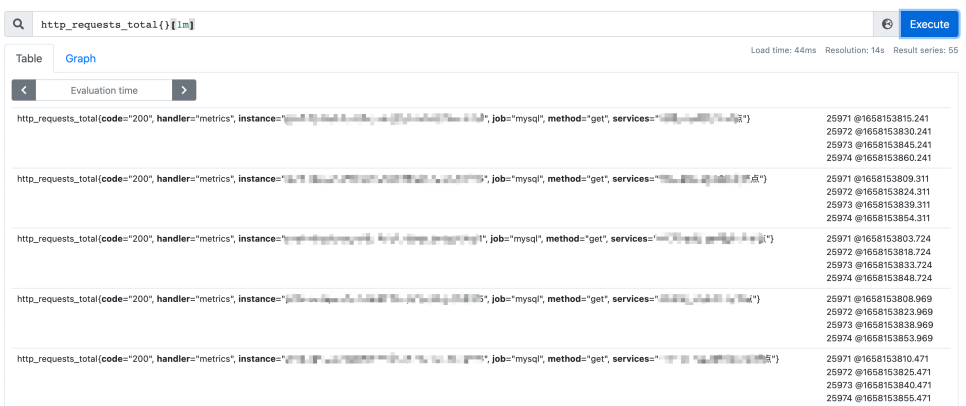
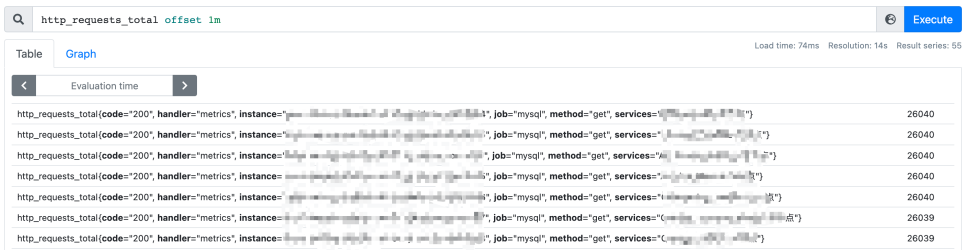
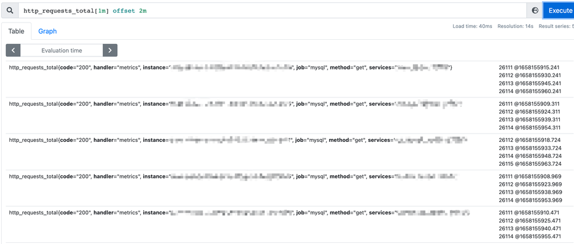
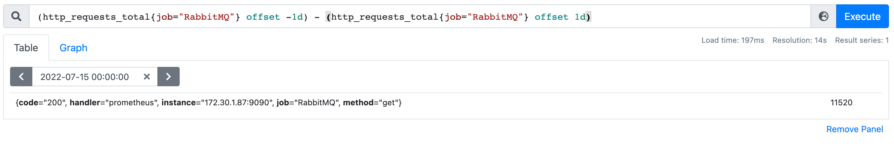
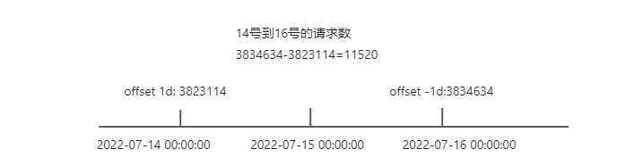

# promql基本概念(一)

<!--more-->
好久没发笔记了，发点存货(●ˇ∀ˇ●)
### 瞬时向量
一组时间序列，每一个时间序列包含一个样本，所有时间序列共享一个时间点。
比如`http_requests_total`指标

红框内的算一组时间序列(所有时间序列)，每一行算一个时间序列，每一个时间序列都有自己的value即样本。
所有时间序列共享一个时间点是什么意思呢? 可以看到上面的一组时间序列的时间点都是`2022-07-18 21:12:15`的。

### 范围向量
一组时间序列，每个时间序列包含N个样本数据(随时间变化的)
还是拿`http_requests_total`指标举例

可以看到我们在最后加了`[1m]`,即`http_requests_total[1m]`什么意思呢?
获取每个时间序列过去1分钟内的所有样本和对它应的时间，因为没有指定时间，所以默认就是当前时间，含义就是当前时间-1m这个时间范围的数据。可以看到这样结果和瞬时向量有很大的区别，这种数据就是范围向量了。为什么一个时间序列只有4个样本数据呢？因为15秒收集一次，1分钟刚好4个。

### 标量
就是简单的数字、浮点型数据

### Offset修饰符
用于修改瞬时向量、范围向量的时间偏移量。
举个例子
`http_requests_total offset 1m`

正常情况下我们查询是当前时间,  加了`offset 1m`后就代表当前时间减`1m`。这里和`[1m]`不一样的是,`[1m]`的查询结果是范围向量，而`offset 1m`的结果是不会变的，他还是瞬时向量，最终他的含义就是获取1分钟前的时间点的样本数据

在举一个例子
`http_requests_total[1m] offset 2m`

首先看结果他肯定是一个范围向量，先不看`offset 2m`，先看`http_requests_total[1m]`他的含义是获取`当前时间-1m`到`当前时间`的数据。offset做了什么呢? 其实他就是把当前时间修改了，也就是`当前时间-2m`，最终含义就变成了:
获取`(当前时间-2m)-1m`到`当前时间-2m`的数据

offset还可以指定负数，也就是将时间点偏移到未来，这个的使用场景我只能想到是在指定了查询时间的情况下，比如`(http_requests_total{job="RabbitMQ"} offset -1d) - (http_requests_total{job="RabbitMQ"} offset 1d)`

将这个式子想象成一个线段，这将以`2022-07-15 00:00:00`为中点，用右边的值减去左边的值就是中间区域的值了，最终计算出14号到16号的请求数。

注意使用负偏移需要开启参数--enable-feature=promql-negative-offset

### @ 修饰符
用来设置查询值的时间，比如`http_requests_total @ 1609746000`查询2021年1月4日 15点40的值。
一般情况下用api查询就足够了，query API可以指定`time`参数，query_range API可以指定`start`、`end`参数。
如果想要使用`@修饰符`需要启用`--enable-feature=promql-at-modifier`

---

> 作者: [SoulChild](https://www.soulchild.cn)  
> URL: https://www.soulchild.cn/post/2920/  

