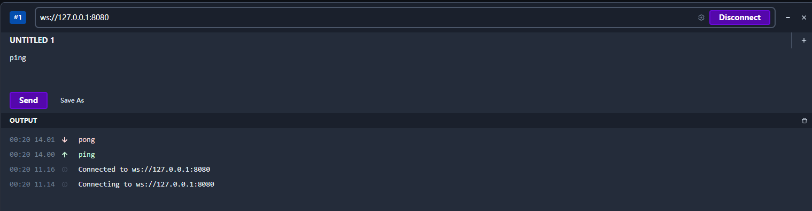

# Gin+Gorilla构建一个简单的websocket服务端

<!--more-->
参考: https://hoohoo.top/blog/20220320172715-go-websocket/


关于客户端部分使用 chrome 扩展：`Websocket King`。
在线版: https://websocketking.com/

### 安装module
```bash
go get github.com/gin-gonic/gin
go get github.com/gorilla/websocket
```

### 构建一个 websocket 服务器
以下是使用 gin 和 gorilla 构建的简单 websocket 服务器的示例，Gin 创建一个 get 请求，并通过 upgrade.Upgrade 将这个 HTTP 连接升级为 websocket 连接。

可以使用具有以下参数的 websocket.Upgrader：
- `HandshakeTimeout`：指定握手完成的超时时间。
- `ReadBufferSize` 和 `WriteBufferSize`：以字节为单位指定 I/O 缓冲区大小，这不会限制发送消息的大小。
- `WriteBufferPool`：用于写操作的缓冲区池, 缓冲区可以使用后被重用，从而减少内存分配和回收的开销。
- `Subprotocols`：指定服务器支持的子协议列表，按照顺序来协商使用哪个，比如chat，jsonrpc，soap，xmpp等等。
- `Error`：http升级到websocket发生错误时的处理函数，可以以http的方式响应回去
- `CheckOrigin`: 可以进行鉴权之类的操作，不符合条件的不允许建立websocket连接
- `EnableCompression`：指定服务器是否应该尝试协商每个消息的压缩(RFC 7692)。


```bash
package main

import (
	"fmt"
	"github.com/gin-gonic/gin"
	"github.com/gorilla/websocket"
	"net/http"
	"time"
)

var upgrader = websocket.Upgrader{
	HandshakeTimeout: time.Second * 3,
	ReadBufferSize:   4096,
	WriteBufferSize:  4096,
	Error: func(w http.ResponseWriter, r *http.Request, status int, reason error) {
		fmt.Printf("升级连接发生错误: %v", reason)
		http.Error(w, http.StatusText(status), status)
		_, err := w.Write([]byte("升级连接发生错误"))
		if err != nil {
			fmt.Printf("写入response失败: %v", reason)
		}
	},
	CheckOrigin: func(r *http.Request) bool {
		return r.Header["Origin"][0] == "chrome-extension://cbcbkhdmedgianpaifchdaddpnmgnknn"
	},
	EnableCompression: true,
}

func main() {
	r := gin.Default()
	r.GET("/", func(c *gin.Context) {
		// 将get请求升级成websocket协议
		ws, err := upgrader.Upgrade(c.Writer, c.Request, nil)
		if err != nil {
			fmt.Println(err)
			return
		}
		defer ws.Close()
		for {
			// 读取message消息
			mt, message, err := ws.ReadMessage()
			if err != nil {
				fmt.Println(err)
				break
			}
			// 如果客户端发来ping,我们就回复pong
			if string(message) == "ping" {
				message = []byte("pong")
			}
			// 响应消息到客户端
			err = ws.WriteMessage(mt, message)
			if err != nil {
				fmt.Println(err)
				break
			}
		}
	})
	r.Run() // listen and serve on 0.0.0.0:8080
}


```




通过http访问


---

> 作者: [SoulChild](https://www.soulchild.cn)  
> URL: https://www.soulchild.cn/post/2942/  

