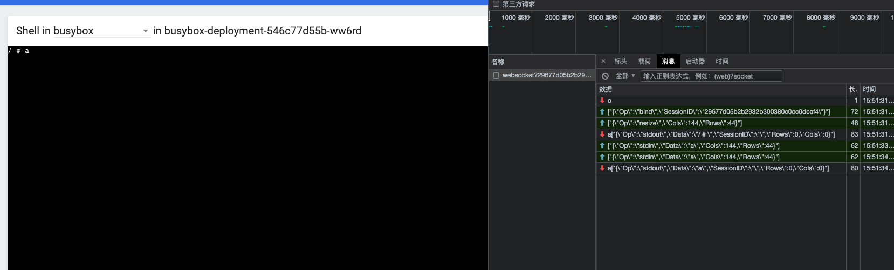
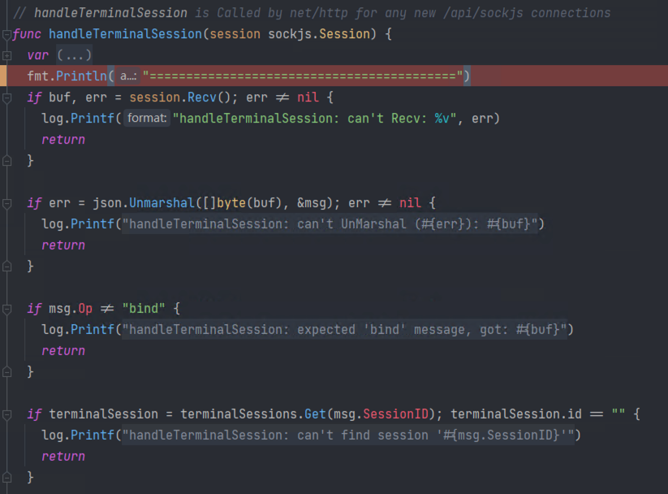
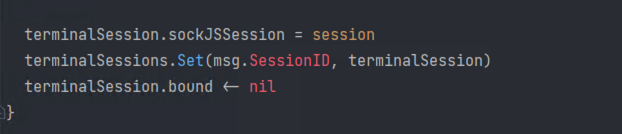
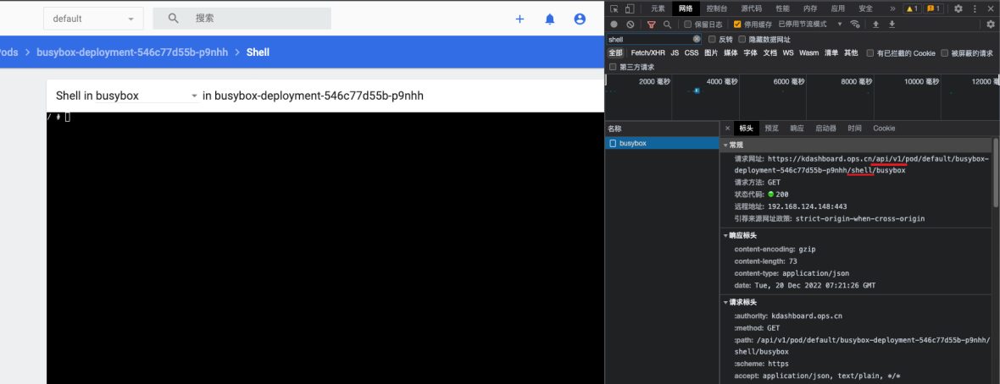
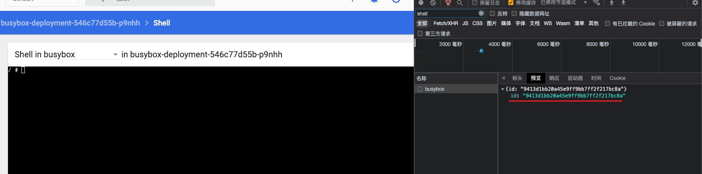
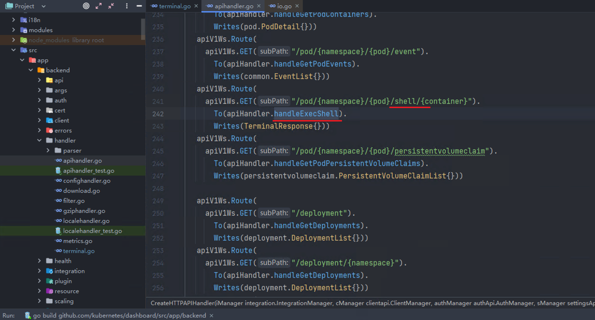

# k8s dashboard terminal源码分析

<!--more-->
### 源码位置
#### 前端实现
[https://github.com/kubernetes/dashboard/blob/v2.7.0/src/app/frontend/shell/template.html](https://github.com/kubernetes/dashboard/blob/v2.7.0/src/app/frontend/shell/template.html)
[https://github.com/kubernetes/dashboard/blob/v2.7.0/src/app/frontend/shell/component.ts](https://github.com/kubernetes/dashboard/blob/v2.7.0/src/app/frontend/shell/component.ts)

#### 后端实现
入口有两个

1. sockjs连接实现 [https://github.com/kubernetes/dashboard/blob/v2.7.0/src/app/backend/dashboard.go](https://github.com/kubernetes/dashboard/blob/v2.7.0/src/app/backend/dashboard.go)
2. 访问终端界面时的handler [https://github.com/kubernetes/dashboard/blob/v2.7.0/src/app/backend/handler/apihandler.go](https://github.com/kubernetes/dashboard/blob/v2.7.0/src/app/backend/handler/apihandler.go)

主要逻辑
[https://github.com/kubernetes/dashboard/blob/v2.7.0/src/app/backend/handler/terminal.go](https://github.com/kubernetes/dashboard/blob/v2.7.0/src/app/backend/handler/terminal.go)

### 源码分析
#### 一、socket部分

1. 首先通过入口开始定位，慢慢把流程串起来.

通过浏览器可以定位到web terminal使用了websocket进行的通信，对话内容也可以记一下，这个顺序也有些用。



在源码中找到api路由`/api/sockjs/491/jv0og3kn/websocket?29677d05b2b2932b300380c0cc0dcaf4`
源码位置
[https://github.com/kubernetes/dashboard/blob/v2.7.0/src/app/backend/dashboard.go#L170](https://github.com/kubernetes/dashboard/blob/v2.7.0/src/app/backend/dashboard.go#L170)

这里可以看出来`/api/sockjs/`开头的路由都交给了`handler.CreateAttachHandler("/api/sockjs")`函数处理
这个函数很简单就一句`return sockjs.NewHandler(path, sockjs.DefaultOptions, handleTerminalSession)`
`/api/sockjs`这个路由最终的处理函数是`handleTerminalSession`，这个函数接收sockjs.Session类型参数，通过他可以读取websocket会话的消息。

这个函数前面做了一些判断err，msg变量是TerminalMessage结构体实例化出来的，主要应该用来反序列化客户端传来的消息为结构体对象的，后面两个，如果建立会话后发送的内容中msg.Op不是bind就直接return，下面会判断msg中的sessionID是否存在于terminalSessions中，不存在的sessionID也会return(什么时候将sessionID存入terminalSessions中的?在另一个入口中，后面会说到【1】)



再往下，第一行是将sockjs.Session对象存入sockJSSession中，第二行是将sockjs.Session对象存入SessionMap中, sockjs.Session对象可以用来发送和接受数据
第三行的bound是个err类型的channel，将nil放进去, 执行完应该会阻塞，由后面的`WaitForTerminal`函数来消费处理



这里使用了TerminalSession结构体，terminalSession变量是在当前函数体内声明的，我没截出来。 
```go
// 这里是实例化StreamOptions需要用的一些参数，stream通过read、write方法将服务端的stdout、stdin、stderr、写入到指定的位置，具体写到哪可以看下面的实现逻辑
type PtyHandler interface {
	io.Reader
	io.Writer
	remotecommand.TerminalSizeQueue // 终端大小，也是stream需要的option
}

// TerminalSession implements PtyHandler (using a SockJS connection)
type TerminalSession struct {
	id            string
	bound         chan error
	sockJSSession sockjs.Session
	sizeChan      chan remotecommand.TerminalSize  // 这个结构体就两个属性宽和高
}

// 和客户端发的消息格式对应，格式不一致就无法反序列化，从而无法建立连接
type TerminalMessage struct {
	Op, Data, SessionID string
	Rows, Cols          uint16
}

// 主要用来存储sessionId和session的对应关系的，通过get、set方法可以读取和设置
type SessionMap struct {
	Sessions map[string]TerminalSession
	Lock     sync.RWMutex
}
```
注释中说TerminalSession实现了PtyHandler接口，并且他还拥有SockJS session对象信息，PtyHandler接口继承了io.Reader、io.Writer、remotecommand.TerminalSizeQueue，只要实现下面三个方法即可
read 读取客户端发来的数据
write 向客户端发送数据
next 获取终端大小，返回给调用方

看看他实现这些方法的逻辑
```go
// Read方法将终端大小存入到channel中了，这个方法从channel中读出来并将结果返回
func (t TerminalSession) Next() *remotecommand.TerminalSize {
	size := <-t.sizeChan
	if size.Height == 0 && size.Width == 0 {
		return nil
	}
	return &size
}

func (t TerminalSession) Read(p []byte) (int, error) {
	m, err := t.sockJSSession.Recv() // 读取客户端的数据
	if err != nil {
		// Send terminated signal to process to avoid resource leak
		return copy(p, END_OF_TRANSMISSION), err   // 如果读取异常则return一个终止传输的符号(\u0004-EOT)
	}

	var msg TerminalMessage
	if err := json.Unmarshal([]byte(m), &msg); err != nil {
		return copy(p, END_OF_TRANSMISSION), err
	}

	switch msg.Op {   // 成功读取数据后,需要根据数据中的Op属性，判断要进行的动作
	case "stdin":
		return copy(p, msg.Data), nil
	case "resize":  // 实例化TerminalSize对象，客户端发来的终端大小放在这个对象里, 将这个对象放入sizeChan中
		t.sizeChan <- remotecommand.TerminalSize{Width: msg.Cols, Height: msg.Rows}
		return 0, nil
	default:
		return copy(p, END_OF_TRANSMISSION), fmt.Errorf("unknown message type '%s'", msg.Op)  // 未知的Op属性，返回终止传输符号，同时返回错误信息
	}
}

// 对数据序列化进行然后发送给客户端，类型是stdout
func (t TerminalSession) Write(p []byte) (int, error) {
	msg, err := json.Marshal(TerminalMessage{
		Op:   "stdout",
		Data: string(p),
	})
	if err != nil {
		return 0, err
	}

	if err = t.sockJSSession.Send(string(msg)); err != nil {
		return 0, err
	}
	return len(p), nil
}

// 发送类型为OOB的消息，暂时不管，可能适用于扩展警告信息等
func (t TerminalSession) Toast(p string) error {
	msg, err := json.Marshal(TerminalMessage{
		Op:   "toast",
		Data: p,
	})
	if err != nil {
		return err
	}

	if err = t.sockJSSession.Send(string(msg)); err != nil {
		return err
	}
	return nil
}
```

#### 小总结
客户端发送`/api/sockjs/xxxx`后会执行`handleTerminalSession`函数进行初始化，验证连接的合法性，如果合法将websocket的session存入sessionMap中，最后向bound这个channel中放入nil，通知另一个函数当前连接已就绪

#### 二、apiserver交互部分
当进入这个页面的时候，它会发送一个请求，服务端会返回一个id





后端处理逻辑分析，首先定位到它的handler是handleExecShell



源码如下
```go
// Handles execute shell API call
func (apiHandler *APIHandler) handleExecShell(request *restful.Request, response *restful.Response) {
	sessionID, err := genTerminalSessionId() // 这里调用了genTerminalSessionId函数，随机生成一个ID
	if err != nil {
		errors.HandleInternalError(response, err)
		return
	}

	k8sClient, err := apiHandler.cManager.Client(request) // 获取k8s client，startProcess函数需要使用
	if err != nil {
		errors.HandleInternalError(response, err)
		return
	}

	cfg, err := apiHandler.cManager.Config(request)  // 获取k8s config，startProcess函数需要使用
	if err != nil {
		errors.HandleInternalError(response, err)
		return
	}

	terminalSessions.Set(sessionID, TerminalSession{  // 将sessionID set到terminalSessions对象中，key是sessionID，value是TerminalSession对象，这里和上面的【1】对应上了
		id:       sessionID,
		bound:    make(chan error),
		sizeChan: make(chan remotecommand.TerminalSize),
	})
	go WaitForTerminal(k8sClient, cfg, request, sessionID)  // 执行WaitForTerminal，处理客户端的请求
	response.WriteHeaderAndEntity(http.StatusOK, TerminalResponse{ID: sessionID})
}
```

继续往后看`WaitForTerminal`函数，
```go
func WaitForTerminal(k8sClient kubernetes.Interface, cfg *rest.Config, request *restful.Request, sessionId string) {
	shell := request.QueryParameter("shell")  // 从参数中获取要执行的shell，暂时没发现前端有可以修改的地方

	select {   // 通过select监听channel，10秒内bound这个channel没有收到内容，就会执行超时关闭连接
	case <-terminalSessions.Get(sessionId).bound:  // 从bound这个channel获取内容，也就是上面的handleTerminalSession函数给置入的nil
		close(terminalSessions.Get(sessionId).bound) // 获取成功后这个channel就用不上了，可以执行close

		var err error
		validShells := []string{"bash", "sh", "powershell", "cmd"}  // 默认会执行几个shell进行测试

		if isValidShell(validShells, shell) {  // 如果传过来的指定shell在validShells列表里就直接调用startProcess执行命令
			cmd := []string{shell}
			err = startProcess(k8sClient, cfg, request, cmd, terminalSessions.Get(sessionId))
		} else {
			for _, testShell := range validShells {  // 否则就循环一个一个测试validShells列表里的命令是否可用
				cmd := []string{testShell}
				if err = startProcess(k8sClient, cfg, request, cmd, terminalSessions.Get(sessionId)); err == nil { // 如果可以用startProcess会阻塞，否则返回错误
					break
				}
			}
		}

		if err != nil {  // 如果发生错误则关闭连接
			terminalSessions.Close(sessionId, 2, err.Error())
			return
		}

        // 正常退出进程的情况，触发关闭连接
		terminalSessions.Close(sessionId, 1, "Process exited")

    // time.After(10 * time.Second)也会返回一个channel，只不过它是10秒之后才会返回
	case <-time.After(10 * time.Second): 
		// Close chan and delete session when sockjs connection was timeout
		close(terminalSessions.Get(sessionId).bound)
		delete(terminalSessions.Sessions, sessionId)
		return
	}
}
```
这里主要就是调用startProcess函数执行一个shell，后续的交互都是由startProcess来维护

startProcess代码如下，
```go
func startProcess(k8sClient kubernetes.Interface, cfg *rest.Config, request *restful.Request, cmd []string, ptyHandler PtyHandler) error {
	namespace := request.PathParameter("namespace")
	podName := request.PathParameter("pod")
	containerName := request.PathParameter("container")

    // 实例化rest client
	req := k8sClient.CoreV1().RESTClient().Post().
		Resource("pods").
		Name(podName).
		Namespace(namespace).
		SubResource("exec")

    // 设置执行参数
	req.VersionedParams(&v1.PodExecOptions{
		Container: containerName,
		Command:   cmd,
		Stdin:     true,
		Stdout:    true,
		Stderr:    true,
		TTY:       true,
	}, scheme.ParameterCodec)

	exec, err := remotecommand.NewSPDYExecutor(cfg, "POST", req.URL())
	if err != nil {
		return err
	}
	// Stream方法处理输入、输出和错误输出流，并将这些流转发到给定的ptyHandler，按照read、write、next来操作
	err = exec.Stream(remotecommand.StreamOptions{  // 成功运行的话，exec.Stream会一直阻塞在这，直到客户端执行exit退出
		Stdin:             ptyHandler,
		Stdout:            ptyHandler,
		Stderr:            ptyHandler,
		TerminalSizeQueue: ptyHandler,
		Tty:               true, // 将命令运行在TTY终端中，可以使用终端的一些特性，例如输入行编辑、光标移动等
	})
	if err != nil {
		return err
	}

	return nil
}
```
### 
### 功能拆解例子
代码量明显减少，方便阅读
[https://github.com/SoulChildTc/k8s-web-terminal-learn](https://github.com/SoulChildTc/k8s-web-terminal-learn)


<!--markdown-->### 源码位置
#### 前端实现
[https://github.com/kubernetes/dashboard/blob/v2.7.0/src/app/frontend/shell/template.html](https://github.com/kubernetes/dashboard/blob/v2.7.0/src/app/frontend/shell/template.html)
[https://github.com/kubernetes/dashboard/blob/v2.7.0/src/app/frontend/shell/component.ts](https://github.com/kubernetes/dashboard/blob/v2.7.0/src/app/frontend/shell/component.ts)

#### 后端实现
入口有两个

1. sockjs连接实现 [https://github.com/kubernetes/dashboard/blob/v2.7.0/src/app/backend/dashboard.go](https://github.com/kubernetes/dashboard/blob/v2.7.0/src/app/backend/dashboard.go)
2. 访问终端界面时的handler [https://github.com/kubernetes/dashboard/blob/v2.7.0/src/app/backend/handler/apihandler.go](https://github.com/kubernetes/dashboard/blob/v2.7.0/src/app/backend/handler/apihandler.go)

主要逻辑
[https://github.com/kubernetes/dashboard/blob/v2.7.0/src/app/backend/handler/terminal.go](https://github.com/kubernetes/dashboard/blob/v2.7.0/src/app/backend/handler/terminal.go)

### 源码分析
#### 一、socket部分

1. 首先通过入口开始定位，慢慢把流程串起来.

通过浏览器可以定位到web terminal使用了websocket进行的通信，对话内容也可以记一下，这个顺序也有些用。


在源码中找到api路由`/api/sockjs/491/jv0og3kn/websocket?29677d05b2b2932b300380c0cc0dcaf4`
源码位置
[https://github.com/kubernetes/dashboard/blob/v2.7.0/src/app/backend/dashboard.go#L170](https://github.com/kubernetes/dashboard/blob/v2.7.0/src/app/backend/dashboard.go#L170)

这里可以看出来`/api/sockjs/`开头的路由都交给了`handler.CreateAttachHandler("/api/sockjs")`函数处理
这个函数很简单就一句`return sockjs.NewHandler(path, sockjs.DefaultOptions, handleTerminalSession)`
`/api/sockjs`这个路由最终的处理函数是`handleTerminalSession`，这个函数接收sockjs.Session类型参数，通过他可以读取websocket会话的消息。

这个函数前面做了一些判断err，msg变量是TerminalMessage结构体实例化出来的，主要应该用来反序列化客户端传来的消息为结构体对象的，后面两个，如果建立会话后发送的内容中msg.Op不是bind就直接return，下面会判断msg中的sessionID是否存在于terminalSessions中，不存在的sessionID也会return(什么时候将sessionID存入terminalSessions中的?在另一个入口中，后面会说到【1】)


再往下，第一行是将sockjs.Session对象存入sockJSSession中，第二行是将sockjs.Session对象存入SessionMap中, sockjs.Session对象可以用来发送和接受数据
第三行的bound是个err类型的channel，将nil放进去, 执行完应该会阻塞，由后面的`WaitForTerminal`函数来消费处理


这里使用了TerminalSession结构体，terminalSession变量是在当前函数体内声明的，我没截出来。 
```go
// 这里是实例化StreamOptions需要用的一些参数，stream通过read、write方法将服务端的stdout、stdin、stderr、写入到指定的位置，具体写到哪可以看下面的实现逻辑
type PtyHandler interface {
	io.Reader
	io.Writer
	remotecommand.TerminalSizeQueue // 终端大小，也是stream需要的option
}

// TerminalSession implements PtyHandler (using a SockJS connection)
type TerminalSession struct {
	id            string
	bound         chan error
	sockJSSession sockjs.Session
	sizeChan      chan remotecommand.TerminalSize  // 这个结构体就两个属性宽和高
}

// 和客户端发的消息格式对应，格式不一致就无法反序列化，从而无法建立连接
type TerminalMessage struct {
	Op, Data, SessionID string
	Rows, Cols          uint16
}

// 主要用来存储sessionId和session的对应关系的，通过get、set方法可以读取和设置
type SessionMap struct {
	Sessions map[string]TerminalSession
	Lock     sync.RWMutex
}
```
注释中说TerminalSession实现了PtyHandler接口，并且他还拥有SockJS session对象信息，PtyHandler接口继承了io.Reader、io.Writer、remotecommand.TerminalSizeQueue，只要实现下面三个方法即可
read 读取客户端发来的数据
write 向客户端发送数据
next 获取终端大小，返回给调用方

看看他实现这些方法的逻辑
```go
// Read方法将终端大小存入到channel中了，这个方法从channel中读出来并将结果返回
func (t TerminalSession) Next() *remotecommand.TerminalSize {
	size := <-t.sizeChan
	if size.Height == 0 && size.Width == 0 {
		return nil
	}
	return &size
}

func (t TerminalSession) Read(p []byte) (int, error) {
	m, err := t.sockJSSession.Recv() // 读取客户端的数据
	if err != nil {
		// Send terminated signal to process to avoid resource leak
		return copy(p, END_OF_TRANSMISSION), err   // 如果读取异常则return一个终止传输的符号(\u0004-EOT)
	}

	var msg TerminalMessage
	if err := json.Unmarshal([]byte(m), &msg); err != nil {
		return copy(p, END_OF_TRANSMISSION), err
	}

	switch msg.Op {   // 成功读取数据后,需要根据数据中的Op属性，判断要进行的动作
	case "stdin":
		return copy(p, msg.Data), nil
	case "resize":  // 实例化TerminalSize对象，客户端发来的终端大小放在这个对象里, 将这个对象放入sizeChan中
		t.sizeChan <- remotecommand.TerminalSize{Width: msg.Cols, Height: msg.Rows}
		return 0, nil
	default:
		return copy(p, END_OF_TRANSMISSION), fmt.Errorf("unknown message type '%s'", msg.Op)  // 未知的Op属性，返回终止传输符号，同时返回错误信息
	}
}

// 对数据序列化进行然后发送给客户端，类型是stdout
func (t TerminalSession) Write(p []byte) (int, error) {
	msg, err := json.Marshal(TerminalMessage{
		Op:   "stdout",
		Data: string(p),
	})
	if err != nil {
		return 0, err
	}

	if err = t.sockJSSession.Send(string(msg)); err != nil {
		return 0, err
	}
	return len(p), nil
}

// 发送类型为OOB的消息，暂时不管，可能适用于扩展警告信息等
func (t TerminalSession) Toast(p string) error {
	msg, err := json.Marshal(TerminalMessage{
		Op:   "toast",
		Data: p,
	})
	if err != nil {
		return err
	}

	if err = t.sockJSSession.Send(string(msg)); err != nil {
		return err
	}
	return nil
}
```

#### 小总结
客户端发送`/api/sockjs/xxxx`后会执行`handleTerminalSession`函数进行初始化，验证连接的合法性，如果合法将websocket的session存入sessionMap中，最后向bound这个channel中放入nil，通知另一个函数当前连接已就绪

#### 二、apiserver交互部分
当进入这个页面的时候，它会发送一个请求，服务端会返回一个id


后端处理逻辑分析，首先定位到它的handler是handleExecShell


源码如下
```go
// Handles execute shell API call
func (apiHandler *APIHandler) handleExecShell(request *restful.Request, response *restful.Response) {
	sessionID, err := genTerminalSessionId() // 这里调用了genTerminalSessionId函数，随机生成一个ID
	if err != nil {
		errors.HandleInternalError(response, err)
		return
	}

	k8sClient, err := apiHandler.cManager.Client(request) // 获取k8s client，startProcess函数需要使用
	if err != nil {
		errors.HandleInternalError(response, err)
		return
	}

	cfg, err := apiHandler.cManager.Config(request)  // 获取k8s config，startProcess函数需要使用
	if err != nil {
		errors.HandleInternalError(response, err)
		return
	}

	terminalSessions.Set(sessionID, TerminalSession{  // 将sessionID set到terminalSessions对象中，key是sessionID，value是TerminalSession对象，这里和上面的【1】对应上了
		id:       sessionID,
		bound:    make(chan error),
		sizeChan: make(chan remotecommand.TerminalSize),
	})
	go WaitForTerminal(k8sClient, cfg, request, sessionID)  // 执行WaitForTerminal，处理客户端的请求
	response.WriteHeaderAndEntity(http.StatusOK, TerminalResponse{ID: sessionID})
}
```

继续往后看`WaitForTerminal`函数，
```go
func WaitForTerminal(k8sClient kubernetes.Interface, cfg *rest.Config, request *restful.Request, sessionId string) {
	shell := request.QueryParameter("shell")  // 从参数中获取要执行的shell，暂时没发现前端有可以修改的地方

	select {   // 通过select监听channel，10秒内bound这个channel没有收到内容，就会执行超时关闭连接
	case <-terminalSessions.Get(sessionId).bound:  // 从bound这个channel获取内容，也就是上面的handleTerminalSession函数给置入的nil
		close(terminalSessions.Get(sessionId).bound) // 获取成功后这个channel就用不上了，可以执行close

		var err error
		validShells := []string{"bash", "sh", "powershell", "cmd"}  // 默认会执行几个shell进行测试

		if isValidShell(validShells, shell) {  // 如果传过来的指定shell在validShells列表里就直接调用startProcess执行命令
			cmd := []string{shell}
			err = startProcess(k8sClient, cfg, request, cmd, terminalSessions.Get(sessionId))
		} else {
			for _, testShell := range validShells {  // 否则就循环一个一个测试validShells列表里的命令是否可用
				cmd := []string{testShell}
				if err = startProcess(k8sClient, cfg, request, cmd, terminalSessions.Get(sessionId)); err == nil { // 如果可以用startProcess会阻塞，否则返回错误
					break
				}
			}
		}

		if err != nil {  // 如果发生错误则关闭连接
			terminalSessions.Close(sessionId, 2, err.Error())
			return
		}

        // 正常退出进程的情况，触发关闭连接
		terminalSessions.Close(sessionId, 1, "Process exited")

    // time.After(10 * time.Second)也会返回一个channel，只不过它是10秒之后才会返回
	case <-time.After(10 * time.Second): 
		// Close chan and delete session when sockjs connection was timeout
		close(terminalSessions.Get(sessionId).bound)
		delete(terminalSessions.Sessions, sessionId)
		return
	}
}
```
这里主要就是调用startProcess函数执行一个shell，后续的交互都是由startProcess来维护

startProcess代码如下，
```go
func startProcess(k8sClient kubernetes.Interface, cfg *rest.Config, request *restful.Request, cmd []string, ptyHandler PtyHandler) error {
	namespace := request.PathParameter("namespace")
	podName := request.PathParameter("pod")
	containerName := request.PathParameter("container")

    // 实例化rest client
	req := k8sClient.CoreV1().RESTClient().Post().
		Resource("pods").
		Name(podName).
		Namespace(namespace).
		SubResource("exec")

    // 设置执行参数
	req.VersionedParams(&v1.PodExecOptions{
		Container: containerName,
		Command:   cmd,
		Stdin:     true,
		Stdout:    true,
		Stderr:    true,
		TTY:       true,
	}, scheme.ParameterCodec)

	exec, err := remotecommand.NewSPDYExecutor(cfg, "POST", req.URL())
	if err != nil {
		return err
	}
	// Stream方法处理输入、输出和错误输出流，并将这些流转发到给定的ptyHandler，按照read、write、next来操作
	err = exec.Stream(remotecommand.StreamOptions{  // 成功运行的话，exec.Stream会一直阻塞在这，直到客户端执行exit退出
		Stdin:             ptyHandler,
		Stdout:            ptyHandler,
		Stderr:            ptyHandler,
		TerminalSizeQueue: ptyHandler,
		Tty:               true, // 将命令运行在TTY终端中，可以使用终端的一些特性，例如输入行编辑、光标移动等
	})
	if err != nil {
		return err
	}

	return nil
}
```

### 功能拆解例子
代码量明显减少，方便阅读
[https://github.com/SoulChildTc/k8s-web-terminal-learn](https://github.com/SoulChildTc/k8s-web-terminal-learn)


---

> 作者: [SoulChild](https://www.soulchild.cn)  
> URL: https://www.soulchild.cn/post/2950/  

