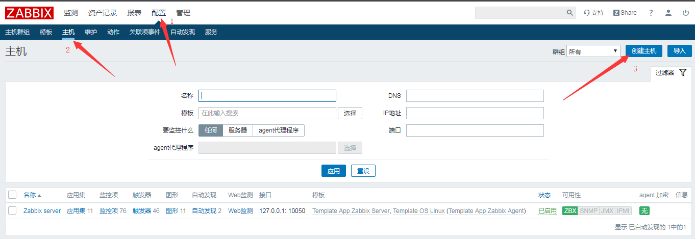
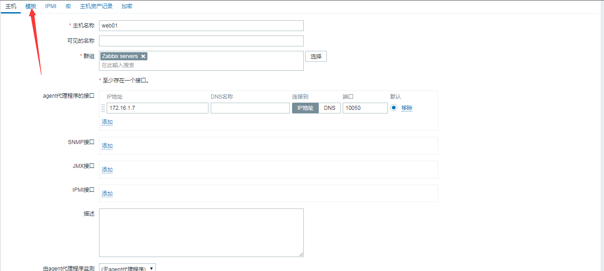
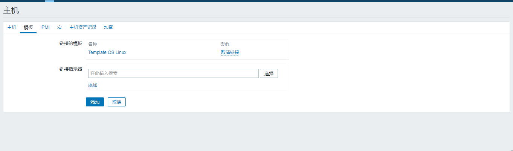
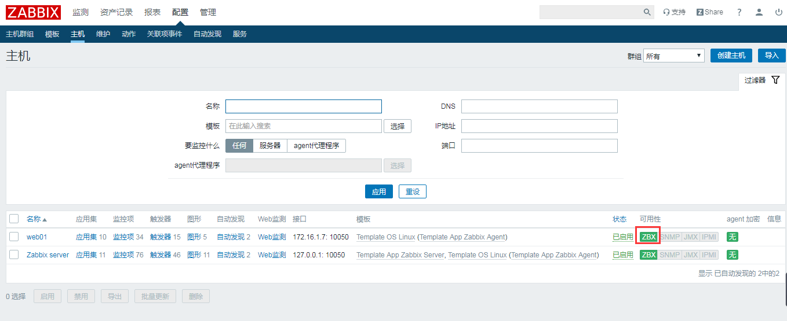

# zabbix通过agent监控主机

<!--more-->
<h2>服务端配置</h2>
zabbix-agent包下载地址：https://repo.zabbix.com/zabbix/4.0/rhel/7/x86_64/

选择和自己环境匹配的包：

rpm -qa | grep zabbix-server

zabbix-server-mysql-4.0.8-1.el7.x86_64

&nbsp;

安装zabbix-agent,我这边是4.0.8的

rpm -ivh https://repo.zabbix.com/zabbix/4.0/rhel/7/x86_64/zabbix-agent-4.0.8-1.el7.x86_64.rpm

&nbsp;

修改配置文件（指定zabbix-server的地址）

vim /etc/zabbix/zabbix_agentd.conf

Server=172.16.1.62

&nbsp;

重启服务和设置开机自启

systemctl restart zabbix-agent.service

systemctl enable zabbix-agent.service

&nbsp;
<h2>web配置</h2>
创建主机

添加linux模板

&nbsp;

&nbsp;

&nbsp;

&nbsp;

&nbsp;

---

> 作者: [SoulChild](https://www.soulchild.cn)  
> URL: https://www.soulchild.cn/post/405/  

