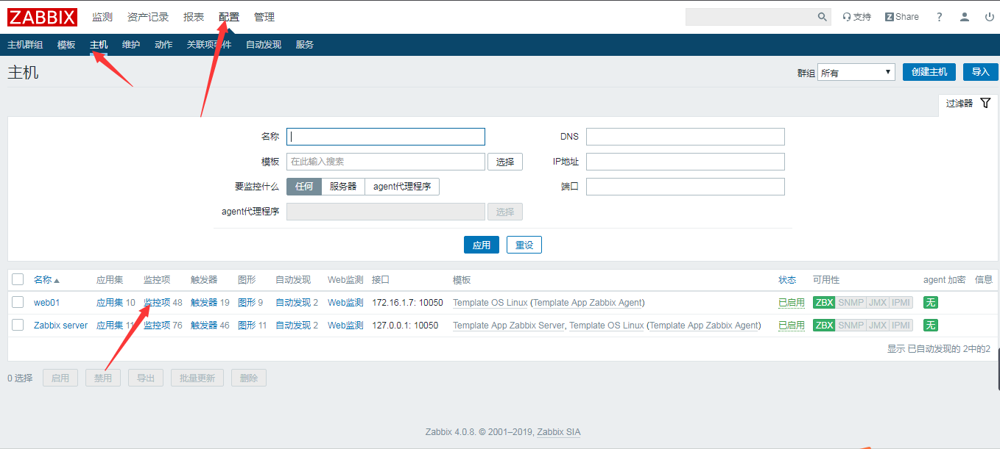

# zabbix添加自定义监控项

<!--more-->
两种方式都可以实现

一个是在zabbix_agentd.conf中直接写

&nbsp;

&nbsp;

另一个是写在zabbix_agentd.d目录下*.conf,前提是配置文件中使用include

Include=/etc/zabbix/zabbix_agentd.d/*.conf

&nbsp;

格式如下：

UserParameter=key,xxxxxxxxxx

xxx部分可以是直接取值的命令，也可以写一个脚本执行，防止传参变量冲突
<h4>监控硬盘的tps值----（agent端配置）</h4>
tps：每秒硬盘读写次数

安装查询工具

yum install -y sysstat

&nbsp;

命令行取值测试

iostat | awk '/^sda/{print $2}'

&nbsp;

添加自定义监控(sda_tps为key值，需要自己取名，不能重复)

vim /etc/zabbix/zabbix_agentd.d/sda_tps.conf

UserParameter=sda_tps,iostat | awk '/^sda/{print $2}'

&nbsp;

重启服务

systemctl restart zabbix-agent.service

&nbsp;

在zabbix-server上手动取值（需要安装zabbix-get，取值使用的是zabbix用户，需要注意用户权限问题）

zabbix_get -s 172.16.1.7 -k sda_tps

1.82

&nbsp;
<h4>web配置</h4>
1.添加监控项

名称可以随便写，键值就是配置文件中的key值

添加完成后，查看最新数据

---

> 作者: [SoulChild](https://www.soulchild.cn)  
> URL: https://www.soulchild.cn/post/412/  

