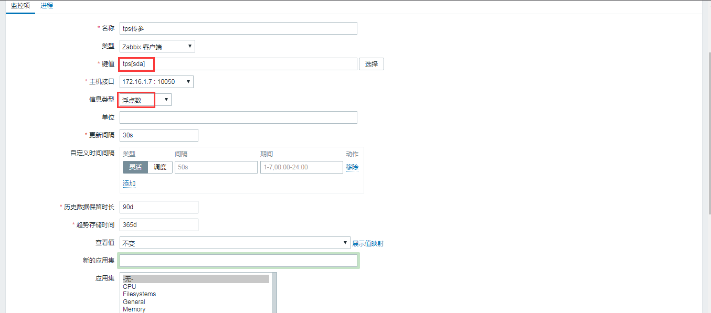
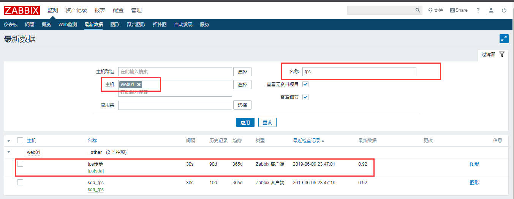

# zabbix传参形式的自定义监控项

<!--more-->
### agent端配置

`[*]用来接收参数,用$可以调用，参数一$1,参数二$2,参数三$3....以此类推`

自定义key：
UserParameter=tps[*],sh /server/scripts/tps.sh $1

```bash
cat /server/scripts/tps.sh
#!/bin/bash
iostat | awk '/^'$1'/{print $2}'
```

测试获取sda：

```bash
zabbix_get -s 172.16.1.7 -k tps[sda]

0.94
```

大概执行过程：
tps[sda]

```bash
------>$1=sda

----->sh /server/scripts/tps.sh sda

----->iostat | awk '/^sda/{print $2}'
```

这样传参的形式可以提高灵活性。

### web配置








---

> 作者: [SoulChild](https://www.soulchild.cn)  
> URL: https://www.soulchild.cn/post/418/  

