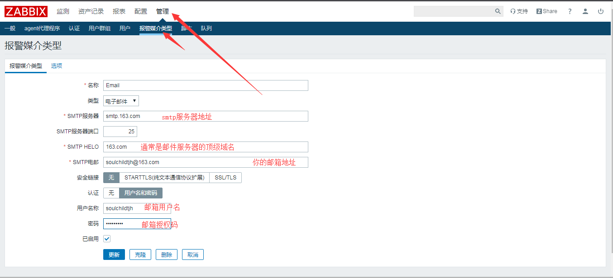
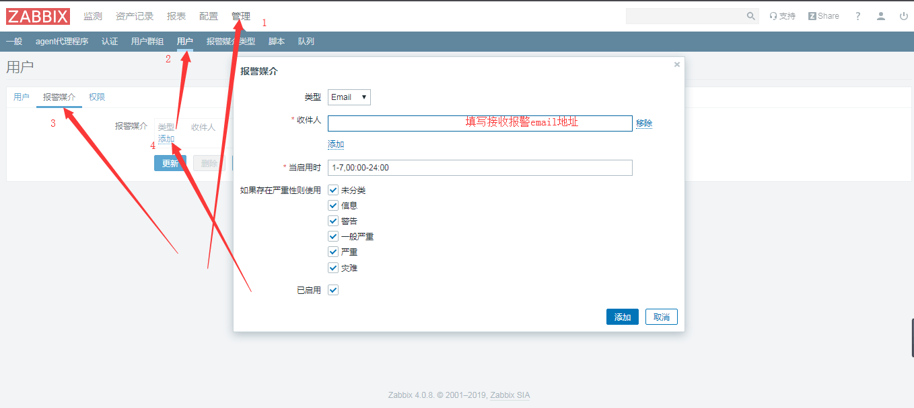
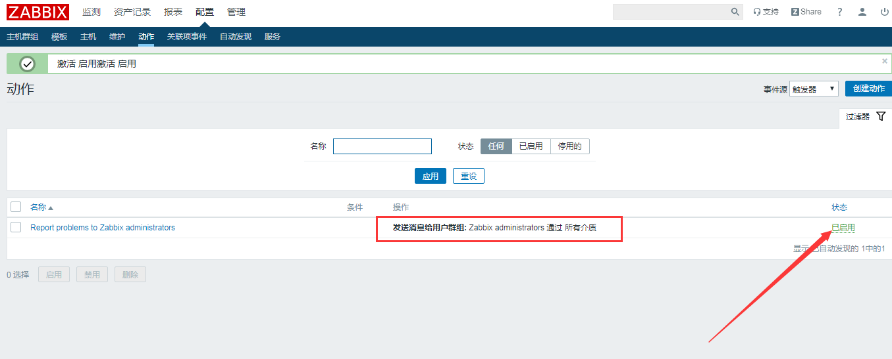
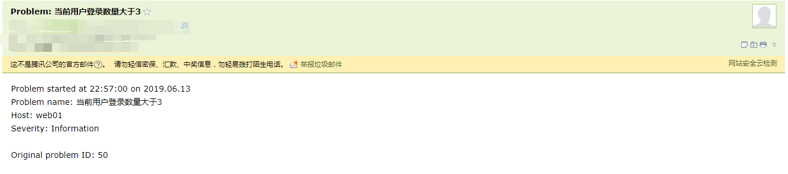

# zabbix内置邮件报警

<!--more-->
<h3><strong>Web配置：</strong></h3>
1.配置邮件服务器（如果是QQ邮箱则需要选中SSL/TLS，勾选SSL验证对端和SSL验证主机）

&nbsp;

2.配置接收报警邮件地址

3.配置动作

步骤2中配置的为管理员用户的收件人地址，默认动作发送包含此组，所以可以不用修改动作，有其他需要可以创建一条。这里直接启用就可以了。

4.测试报警

&nbsp;

报警内容可以在动作中修改。

---

> 作者: [SoulChild](https://www.soulchild.cn)  
> URL: https://www.soulchild.cn/post/433/  

