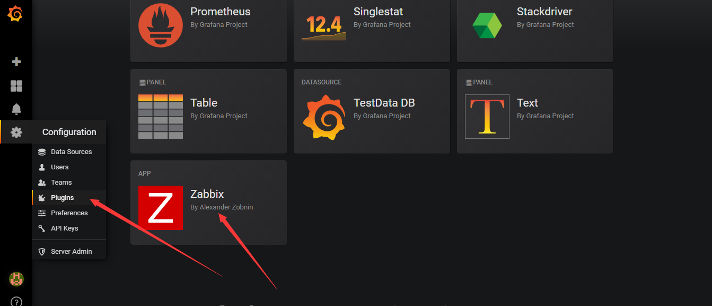

# zabbix之使用grafana展示图形

<!--more-->
<h3><strong>下载安装：</strong></h3>
<pre class="pure-highlightjs"><code class="bash">wget https://dl.grafana.com/oss/release/grafana-6.2.2-1.x86_64.rpm 
yum localinstall grafana-6.2.2-1.x86_64.rpm 
systemctl start grafana-server</code></pre>
&nbsp;
<h3><strong>打开web：</strong></h3>
http://10.0.0.62:3000/

默认用户名密码：admin

首次登陆需要修改
<h3><strong>安装zabbix插件：</strong></h3>
安装插件更多内容可参考官方文档：

https://grafana.com/docs/plugins/installation/

安装：
<pre class="pure-highlightjs"><code class="bash">grafana-cli plugins install alexanderzobnin-zabbix-app
service grafana-server restart</code></pre>
启用插件：进入之后点击enable

&nbsp;
<h3><strong>添加数据源：</strong></h3>
点击add后选择zabbix

&nbsp;

http://10.0.0.62/zabbix/api_jsonrpc.php

填写完成后，点击Save &amp; Test

&nbsp;

保存后，点击Dashboards，导入图形模板

&nbsp;

&nbsp;
<h3><strong>展示图形：</strong></h3>

&nbsp;

展示后，可以选择相应的服务器进行查看

&nbsp;

更深入请参考其他文章：

https://www.cnblogs.com/kevingrace/p/7108060.html

---

> 作者: [SoulChild](https://www.soulchild.cn)  
> URL: https://www.soulchild.cn/post/442/  

