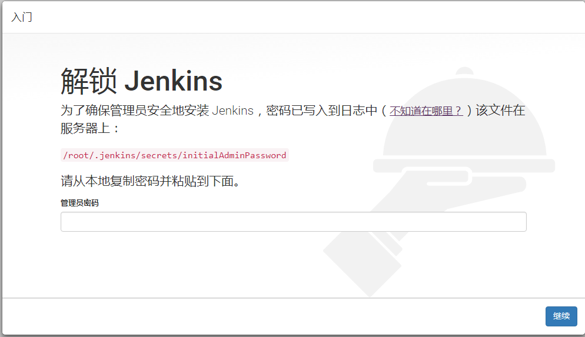

# war包方式部署jenkins，并设置为中文

<!--more-->
最新war包下载地址：

<a href="https://mirrors.tuna.tsinghua.edu.cn/jenkins/war/2.181/jenkins.war">https://mirrors.tuna.tsinghua.edu.cn/jenkins/war-stable/latest/jenkins.war</a>

&nbsp;

将war包复制到tomcat站点目录：

cp jenkins.war /application/tomcat/webapps/

&nbsp;

1.打开web地址：

http://10.0.0.7:8080/jenkins

&nbsp;

2.输入密码后继续，跳过插件安装

3.安装Locale 插件

找到Locale插件安装即可

&nbsp;

4.配置中文

&nbsp;

---

> 作者: [SoulChild](https://www.soulchild.cn)  
> URL: https://www.soulchild.cn/post/475/  

