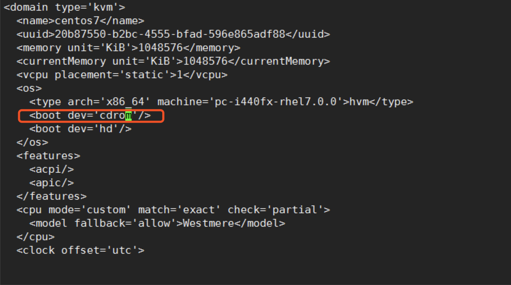

# KVM修改光盘为第一启动项，并添加光盘镜像

<!--more-->
1.编辑配置文件

virsh edit centos7

添加红框中的内容

&nbsp;

2.设置镜像文件路径

3.重启测试

virsh destroy centos7

&nbsp;

---

> 作者: [SoulChild](https://www.soulchild.cn)  
> URL: https://www.soulchild.cn/post/535/  

