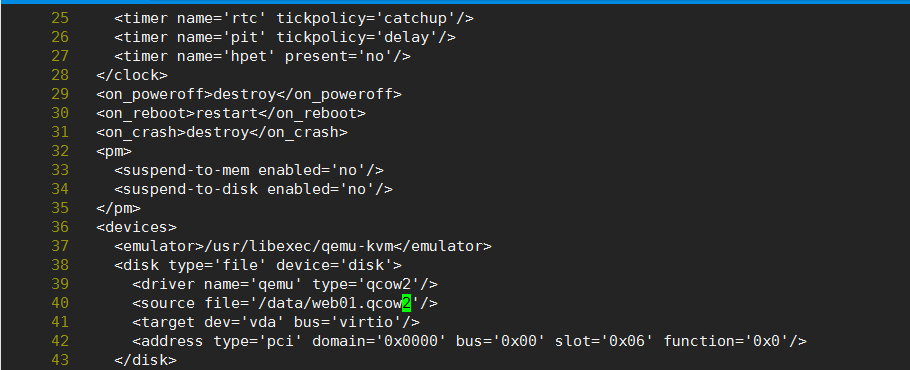

# KVM磁盘格式转换，raw转qcow2

<!--more-->
1.关机
<pre>virsh shutdown web01
virsh destroy web01</pre>
&nbsp;

2.转换磁盘文件格式
<pre>qemu-img convert -f raw -O qcow2 /data/web01.raw /data/web01.qcow2</pre>
&nbsp;

3.修改配置文件的磁盘类型和磁盘路径
<pre>virsh edit web01</pre>

&nbsp;

4.开机
<pre>virsh start web01</pre>
&nbsp;

&nbsp;

---

> 作者: [SoulChild](https://www.soulchild.cn)  
> URL: https://www.soulchild.cn/post/558/  

