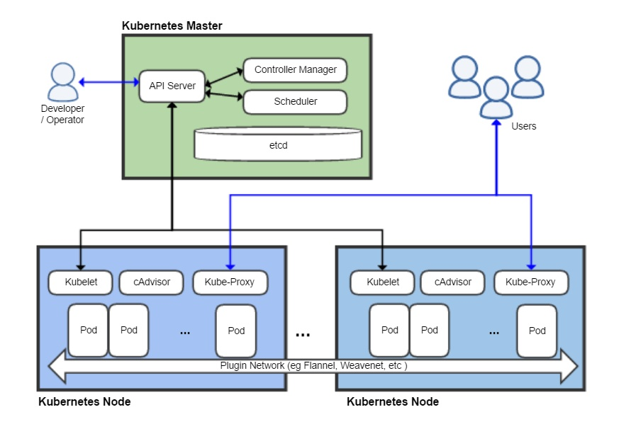

# yum方式安装部署k8s集群

<!--more-->
安装前准备：

环境：
<table width="400">
<tbody>
<tr>
<td width="99">主机</td>
<td width="83">服务</td>
<td width="87">ip</td>
</tr>
<tr>
<td>k8s-master</td>
<td>etcd、</td>
<td>10.0.0.11</td>
</tr>
<tr>
<td>k8s-node-1</td>
<td>k8s-node</td>
<td>10.0.0.12</td>
</tr>
<tr>
<td>k8s-node-2</td>
<td>k8s-node</td>
<td>10.0.0.13</td>
</tr>
</tbody>
</table>
所有主机配置hosts解析
<pre>10.0.0.11     k8s-master
10.0.0.12     k8s-node-1
10.0.0.13     k8s-node-2</pre>
关闭防火墙和selinux
<pre>systemctl stop firewalld
setenforce 0</pre>
yum源使用的是阿里云的
<pre>curl -o /etc/yum.repos.d/CentOS-Base.repo http://mirrors.aliyun.com/repo/Centos-7.repo</pre>
<strong>kubernetes架构图：</strong>

<strong>一、首先配置k8s-master</strong>

1.k8s-master安装etcd：
<pre>yum install -y etcd</pre>
2.配置etcd
<pre>vim /etc/etcd/etcd.conf
#修改下面三项
ETCD_LISTEN_CLIENT_URLS="http://0.0.0.0:2379"
ETCD_NAME="k8s-master"
ETCD_ADVERTISE_CLIENT_URLS="http://10.0.0.11:2379"

#启动服务
systemctl enable etcd
systemctl start etcd

#测试，正常设置和取值
[root@k8s-master ~]# etcdctl set test/k v
v
[root@k8s-master ~]# etcdctl get test/k
v

#查看etcd健康状态
[root@k8s-master ~]# etcdctl -C http://10.0.0.11:2379 cluster-health
member 8e9e05c52164694d is healthy: got healthy result from http://10.0.0.11:2379
cluster is healthy</pre>
&nbsp;

3.安装kubernetes-master
<pre>yum install -y kubernetes-master</pre>
&nbsp;

4.配置apiserver
<pre>vim /etc/kubernetes/apiserver
# 修改下面五项
KUBE_API_ADDRESS="--insecure-bind-address=0.0.0.0"
KUBE_API_PORT="--port=8080"
KUBELET_PORT="--kubelet-port=10250"
KUBE_ETCD_SERVERS="--etcd-servers=http://10.0.0.11:2379"
KUBE_ADMISSION_CONTROL="--admission-control=NamespaceLifecycle,NamespaceExists,LimitRanger,SecurityContextDeny,ResourceQuota"

</pre>
&nbsp;

5.指定apiserver地址，给controller-manager和scheduler使用
<pre>vim /etc/kubernetes/config
KUBE_MASTER="--master=http://10.0.0.11:8080"</pre>
&nbsp;

6.启动服务
<pre>systemctl enable kube-apiserver
systemctl enable kube-controller-manager
systemctl enable kube-scheduler

systemctl restart kube-apiserver
systemctl restart kube-controller-manager
systemctl restart kube-scheduler</pre>
&nbsp;

7.检查其他组件的状态
<pre>[root@k8s-master ~]# kubectl get componentstatus 
NAME                 STATUS       MESSAGE            ERROR
etcd-0               Healthy      {"health":"true"} 
scheduler            Healthy ok 
controller-manager   Healthy ok</pre>
&nbsp;

二、配置node节点(node2也是同样配置)

1.安装kubernetes-node
<pre>yum install -y kubernetes-node</pre>
&nbsp;

2.修改kubelet，注意hostname，每个节点需要不同的名字
<pre>vim /etc/kubernetes/kubelet

KUBELET_ADDRESS="--address=0.0.0.0"
KUBELET_PORT="--port=10250"
KUBELET_HOSTNAME="--hostname-override=k8s-node-1"
KUBELET_API_SERVER="--api-servers=http://10.0.0.11:8080"</pre>
&nbsp;

3.指定apiserver地址，给kube-proxy使用
<pre>vim /etc/kubernetes/config
KUBE_MASTER="--master=http://10.0.0.11:8080"</pre>
4.启动服务
<pre>systemctl enable kubelet
systemctl enable kube-proxy

systemctl restart kubelet.service 
systemctl restart kube-proxy.service</pre>
&nbsp;

5. 在master上查看node节点
<pre>kubectl get nodes
NAME       STATUS    AGE
k8s-node-1 Ready     1m
k8s-node-2 Ready     3s</pre>
&nbsp;

至此k8s已经装完了，接下来配置不同宿主机之间容器的通信，这里使用的flannel。

<strong>安装配置flannel</strong>

1.所有节点安装flannel
<pre>yum install -y flannel
systemctl enable flanneld</pre>
&nbsp;

2.修改fannel配置,三台机器都做此操作
<pre>vim /etc/sysconfig/flanneld
FLANNEL_ETCD_ENDPOINTS="http://10.0.0.11:2379"

#也可以使用sed替换
sed -i s#127.0.0.1:2379#10.0.0.11:2379#g /etc/sysconfig/flanneld
</pre>
&nbsp;

3.通过etcd配置ip地址范围（key:value形式）
<pre>etcdctl mk /atomic.io/network/config '{"Network":"172.16.0.0/16"}'</pre>
&nbsp;

4.重启服务

master节点需要自行安装docker，配置完flannel也需要重启docker。

master节点：
<pre>systemctl restart flanneld
systemctl restart kube-apiserver
systemctl restart kube-controller-manager 
systemctl restart kube-scheduler</pre>
node节点：
<pre>systemctl restart flanneld
systemctl restart docker
systemctl restart kubelet
systemctl restart kube-proxy</pre>
&nbsp;

docker1.13版本中的一个问题，需要修改iptables，否则容器之间不通。
<pre>vim /usr/lib/systemd/system/docker.service
ExecStartPost=/sbin/iptables -P FORWARD ACCEPT
systemctl daemon-reload
systemctl restart docker</pre>
&nbsp;

---

> 作者: [SoulChild](https://www.soulchild.cn)  
> URL: https://www.soulchild.cn/post/681/  

