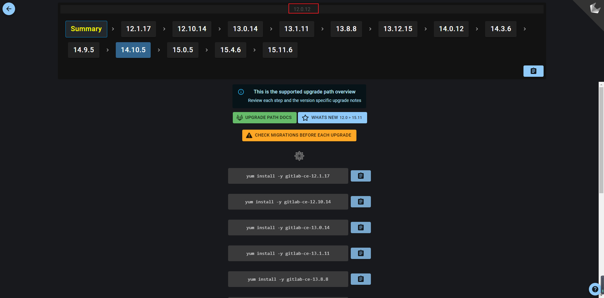

# Gitlab升级实战


<!--more-->

## 升级前准备

<https://docs.gitlab.com/ee/update/>

### 确认安装方式

[官方文档](https://docs.gitlab.com/ee/update/index.html#upgrade-based-on-installation-method)

我这里使用的yum安装, 选择 Linux packages (Omnibus GitLab) 方式升级

#### 升级前后检查

确认升级前后gitlab是没有问题的

<https://docs.gitlab.com/ee/update/plan_your_upgrade.html#pre-upgrade-and-post-upgrade-checks>

```bash
gitlab-rake gitlab:check
gitlab-rake gitlab:geo:check # 老版本可能没有这个命令,忽略即可
```

#### 升级前备份

使用yum安装仅自动备份 GitLab SQL 数据库(不包括其他一切!)

自己备份一份吧, 使用快照和gitlab命令都可以, 恢复请查看文档 <https://docs.gitlab.com/ee/raketasks/backup_restore.html>

```bash
# 关闭安装前的数据库自动备份
touch /etc/gitlab/skip-auto-backup

# 手动备份
gitlab-rake gitlab:backup:create # 备份文件默认存储路径 /var/opt/gitlab/backups

# 备份配置文件和secret
cp /etc/gitlab/gitlab.rb{,.bak.$(date +%Y%m%d%H%M)}
cp /etc/gitlab/gitlab-secrets.json{,.bak.$(date +%Y%m%d%H%M)}
```

#### 确认后台没有迁移任务

```bash
# 未执行的后台迁移任务的数量
gitlab-rails runner -e production 'puts Gitlab::BackgroundMigration.remaining'

# 等待执行的批量迁移任务的数量
gitlab-rails runner -e production 'puts Gitlab::Database::BackgroundMigration::BatchedMigration.queued.count'
```

> 老版本可能没有这些命令, 用UI查看也可以. <http://xxx.com/admin/background_jobs>

#### 确认runner

使用如下方法可以防止runner获取到新的任务。

```bash
nginx['custom_gitlab_server_config'] = "location /api/v4/jobs/request {\n deny all;\n return 503;\n}\n"

sudo gitlab-ctl reconfigure
```

然后再确认没有正在运行的 runner 任务

#### 附加升级

<https://docs.gitlab.com/ee/update/plan_your_upgrade.html#additional-features>
在gitlab升级后, 如果安装了 runner 、 kubernetes agent 之类的东西, 也需要进行升级

#### 确认升级版本

##### 确认升级路径

升级路径可视化工具
<https://gitlab-com.gitlab.io/support/toolbox/upgrade-path/?current=12.0.12&target=15.11.6&distro=centos&auto=true&edition=ce>

我的版本是12.0.3, 没有这个选项, 选择最近的下一个版本12.0.12, 稳妥的办法是先升级12.0.3 -> 12.0.12, 然后再按照升级路线图走。



##### 确认不同版本升级细节

我需要先升级到[12.0.12](https://docs.gitlab.com/ee/update/index.html#1200), 查看相关文档后, 发现没有需要注意的事项。

#### 查看change log

<https://docs.gitlab.com/omnibus/update/gitlab_12_changes.html>

#### 关于pg数据库升级

git / pg 版本对应关系 <https://docs.gitlab.com/ee/administration/package_information/postgresql_versions.html>

如果需要升级请查看官方文档, 一般升级gitlab都会自动升级pg <https://docs.gitlab.com/omnibus/settings/database.html#upgrade-packaged-postgresql-server>

手动升级示例

```bash
# 查看剩余磁盘空间是否足够存下另一个数据库副本
du -sh /var/opt/gitlab/postgresql/data

# 升级到 pg 11 版本
gitlab-ctl pg-upgrade -V 11
```

> 如果数据库所在的分区容量不够,可以使用 --tmp-dir $DIR 参数指定另一个目录

### 配置gitlab yum仓库

<https://packages.gitlab.com/gitlab/gitlab-ce/install#bash-rpm>

```bash
curl -s https://packages.gitlab.com/install/repositories/gitlab/gitlab-ce/script.rpm.sh | sudo bash
```

### 升级

准备工作完成后, 就可以升级了

```bash
# 确认版本存在
yum list --show-duplicates | grep gitlab | grep 12.0.12

# 安装
yum install gitlab-ce-12.0.12-ce.0.el7.x86_64

# 重新启动
gitlab-ctl reconfigure
gitlab-ctl restart
```


---

> 作者: [SoulChild](https://www.soulchild.cn)  
> URL: https://www.soulchild.cn/post/684987326/  

