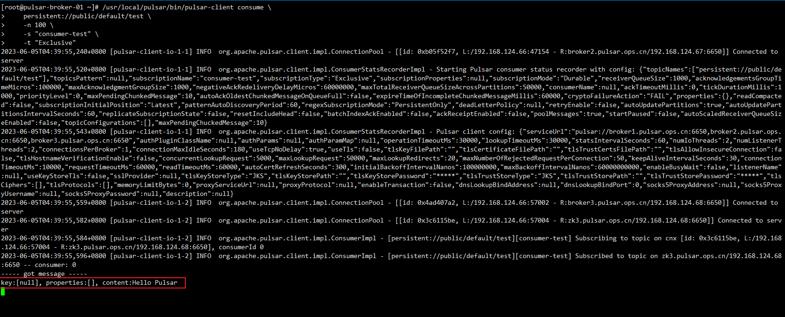

# 二进制包部署pulsar集群


<!--more-->

| IP | 主机名 | 角色 |
| --- | --- | --- |
| 192.168.124.66 | pulsar-broker-01 | zk + broker |
| 192.168.124.67 | pulsar-broker-02 | zk + broker |
| 192.168.124.68 | pulsar-broker-03 | zk + broker |
| 192.168.124.69 | pulsar-bookie-01 | bookie |
| 192.168.124.70 | pulsar-bookie-02 | bookie |
| 192.168.124.71 | pulsar-bookie-03 | bookie |

### 安装jdk17

[java版本推荐](https://github.com/apache/pulsar/blob/master/README.md#pulsar-runtime-java-version-recommendation)

```bash
wget https://download.oracle.com/java/17/archive/jdk-17.0.7_linux-x64_bin.rpm
rpm -ivh jdk-17.0.7_linux-x64_bin.rpm

for i in {67..71};do scp jdk-17.0.7_linux-x64_bin.rpm 192.168.124.$i:  ;done
for i in {67..71};do ssh 192.168.124.$i rpm -ivh jdk-17.0.7_linux-x64_bin.rpm  ;done
```

### 配置hosts或dns

```bash
# pulsar
192.168.124.66 zk1.pulsar.ops.cn broker1.pulsar.ops.cn
192.168.124.67 zk2.pulsar.ops.cn broker2.pulsar.ops.cn
192.168.124.68 zk3.pulsar.ops.cn broker3.pulsar.ops.cn
192.168.124.69 bookie1.pulsar.ops.cn
192.168.124.70 bookie2.pulsar.ops.cn
192.168.124.71 bookie3.pulsar.ops.cn
```

### 安装pulsar

pulsar二进制包 包含了所有的组件, 只需要下载分发到所有节点即可

```bash
wget https://archive.apache.org/dist/pulsar/pulsar-3.0.0/apache-pulsar-3.0.0-bin.tar.gz
tar xf apache-pulsar-3.0.0-bin.tar.gz -C /usr/local/
ln -s /usr/local/apache-pulsar-3.0.0/ /usr/local/pulsar

for i in {67..71};do scp apache-pulsar-3.0.0-bin.tar.gz 192.168.124.$i: ;done
for i in {67..71};do ssh 192.168.124.$i "tar xf apache-pulsar-3.0.0-bin.tar.gz -C /usr/local/ && ln -s /usr/local/apache-pulsar-3.0.0/ /usr/local/pulsar"  ;done
```

### 部署zk集群

这里使用pulsar内置的zk，如果你有单独的zk集群，建议用外部的zk

```bash
# 配置zk server地址
cat >> /usr/local/pulsar/conf/zookeeper.conf <<EOF
server.1=zk1.pulsar.ops.cn:2888:3888;2181
server.2=zk2.pulsar.ops.cn:2888:3888;2181
server.3=zk3.pulsar.ops.cn:2888:3888;2181
EOF

# 配置zk数据目录
sed -i "s#^\(dataDir=\).*#\1/data/zookeeper#" /usr/local/pulsar/conf/zookeeper.conf


# 分发配置文件
for i in {67,68};do scp /usr/local/pulsar/conf/zookeeper.conf 192.168.124.$i:/usr/local/pulsar/conf/zookeeper.conf ;done

# 创建myid文件
servers=([66]=1 [67]=2 [68]=3); for server in ${!servers[@]};do ssh 192.168.124.$server "mkdir -p /data/zookeeper && echo ${servers[$server]} > /data/zookeeper/myid" ;done

# 启动zk
for i in {66,67,68};do ssh 192.168.124.$i "/usr/local/pulsar/bin/pulsar-daemon start zookeeper" ;done

# 检查运行状态
for i in {66,67,68};do ssh 192.168.124.$i "netstat -lntp | grep 2181" ;done
```

### 初始化pulsar集群元数据

```bash
/usr/local/pulsar/bin/pulsar initialize-cluster-metadata \
    --cluster pulsar-cluster-1 \
    --metadata-store zk:zk1.pulsar.ops.cn:2181,zk2.pulsar.ops.cn:2181,zk3.pulsar.ops.cn:2181 \
    --configuration-metadata-store zk:zk1.pulsar.ops.cn:2181,zk2.pulsar.ops.cn:2181,zk3.pulsar.ops.cn:2181 \
    --web-service-url http://broker1.pulsar.ops.cn:8080,broker2.pulsar.ops.cn:8080,broker3.pulsar.ops.cn:8080 \
    --broker-service-url pulsar://broker1.pulsar.ops.cn:6650,broker2.pulsar.ops.cn:6650,broker3.pulsar.ops.cn:6650

# 最后输出
Cluster metadata for 'pulsar-cluster-1' setup correctly
```

> --cluster 指定集群名称
> 
> --metadata-store 元数据存储位置，元数据包括topic元数据、schema、broker所负责的topic和partition的元数据信息等。[doc](https://pulsar.apache.org/docs/3.0.x/concepts-architecture-overview/#metadata-store)
> 
> --configuration-metadata-store 配置元数据存储位置，包括集群、租户、命名空间、分区主题相关的配置等。[doc](https://pulsar.apache.org/docs/3.0.x/concepts-architecture-overview/#configuration-store)
> 
> --web-service-url 用于管理和监控Pulsar集群的地址
> 
> --broker-service-url  用于与Pulsar Broker建立连接并发送/接收消息的地址

### 部署bookkeeper集群

pulsar中所有的消息都是存在BookKeeper集群中的, 这里使用3个bookie节点组成bookkeeper集群

```bash
# 修改配置文件, 需要注意的内容如下
journalDirectory=/data/bookkeeper/journal # 预写日志(wal)目录
ledgerDirectories=/data/bookkeeper/ledgers # ledgers数据目录
advertisedAddress= # 宣告自己的地址,  默认使用eth0的地址, 也可以手动写dns名称或者IP
metadataServiceUri=zk+hierarchical://zk1.pulsar.ops.cn:2181;zk2.pulsar.ops.cn:2181;zk3.pulsar.ops.cn:2181/ledgers # zk地址
#zkServers=localhost:2181  # 被弃用的参数,这里注释它, 使用metadataServiceUri替代

# 批量修改
for i in {69,70,71}
do 
  ssh 192.168.124.$i "sed -i -e 's#^journalDirectory=data/bookkeeper/journal#journalDirectory=/data/bookkeeper/journal#' -e 's#^ledgerDirectories=data/bookkeeper/ledgers#ledgerDirectories=/data/bookkeeper/ledgers#' -e 's#^metadataServiceUri=#metadataServiceUri=zk+hierarchical://zk1.pulsar.ops.cn:2181;zk2.pulsar.ops.cn:2181;zk3.pulsar.ops.cn:2181/ledgers#' -e 's@^\(zkServers=.*\)@#\1@' /usr/local/pulsar/conf/bookkeeper.conf"
done

# 验证
for i in {69,70,71}
do 
  ssh 192.168.124.$i "echo ======$i======= ; grep -E '^journalDirectory|^ledgerDirectories|^advertisedAddress|^metadataServiceUri|^#zkServers' /usr/local/pulsar/conf/bookkeeper.conf"
done

# 创建预写日志(wal)目录和ledgers目录
for i in {69,70,71};do ssh 192.168.124.$i "mkdir -p /data/bookkeeper/{journal,ledgers}" ;done

# 启动bookie节点
for i in {69,70,71};do ssh 192.168.124.$i "/usr/local/pulsar/bin/pulsar-daemon start bookie" ;done

# 检查集群健康状况
/usr/local/pulsar/bin/bookkeeper shell bookiesanity
```

### 部署Pulsar broker

```bash
# 修改配置文件, 需要注意的内容如下
metadataStoreUrl=zk:zk1.pulsar.ops.cn:2181,zk2.pulsar.ops.cn:2181,zk3.pulsar.ops.cn:2181
configurationMetadataStoreUrl=zk:zk1.pulsar.ops.cn:2181,zk2.pulsar.ops.cn:2181,zk3.pulsar.ops.cn:2181
clusterName=pulsar-cluster-1 # 和初始化集群元数据的时候指定的集群名称一致
brokerServicePort=6650 # 默认无需修改
webServicePort=8080 # 默认无需修改

# 批量修改
for i in {66,67,68}
do 
  zk_url="zk:zk1.pulsar.ops.cn:2181,zk2.pulsar.ops.cn:2181,zk3.pulsar.ops.cn:2181"
  cluster_name="pulsar-cluster-1"
  echo ssh 192.168.124.$i "sed -i -e 's#^metadataStoreUrl=.*#metadataStoreUrl=${zk_url}#' -e 's#^configurationMetadataStoreUrl=.*#configurationMetadataStoreUrl=${zk_url}#' -e 's#^clusterName=.*#clusterName=${cluster_name}#' /usr/local/pulsar/conf/broker.conf"
done

# 启动
for i in {66,67,68};do ssh 192.168.124.$i "/usr/local/pulsar/bin/pulsar-daemon start broker" ;done
```

### 测试

修改客户端配置

```bash
vim /usr/local/pulsar/conf/client.conf
webServiceUrl=http://broker1.pulsar.ops.cn:8080,broker2.pulsar.ops.cn:8080,broker2.pulsar.ops.cn:8080
brokerServiceUrl=pulsar://broker1.pulsar.ops.cn:6650,broker2.pulsar.ops.cn:6650,broker3.pulsar.ops.cn:6650
```

开启消费者等待数据

```bash
/usr/local/pulsar/bin/pulsar-client consume \
    persistent://public/default/test \
    -n 100 \
    -s "consumer-test" \
    -t "Exclusive"
```

> -n 要消费的消息数量,默认1,0代表一直消费
>
> -s 订阅者的名称
>
> -t 订阅的类型, 支持Exclusive, Shared, Failover. Exclusive 代表独占模式, 使其他消费者无法消费 

生产者生产数据

```bash
/usr/local/pulsar/bin/pulsar-client produce \
    persistent://public/default/test \
    -n 1 \
    -m "Hello Pulsar"
```

> -n 发送消息的次数
>
> -m 发送的内容




---

> 作者: [SoulChild](https://www.soulchild.cn)  
> URL: https://www.soulchild.cn/post/685882692/  

