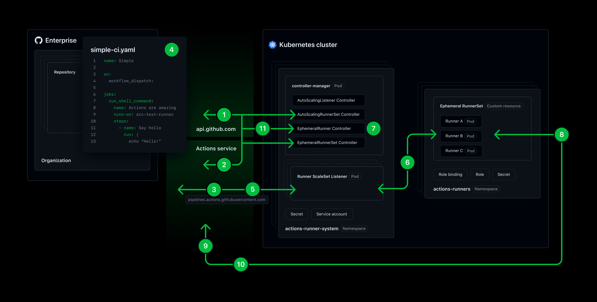
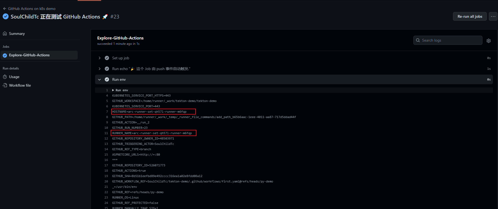

# kubernetes 上运行 github 自托管 runner


<!--more-->
## 描述

Actions Runner Controller 是 kubernetes operator, 可以为 GitHub Actions 编排和扩展`自托管运行器`(self hosted)

## Autoscaling Runner Scale Sets mode

参考文档: 
<https://github.com/actions/actions-runner-controller/blob/master/docs/preview/gha-runner-scale-set-controller/README.md>



### 工作原理

1. 首先在k8s集群中安装`gha-runner-scale-set-controller`，这是新arc的controller。其中 `AutoScalingRunnerSet Controller`调用 GitHub 的 API 来获取这个 Runner scale set 所属的 runner 组 ID。

2. `AutoScalingRunnerSet` 资源创建后会自动创建`AutoscalingListener`资源, 创建`AutoscalingListener`之前会调用 `Actions Service` (可能是如果没有获取到组ID，会调用API创建组，还有[获取注册token](https://docs.github.com/zh/rest/actions/self-hosted-runners?apiVersion=2022-11-28#create-a-registration-token-for-an-organization))

3. 一个 `Runner ScaleSet Listener` pod 由 `AutoScaling Listener Controller` 创建。在此 pod 中，他会连接到 `Actions Service` 进行身份验证并建立长轮询 HTTPS 连接。它接收来自 `Actions Service` 的 `Job Available` 消息。

4. 当从存储库触发工作流运行时， `Actions Service` 会将单个 job 的运行分派给 runs-on 匹配的 runner 或 runner scale set。

5. 当 `Runner ScaleSet Listener` pod 收到 `Job Available` 消息时，它会检查它是否可以扩展到所需的数量。如果可以，`Runner ScaleSet Listener` 将确认该消息。

6. `Runner ScaleSet Listener` 使用 sa 和绑定到该帐户的角色通过 Kubernetes API 进行调用，修改`EphemeralRunnerSet` 资源的 replicas 属性。

7. `EphemeralRunnerSet` 尝试创建`EphemeralRunner`，而 `EphemeralRunner Controller` 请求 JIT 配置令牌，用于提供给 runner pod 向 `Actions Service` 注册。然后尝试创建 runner 
   pod。如果 pod 的状态为失败，控制器最多重试 5 次。 24 小时后，如果没有 runner 接受，`Actions Service` 将取消分配该 job。

8. 创建 runner Pod 后，Pod 中的程序使用 JIT 配置令牌向 `GitHub Actions` 服务注册自身。 然后，它建立另一个 HTTPS 长轮询连接，以接收它需要执行的 job 详细信息。

9. `Actions Service` 确认 runner 注册并发送 job 运行详细信息。

10. 在整个 job 运行执行过程中，runner 不断将日志和 job 运行状态传回`Actions Service`。

11. 当 runner 成功完成 job 时，`EphemeralRunner Controller` 请求 `Actions Service` 是否可以删除 runner。如果可以，`EphemeralRunnerSet` 将删除runner pod。

### 较旧ARC的改进

- 不再依赖于 `cert-manager` 组件

- 根据 job 需求可靠地放大和缩小 runner pod 到零0

- 减少对 api.github.com 的 API 请求，不再有 API 限速问题

- GitHub 个人访问令牌 (PAT) 或 GitHub 应用程序安装令牌不再传递给runner pod 进行 runner 注册。(应该是改成了JIT)

- 提升了 runner pod 模板定制的灵活性

## 安装Controller

### helm安装arc

```bash
helm pull oci://ghcr.io/actions/actions-runner-controller-charts/gha-runner-scale-set-controller --untar
cd gha-runner-scale-set-controller

helm install arc-system --namespace "arc-systems" --create-namespace .
```

## 安装自动缩放的RunnerSet

安装配置 AutoscalingRunnerSet 相关的资源, 由于涉及的资源比较多, 所以也使用 helm 安装

### 申请PAT令牌

PAT=personal access token

[https://github.com/settings/tokens](https://github.com/settings/tokens)

token权限要求如下

- Repository runners: `repo`
- Organization runners: `admin:org`

如果上面的不行,试试这个。[到这看](https://github.com/actions/actions-runner-controller/blob/master/docs/authenticating-to-the-github-api.md#deploying-using-pat-authentication)

### 默认模式

默认模式就是使用 runner pod 本身执行 job

```bash
helm pull oci://ghcr.io/actions/actions-runner-controller-charts/gha-runner-scale-set --untar
cd gha-runner-scale-set
```

修改配置

```bash
cat > myvalues.yaml <<EOF
# 代码库、组织或企业的 Github URL
# 代码库的runner只有当前代码库能使用
githubConfigUrl: "https://github.com/SoulChildTc/tekton-demo"
githubConfigSecret:
  # PAT令牌
  github_token: ghp_xxxxxxxxxxxxxxxxxxxxxxxxx
# 控制runner的最大最小数量
minRunners: 0
maxRunners: 10
EOF
```

```bash
# 注意安装名称就是runs-on的值, 所以需要取的有意义
helm install arc-runner-set --namespace arc-runners --create-namespace . -f myvalues.yaml
```

测试

创建workflow配置, <https://github.com/SoulChildTc/tekton-demo/edit/py-demo/.github/workflows/first.yaml>

```yaml
name: GitHub Actions on k8s demo
run-name: ${{ github.actor }} 正在测试 GitHub Actions 🚀
on: [push]
jobs:
  Explore-GitHub-Actions:
    runs-on: arc-runner-set
    steps:
      - run: echo "🎉 这个 Job 由 ${{ github.event_name }} 事件自动触发."
      - run: env
```

可以看到接收到新的 job 后, 就会自动创建一个 pod 来执行任务


根据输出的内容可以确定是使用我们的环境执行的 job



### dind模式

在 runner pod 中使用 docker sidecar 实现 dind 模式, 这样就可以在 job 中执行 docker 相关的命令了

```yaml
# 存储库、组织或企业的 URL
githubConfigUrl: "https://github.com/SoulChildTc/tekton-demo"
githubConfigSecret:
# PAT令牌
  github_token: ghp_xxxxxxxxxxxxxxxxxxxxxxxxx

containerMode:
  type: "dind"

# 使用dind模式后, 会渲染如下的template. 不使用containerMode.type: "dind", 直接使用下面的配置也可以, 同时使用可能会冲突
#template:
#  spec:
#    initContainers:
#    - name: init-dind-externals
#      image: ghcr.io/actions/actions-runner:latest
#      command: ["cp"]
#      args: ["-r", "-v", "/home/runner/externals/.", "/home/runner/tmpDir/"]
#      volumeMounts:
#        - name: dind-externals
#          mountPath: /home/runner/tmpDir
#    containers:
#    - name: runner
#      command: 
#        - /home/runner/run.sh
#      image: ghcr.io/actions/actions-runner:latest
#      env:
#        - name: DOCKER_HOST
#          value: tcp://localhost:2376
#        - name: DOCKER_TLS_VERIFY
#          value: "1"
#        - name: DOCKER_CERT_PATH
#          value: /certs/client
#        - name: RUNNER_WAIT_FOR_DOCKER_IN_SECONDS
#          value: "120"
#      volumeMounts:
#        - name: work
#          mountPath: /home/runner/_work
#        - name: dind-cert
#          mountPath: /certs/client
#          readOnly: true
#    - name: dind
#      image: docker:dind
#      securityContext:
#        privileged: true
#      volumeMounts:
#        - name: work
#          mountPath: /home/runner/_work
#        - name: dind-cert
#          mountPath: /certs/client
#        - name: dind-externals
#          mountPath: /home/runner/externals
#    volumes:
#    - name: dind-cert
#      emptyDir: {}
#    - name: dind-externals
#      emptyDir: {}
#    - name: work
#      emptyDir: {}
```

安装

```bash
helm install -n arc-runners dind-mode-test . -f dind.yaml
```

### kubernetes 模式(推荐)

使用 `runner pod` 创建 单独的 pod 执行 job, 为了保证 `runner pod` 和 `job pod` 之间共享任务详细信息, 需要使用临时 pvc 保存数据。

`runner pod` 和 `job pod` 能共享啥呢？比如actions, 当你引用了别人的 actions, actions 是由 `runner pod` 负责加载的, 然后共享给 `job pod`

使用 Kubernetes 模式后必须在 job 中使用 container 关键字, 否则你会遇到下面的报错。

`Error: Jobs without a job container are forbidden on this runner, please add a 'container:' to your job or contact your self-hosted runner administrator.`

当然你也可以在安装 RunnerSet 的时候配置环境变量参数, 关闭必须使用 container 关键字的要求。 ACTIONS_RUNNER_REQUIRE_JOB_CONTAINER 设置为 false 即可

下面是使用 k8s 模式的 helm 配置

```yaml
# 存储库、组织或企业的 URL
githubConfigUrl: "https://github.com/SoulChildTc/tekton-demo"
githubConfigSecret:
# PAT令牌
  github_token: ghp_xxxxxxxxxxxxxxxxxxxxxxxxx

# 使用 k8s 模式, 会自动创建一个ROLE <RELEASE-NAME>-gha-runner-scale-set-kube-mode-role , 没有它 runner pod 无法创建 job pod
containerMode:
  type: "kubernetes"  ## type can be set to dind or kubernetes
#   ## 这个 volume 就是`runner pod` 和 `job pod` 共享数据用的, 在这个地方用下面的配置或者在template中声明一个名为work的volume都可以
#   kubernetesModeWorkVolumeClaim:
#     accessModes: ["ReadWriteOnce"]
#     # For local testing, use https://github.com/openebs/dynamic-localpv-provisioner/blob/develop/docs/quickstart.md to provide dynamic provision volume with storageClassName: openebs-hostpath
#     storageClassName: "dynamic-blob-storage"
#     resources:
#       requests:
#         storage: 1Gi
template:
  spec:
    containers:
    - name: runner
      image: ghcr.io/actions/actions-runner:latest
      command: ["/home/runner/run.sh"]
      env:
        - name: ACTIONS_RUNNER_CONTAINER_HOOKS
          value: /home/runner/k8s/index.js
        - name: ACTIONS_RUNNER_POD_NAME
          valueFrom:
            fieldRef:
              fieldPath: metadata.name
        - name: ACTIONS_RUNNER_REQUIRE_JOB_CONTAINER
          value: "false"
      volumeMounts:
        - name: work
          mountPath: /home/runner/_work
    volumes:
      - name: work
        ephemeral:
          volumeClaimTemplate:
            spec:
              accessModes: [ "ReadWriteOnce" ]
              storageClassName: "standard"
              resources:
                requests:
                  storage: 1Gi
```

安装

```bash
helm install -n arc-runners k8s-mode-test . -f k8s.yaml
```

> 目前没有发现什么方法可以在 job pod 中使用自定义的 pvc


---

> 作者: [SoulChild](https://www.soulchild.cn)  
> URL: https://www.soulchild.cn/post/686311506/  

