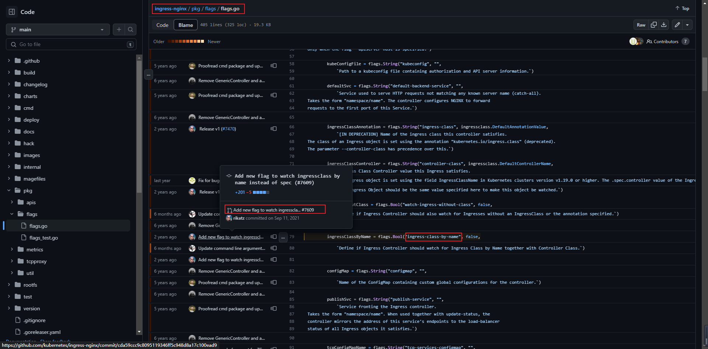
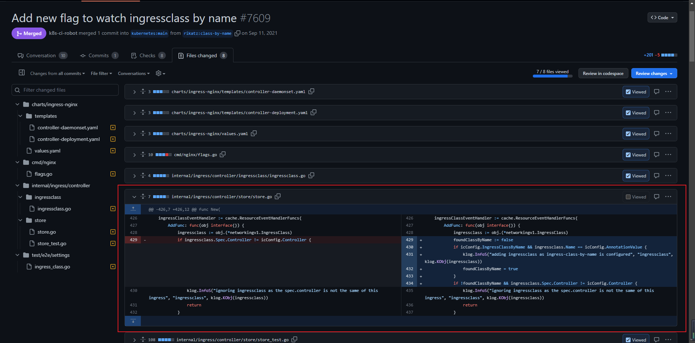

# Ingress Nginx Controller ingress-class-by-name 参数


<!--more-->

今天在 ingress-nginx-controller 的 helm chart 中看到一个参数 `ingressClassByName: false`, 问了一下自己这是啥意思, 不知道!

去查一下它用这个参数干了啥吧。

```bash
[root@mytest ingress-nginx]# grep -ir 'ingressClassByName' templates/
templates/_params.tpl:{{- if .Values.controller.ingressClassByName }}

[root@mytest ingress-nginx]# cat templates/_params.tpl | grep ingressClassByName -C 2
- --health-check-path={{ .Values.controller.healthCheckPath }}
{{- end }}
{{- if .Values.controller.ingressClassByName }}
- --ingress-class-by-name=true
{{- end }}
```

可以看出就是使用了 `--ingress-class-by-name` 参数, 果断去查一下[官方文档](https://kubernetes.github.io/ingress-nginx/user-guide/cli-arguments/)

`--ingress-class-by-name` - Define if Ingress Controller should watch for Ingress Class by Name together with Controller Class. (default false).

嗯, 当时看这句话没看懂, 现在看其实就是  按照 ingressClass 资源对象的名称决定是否要监控(处理)此类的 ingress

如果还是懵, 请继续向下看!

google + chatgpt了很久也没明白是什么意思, 网上也基本搜不到, 浪费了很长时间, 没办法了, 较上劲了, 看源码吧!

首先去看下什么时候加的这个参数, 根据提交信息找到当时的PR, [源码地址](https://github.com/kubernetes/ingress-nginx/blame/main/pkg/flags/flags.go#L79)



发现了[PR](https://github.com/kubernetes/ingress-nginx/pull/7609), 意思大概是 nginx controller 按照 ingressClass 资源对象的 .spec.controller 属性是否与controller的controller-class参数相同决定是否监控(处理)此类的 ingress, 但是有些用户希望按照ingressClass 资源对象的名称来决定。

其实核心代码就几行, 可以简单看下


总结:

- 没有使用 ingress-class-by-name 参数

    会判断 ingressClass 对象的 spec.controller 属性是否和当前 controller 的 controller-class 参数相同。

    如果相同就会处理属于这个 ingress class 的 ingress 对象, 不同则反之。
 
- 使用 ingress-class-by-name 参数

    会判断 ingressClass 对象的名称是否和当前 controller 的 ingress-class 参数相同。

    如果相同就会处理属于这个 ingress class 的 ingress 对象。
      
    不同则和没有使用 ingress-class-by-name 参数的逻辑一样, 使用 controller 字段的内容判断, 是否监听这个ingressClass


---

> 作者: [SoulChild](https://www.soulchild.cn)  
> URL: https://www.soulchild.cn/post/686400585/  

