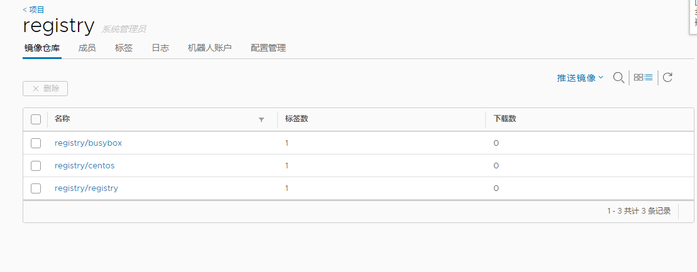

# 将registry仓库镜像迁移至harbor中

<!--more-->
环境：

10.0.0.11       harbor

10.0.0.12       registry

实现思路：

获取registry仓库镜像--&gt;获取registry仓库镜像的标签--&gt;每个镜像打好harbor仓库标签--&gt;上传至harbor仓库

&nbsp;

1.准备工具jq
<pre>yum install -y jq</pre>
2.harbor中创建一个项目registry

我的操作都是在10.0.0.12上操作的，所以在执行脚本前需要做一些其他工作：
<pre>#登录harbor仓库，上传镜像需要
docker login soulchild.cn

#soulchild.cn需要单独做一下解析，harbor仓库地址为10.0.0.11
echo "10.0.0.11 soulchild.cn" &gt;&gt; /etc/hosts</pre>
&nbsp;

3.编写脚本(在registry中执行，这样可以省去pull镜像的步骤，直接上传到harbor即可)
<pre class="line-numbers" data-start="1"><code class="language-bash">#!/bin/bash
images=`curl -s -u test:test 10.0.0.12:5000/v2/_catalog | jq .repositories[] | tr -d '"'`

for image in $images;
do
    tags=`curl -s -u test:test 10.0.0.12:5000/v2/$image/tags/list | jq .tags[] | tr -d '"'`
    for tag in $tags;
    do
        docker tag 10.0.0.12:5000/$image:$tag soulchild.cn/registry/$image:$tag
        docker push soulchild.cn/registry/$image:$tag
        if [ $? -eq 0 ];then
            echo "###############################$image:$tag pull complete!###############################"
        else
            echo "$image:$tag pull failure!"
        fi
    done
done</code></pre>
&nbsp;

脚本执行完后可以发现harbor仓库中镜像已经传输完成了。

&nbsp;

---

> 作者: [SoulChild](https://www.soulchild.cn)  
> URL: https://www.soulchild.cn/post/691/  

