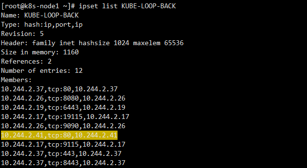

# Ipset含义


<!--more-->
k8s中有个nat表有个规则如下

```bash
-A KUBE-POSTROUTING -m comment --comment "Kubernetes endpoints dst ip:port, source ip for solving hairpin purpose" -m set --match-set KUBE-LOOP-BACK dst,dst,src -j MASQUERADE
```

注意看 `--match-set KUBE-LOOP-BACK dst,dst,src` 这一部分，他代表什么含义？

首先我们可以通过`ipset list KUBE-LOOP-BACK`查看他的类型。

```bash
Name: KUBE-LOOP-BACK
Type: hash:ip,port,ip # ip,port,ip主要看这个
Revision: 5
Header: family inet hashsize 1024 maxelem 65536
Size in memory: 1480
References: 1
Number of entries: 16
Members:
192.168.124.100,tcp:10259,192.168.124.100
```

含义

```bash
# iptable规则如下，类型是ip,port,ip
--match-set KUBE-LOOP-BACK dst,dst,src

# 让我们把他们连起来一一对应,这样就好理解了。如果不能一一连起来，就以第一个连起来的为准，其他没连起来的忽略。
dst->ip
dst->port
src->ip

# 当数据包中的目标ip，目标端口，源ip组合起来后，在KUBE-LOOP-BACK里找到，那么匹配成功。(注意端口号是带协议的)
```

证实一下

```bash
# 首先找一个单副本的pod，查看他所属的节点，在他的节点添加iptables日志记录规则
# 使用同样的规则记录日志，查看具体的格式是怎样的
iptables -t nat -I POSTROUTING -m set --match-set KUBE-LOOP-BACK dst,dst,src -j LOG --log-prefix "NAT LOOP packets "

# 注意这个规则只有当前节点pod访问自己的service时会触发，也就是pod通过service访问自己。
# 进入pod，使用service ip访问自己
k exec -it busybox-deployment-7f66d95685-mbzzq -- curl 10.1.48.211
```

得到下面日志

```bash
[root@k8s-node1 ~]# tail /var/log/messages -f |grep NAT
Nov 11 22:56:13 k8s-node1 kernel: NAT LOOP packetsIN= OUT=cni0 PHYSIN=veth1fa78eb4 SRC=10.244.2.41 DST=10.244.2.41 LEN=60 TOS=0x00 PREC=0x00 TTL=63 ID=32145 DF PROTO=TCP SPT=43678 DPT=80 WINDOW=64860 RES=0x00 SYN URGP=0 
```

按照上面的方法连一连
dst->ip = 10.244.2.41
dst->port = 80 -> tcp:80
src->ip = 10.244.2.41
最终就是他了`10.244.2.41,tcp:80,10.244.2.41`
看下set里有没有



---

> 作者: [SoulChild](https://www.soulchild.cn)  
> URL: https://www.soulchild.cn/post/692000581/  

