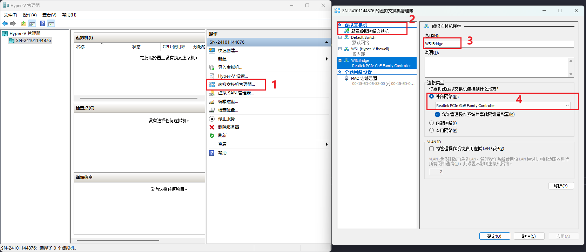

# Wsl2配置桥接和静态IP


<!--more-->

### 一、创建桥接交换机



### 二、配置wslconfig

进入 `%UserProfile%` 目录, 创建 `.wslconfig` 文件, 内容如下

```ini
[wsl2]
networkingMode=bridged
vmSwitch=WSLBridge
ipv6=true
dhcp=false # 如果不用静态IP 改为false即可
```

### 三、配置静态IP

在 WSL 中修改如下信息

```bash
sudo vim /lib/lib/systemd/network/wsl_external.network

[Match]
Name=eth0
[Network]
Description=bridge
DHCP=false
Address=192.168.6.117/21
Gateway=192.168.2.1
```

自定义 DNS

```bash
sudo vim /etc/wsl.conf

[network]
generateResolvConf = false
[boot]
systemd=true

rm -f /etc/resolv.conf
echo "nameserver 223.5.5.5\nnameserver 223.6.6.6" > /etc/resolv.conf

```

### 四、开机自启网络管理

重启 WSL( `wsl --shutdown` )后执行如下命令

```bash
sudo systemctl restart systemd-networkd
sudo systemctl enable systemd-networkd
sudo systemctl restart systemd-resolved.service
sudo systemctl enable systemd-resolved.service
```


---

> 作者: [SoulChild](https://www.soulchild.cn)  
> URL: https://www.soulchild.cn/post/700533749/  

