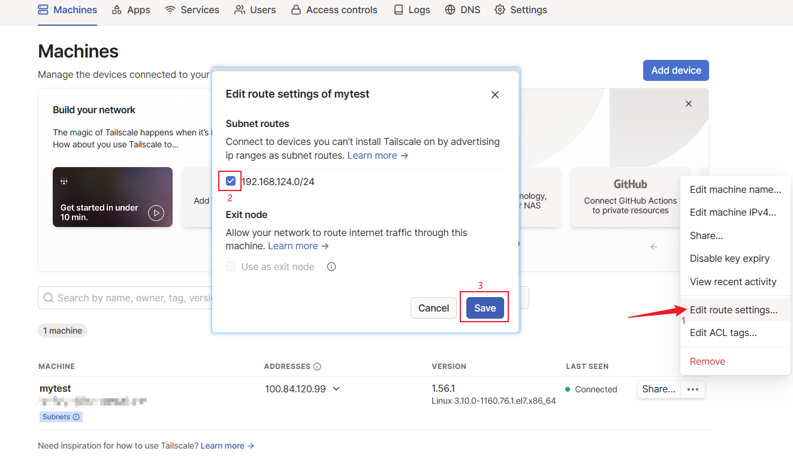

# 使用tailscale组网+访问内网其他主机


<!--more-->

## 目标

将办公室的PC和家里的虚拟机内网打通

## 一、家里的机器配置TailScale

### 安装

如果是其他系统请参考官方文档, 或者问我, 无偿提供帮助

```bash
# 一键安装
curl -fsSL https://tailscale.com/install.sh | sh

# 如果网络不好可以手动安装 https://tailscale.com/download/linux/static
wget https://dl.tailscale.com/stable/tailscale_1.56.1_amd64.tgz
```

### 启动并登录

```bash
tailscale up
```

### 配置 IP 转发

```bash
echo 'net.ipv4.ip_forward = 1' | sudo tee -a /etc/sysctl.d/99-tailscale.conf
echo 'net.ipv6.conf.all.forwarding = 1' | sudo tee -a /etc/sysctl.d/99-tailscale.conf
sudo sysctl -p /etc/sysctl.d/99-tailscale.conf
```

### 宣告当前节点可路由网段

```bash
tailscale up --advertise-routes=192.168.124.0/24
```

### 批准宣告的路由

打开 TailScale 控制台



## 二、办公室PC安装TailScale

[点击下载](https://pkgs.tailscale.com/stable/tailscale-setup-latest.exe)

安装并登录后, 即可连接家里内网其他机器了


---

> 作者: [SoulChild](https://www.soulchild.cn)  
> URL: https://www.soulchild.cn/post/705478069/  

