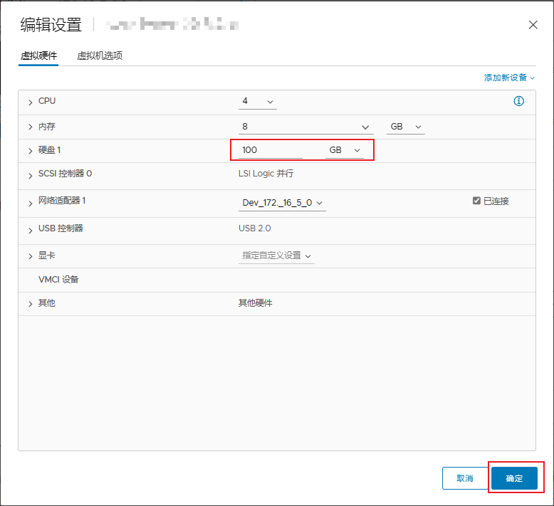

# Vmware扩容硬盘+根分区


<!--more-->

### vsphere中增加硬盘容量



### 重新扫描硬盘

```bash
[root@soulchild ~]# echo 1 > /sys/block/sda/device/rescan
[root@soulchild ~]# lsblk
NAME   MAJ:MIN RM  SIZE RO TYPE MOUNTPOINT
sda      8:0    0  100G  0 disk
├─sda1   8:1    0    2G  0 part
└─sda2   8:2    0   58G  0 part /
```

### 扩容分区

这里有个限制, 只有根分区是当前磁盘最后一个分区的时候才能扩容

```bash
[root@soulchild ~]# fdisk /dev/sda
Welcome to fdisk (util-linux 2.23.2).

Changes will remain in memory only, until you decide to write them.
Be careful before using the write command.


Command (m for help): p # 查看当前分区信息

Disk /dev/sda: 107.4 GB, 107374182400 bytes, 209715200 sectors
Units = sectors of 1 * 512 = 512 bytes
Sector size (logical/physical): 512 bytes / 512 bytes
I/O size (minimum/optimal): 512 bytes / 512 bytes
Disk label type: dos
Disk identifier: 0x000d0785

   Device Boot      Start         End      Blocks   Id  System
/dev/sda1            2048     4196351     2097152   82  Linux swap / Solaris
/dev/sda2         4196352   125829119    60816384   83  Linux 

Command (m for help): d # 删除2号分区, 删除后切记不要保存
Partition number (1,2, default 2):
Partition 2 is deleted

Command (m for help): n # 创建新分区
Partition type:
   p   primary (1 primary, 0 extended, 3 free)
   e   extended
Select (default p): # 默认 p 即可, 直接回车
Using default response p
Partition number (2-4, default 2): # 分区号 2, 直接回车
First sector (4196352-209715199, default 4196352): # 起始扇区, 和之前删掉的分区保持一致, 直接回车
Using default value 4196352
Last sector, +sectors or +size{K,M,G} (4196352-209715199, default 209715199): # 结束扇区 这里根据自己需求选择, 默认是能用的最大值
Using default value 209715199

Command (m for help): w # 保存后退出
The partition table has been altered!

Calling ioctl() to re-read partition table.

WARNING: Re-reading the partition table failed with error 16: Device or resource busy.
The kernel still uses the old table. The new table will be used at
the next reboot or after you run partprobe(8) or kpartx(8)
Syncing disks.
```

### 重新加载分区表

```bash
[root@soulchild ~]# partprobe
[root@soulchild ~]# xfs_growfs /dev/sda2 # 如果是ext4, 请使用 resize2fs /dev/sda2
```


---

> 作者: [SoulChild](https://www.soulchild.cn)  
> URL: https://www.soulchild.cn/post/709261550/  

