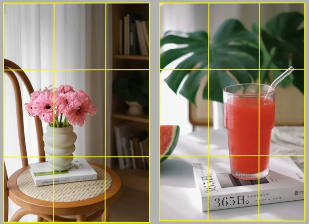
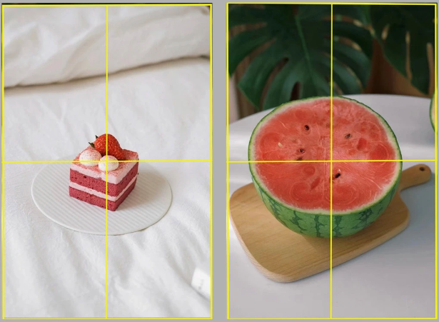
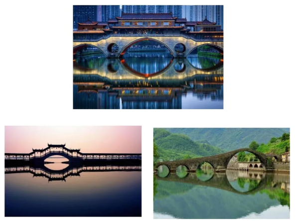
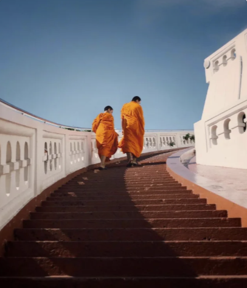
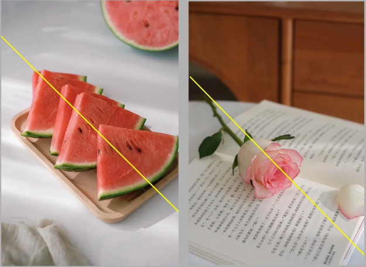
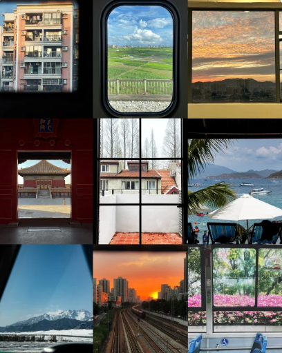
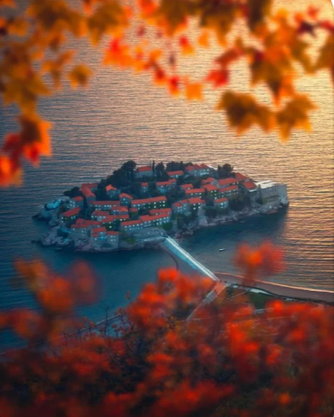
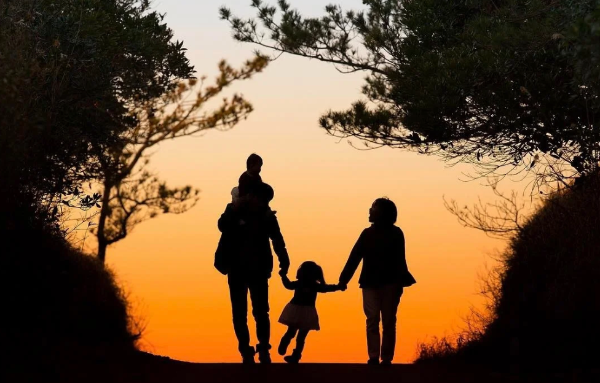

# 摄影构图及示例

<!--more-->

# 11种核心摄影构图法
---
## 一、基础秩序构图

这类构图搭建画面基础框架，简单易上手，快速建立画面平衡感与秩序感。

### 1. 三分法构图

用九宫格分割画面，将主体置于线条或交点上。想要交代环境, 不想主体没有存在感。示例：拍日落时，太阳放在右上交点，地平线对齐下方横线，让画面更协调。

### 2. 居中构图

主体置于九宫格正中央，视觉冲击力强，直接聚焦核心。示例：拍花朵特写、草原孤树，让主体占据C位，一眼抓住视线。

### 3. 对称式构图

以中轴线为基准，两侧元素对称分布，营造稳定、庄重的规整之美。示例：拍湖面倒影、古建筑门洞，上下或左右对称，尽显典雅。

### 4. 引导线构图

用线性元素引导视线聚焦主体，强化纵深感。示例：林间小路、河流、栈道，延伸指向远处山峰或建筑，营造“通往远方”的意境。

### 5. 对角线构图

主体沿画面对角线分布，增强画面动感与张力，打破横竖布局的沉闷。示例：拍倾斜树木、斜向溪流、奔跑的动物，让画面更鲜活。

### 6. 框架式构图

用前景元素形成天然“画框”，将主体框入其中，强化层次感与沉浸感。示例：透过树枝、山洞、车窗拍远处风景，仿佛“透过画框看世界”，画面更有故事性。

### 7. 前景虚化构图

大光圈虚化前景元素，以朦胧质感衬托后方主体，营造氛围感。示例：用虚化的树叶、草丛做前景，拍摄远处山峦，让主体在朦胧中更突出，画面更雅致。

### 8. 分层式构图

明确划分前景、中景、远景三层空间，强化画面立体维度。示例：拍风景时，前景铺花草、中景衬湖泊、远景立山脉，三层分明，避免画面单薄。

### 9. 留白构图

主体周围留足大面积空白，弱化冗余元素，突出主体的同时传递空灵韵味。示例：拍天空飞鸟、沙漠孤舟，仅保留主体与纯色背景，简洁又富诗意。

### 10. 剪影构图

逆光环境下压低曝光，保留主体深色轮廓，搭配明亮背景，氛围感拉满。示例：拍日出时的人物轮廓、黄昏时的树木剪影，用光影对比凸显画面张力。

### 11. 对比构图

对比构图是通过强化画面中不同元素的反差，突出核心主体、增强视觉张力的构图方法，核心逻辑是用反差制造视觉焦点，让主体在对比中脱颖而出。

#### 11.1 大小对比
利用元素间的尺寸差异，凸显主体的渺小或宏大，强化空间感和意境。

- 适用场景：山川湖海、城市建筑、自然旷野等大场景拍摄。
- 实操示例：拍巍峨山峰时，在前景放置一块岩石或一棵小树，通过 “小前景 + 大山脉” 的反差，凸显山峰的壮阔；拍城市地标建筑时，让行人从镜头前走过，用人物的小体量衬托建筑的高大雄伟。

#### 11.2 色彩对比
利用色彩的冷暖、明暗、互补反差，快速抓住视线，突出主体色彩。

- 适用场景：花卉植物、城市街景、静物摆拍等色彩丰富的场景。
- 实操示例：拍红色玫瑰时，搭配绿色的叶片做背景，红绿互补色形成强烈反差，让花朵更醒目；拍阴天的街景时，让穿着亮黄色外套的行人走入画面，用亮色主体打破灰色背景的沉闷。
- 富士相机适配技巧：直出时可选择Velvia / 鲜艳胶片模拟，强化色彩饱和度，让对比更鲜明。

#### 11.3 明暗对比
利用光线的强弱差异，制造画面的光影层次，突出主体的轮廓和质感。

- 适用场景：逆光人像、建筑光影、林间小道等光影丰富的场景。
- 实操示例：拍逆光人像时，压低曝光让人物呈现清晰轮廓，背景天空保持明亮，形成 “暗主体 + 亮背景” 的对比；拍老旧砖墙时，用侧光照射墙面，让砖缝的阴影和墙面的亮部形成反差，凸显墙面的粗糙质感。
- 富士相机适配技巧：设置动态范围 DR200，保留亮部和暗部细节，避免明暗对比过度导致的死黑或过曝。

#### 11.4 动静对比
利用元素的运动与静止反差，营造画面的活力和故事感。
- 适用场景：溪流瀑布、城市车流、飞鸟与静物等场景。
- 实操示例：拍瀑布时，用慢门（1/4~1 秒）将水流虚化呈丝绒状（动），搭配岸边静止的岩石（静），动静对比让画面更具灵动性；拍城市广场时，用慢门虚化穿梭的人群（动），保留静止的雕塑（静），展现城市的动态与静态之美。
- 富士相机适配技巧：开启长时间曝光降噪，避免慢门拍摄产生的噪点；搭配三脚架使用，保证静止元素的清晰度。

#### 11.5 其他
还有一些其他的对比, 比如 安静和喧嚣、悲伤和快乐等等，都可以用对比构图的方法来呈现。

## 最后：构图的核心不是“死记硬背”
构图方法有不仅限于以上构图方法，并且构图不是孤立存在的。实际拍摄中，**灵活混搭**往往能拍出更惊艳的效果。比如用“框架式+引导线”拍风景，用“前景虚化+留白”拍人像。

构图的本质，是**通过画面元素的排布，表达你的拍摄意图**。多拍多练，找到属于自己的构图风格，才是摄影的终极意义。

---

> 作者: [SoulChild](https://www.soulchild.cn)  
> URL: https://www.soulchild.cn/post/768529217/  

